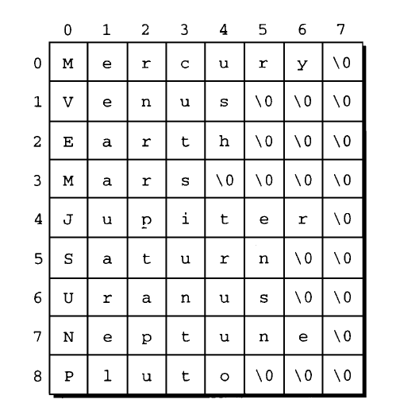
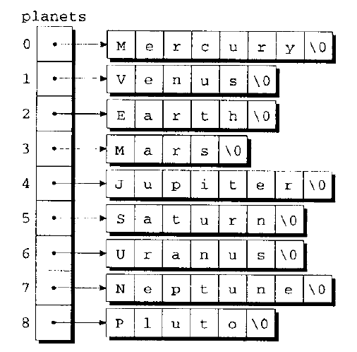

# 字符串

## 字面串

- 字面串（string literal）是用一对双引号括起来的字符序列
- 字面串经程序编译后生成字符串，而字符串是指位于系统存储器里的、以空字符终止的字符序列

### 字面串中的转义序列

```c
#include <stdio.h>

int main() {
  printf("hello\nwold");

  return 0;
}
```

### 延续字面串

- 当两条或更多条字面串相邻时（仅用空白字符分割），编译器会把它们合并成一条字符串

```c
#include <stdio.h>

int main() {
  printf("hello "
         "world");

  return 0;
}
```

### 如何存储字面串

- C 语言把字面串作为字符数组来处理
- 当 C 语言编译器在程序中遇到长度为 `n` 的字面串时，它会为字面串分配长度为 `n+1` 的内存空间。这块内存空间将用来存储字面串中的字符，以及一个用来标志字符串末尾的额外字符（空字符）。空字符是一个所有位都为 `0` 的字节，因此用转义序列 `\0` 来表示。

```c
#include <stdio.h>

int main() {
  char *p = "abc";
  printf(p); // abc

  return 0;
}
```

### 字面串的操作

- 这个赋值操作不是复制 `abc` 中的字符，而是使 p 指向字符串的第一个字符

```c
char *p = "abc";
```

- 可以对字面串取下标

```c
#include <stdio.h>

int main() {
  printf("%c\n", "abc"[0]); // a

  return 0;
}
```

- 试图改变字面串会导致未定义的行为

```c
#include <stdio.h>

int main() {
  char *p = "abc";
  // warn: Incompatible pointer to integer conversion assigning to 'char' from 'char[2]'
  *p = "d";

  return 0;
}
```

### 字面串与字符常量

- 只包含一个字符的字面串不同于字符常量。字面串 `a` 是用指针来表示的，这个指针指向存放字符 `a`（后面紧跟空字符）的内存单元。字符常量 `a` 是用整数（字符集的数值码）来表示的。

```c
int main() {
  int ch = 'a'; // int type
  char *p = "a"; // array type

  return 0;
}
```

## 字符串变量

- 当声明用于存放字符串的字符数组时，要始终保证数组的长度比字符串的长度多一个字符

```c
#define STR_LEN 10

int main() {
  char str[STR_LEN + 1];

  return 0;
}
```

### 初始化字符串变量

- 有两种方法初始化字符串变量

```c
#define STR_LEN 10

int main() {
  char str1[STR_LEN + 1] = "abc";
  char str2[STR_LEN + 1] = { 'a', 'b', 'c', '\0' };

  return 0;
}
```

- 当初始化数据的长度小于数组声明的长度时，空余项使用 `\0` 填充

```c
#define STR_LEN 4

int main() {
  char str[STR_LEN + 1] = "abc";
  
  // equivalent to:
  // char str[STR_LEN + 1] = {'a', 'b', 'c', '\0', '\0'};
  
  return 0;
}
```

- C 语言允许初始化器（不包括空字符）与变量有完全相同的长度，数组将不会存储空字符 `\0`，这样的数组无法作为字符串使用

```c
#define STR_LEN 4

int main() {
  char str[STR_LEN + 1] = "abcde";

  // equivalent to:
  // char str[STR_LEN + 1] = {'a', 'b', 'c', 'd', 'e'};

  return 0;
}
```

- 字符串变量的声明中可以省略它的长度，但不意味着以后可以改变数组的长度。一旦编译了数组长度就固定

```c
int main() {
  char str[] = "abcde";
  
  return 0;
}
```

### 字符数组与字符指针

- 如果希望可以修改字符串，那么就要建立字符数组来存储字符串，仅仅声明指针变量是不够的

```c
#include <stdio.h>

void print(char *str);

int main() {
  char str1[] = "abc";
  char *str2 = "abc";

  str1[0] = 'z';
  print(str1);

  // error
  *str2 = 'z';
  print(str2);

  return 0;
}

void print(char *str) {
  for (int i = 0; i < 3; i++) {
    printf("%c", str[i]);
  }
}
```

- 只声明指针变量无法为字符串分配内存，使用指针变量作为字符串之前，必须把指针变量指向字符数组或者把指针变量指向已经存在的字符串变量

```c
int main() {
  // method-1
  char *str1 = "abc";

  // method-2
  char arr[] = "abc";
  char *str2 = arr;

  return 0;
}
```

- 使用未初始化的指针变量作为字符串是非常严重的错误

```c
int main() {
  char *p;
  p[0] = 'a'; // error

  return 0;
}
```

## 字符串的读和写

### 用 printf 函数和 puts 函数写字符串

- 使用 `%s` 表示字符串

```c
int main() {
  char str[] = "hello world";
  printf("%s\n", str);

  return 0;
}
```

- `%.ps`: p 表示要显示的字符数量

```c
int main() {
  char str[] = "hello world";
  printf("%.5s\n", str); // 显示 5 个字符

  return 0;
}
```

- `%ms`: m 表示在宽度为 m 的栏宽显示，`-` 向左对齐，`+` 向右对齐

```c
int main() {
  char str[] = "hello world";
  printf("#%20s#\n", str); // 默认向右对齐
  printf("#%-20s#\n", str); // 向左对齐
  printf("#%+20s#\n", str); // 向右对齐

  return 0;
}
```

- `puts` 函数可以显示字符串并且在末尾自动添加换行符

```c
int main() {
  char str[] = "hello world";
  puts(str);
  puts(str);

  return 0;
}
```

### 用 scanf 函数读字符串

- 数组名是指针变量，传入 `scanf` 作为第二个参数时不需要 `&` 符号
- `scanf` 读入时会跳过空白字符，然后读取到空白字符时才停止

```c
int main() {
  char str[STR_LEN + 1];
  scanf("%s", str);

  return 0;
}
```

- `gets` 可以用来读入，但是 C11 开始已经将其废除
- `gets` 不会在开始读字符串之前跳过空白字符 (`scanf` 读之前会跳过空白字符)
- `gets` 读到换行符才停止 (`scanf` 读到空白符停止)
- `gets` 不会把换行符存到数组中，而是存储空白符

```c
#include <stdio.h>

#define STR_LEN 10

void print(char arr[]);

int main() {
  char str[STR_LEN + 1];
  printf("Enter:"); // 读入前跳过空白字符
  scanf("%s", str); // 读入前未跳过空白字符
  gets(str);
  print(str);

  return 0;
}

void print(char arr[]) {
  for (int i = 0; arr[i] != '\0'; i++) {
    printf("%c-", arr[i]);
  }
}
```

- `%ns` : `n` 表示最多读入的字符数量

```c
#define STR_LEN 10

int main() {
  char str[STR_LEN + 1];
  scanf("%10s", str); // input: helloworldhhh
  printf(str); // output: helloworld

  return 0;
}
```

- `fgets` 比 `gets` 更安全

### 逐个字符读字符串

- 实现函数进行逐字读入

```c
int read_line(char str[], int n) {
  int ch;
  int i = 0;

  while ((ch = getchar()) != '\n') {
    if (i < n) {
      str[i++] = ch;
    }
  }
  str[i] = '\0';
  return i;
}
```

## 访问字符串中的字符

- 字符串是数组，所以可以通过下标访问每一项的值

```c
int main() {
  int str[] = {1, 2, 3};
  printf("%d\n", str[0]); // 1

  return 0;
}
```

## 使用 C 语言的字符串库

- C 语言不像其他语言一样可以通过运算符操作字符串，而是要通过 `string` 库中的 API 操作字符串

### strcpy 函数

- `char *strcpy(char *s1, const char *s2)` : 把 s2 复制给 s1

```c
#include <stdio.h>
#include <string.h>

#define STR_LEN 10

int main() {
  char str1[STR_LEN + 1];
  char str2[STR_LEN + 1] = "abc";
  strcpy(str1, str2);
  printf("%s\n", str1); // "abc"

  return 0;
}
```

- `strncpy` 解决 `strcpy` 中来源字符串的长度比目的字符串长度长的问题
- `strncpy` 第三个参数指定赋值的个数

```c
#include <stdio.h>
#include <string.h>

#define STR_LEN 5

int main() {
  char str1[STR_LEN + 1] = "abc";
  char str2[3];
  char str3[3];

  strcpy(str2, str1);
  printf("str2 = %s\n", str2); // "abc"

  strncpy(str3, str2, sizeof str3 - 1);
  printf("str3 = %s\n", str3); // "ab"

  return 0;
}
```

### strlen 函数

- 获取字符串长度
- 原型 : `size_t strlen (const char *s);`
- 返回空字符 `\0` 之前的字符数 不包含空字符 `\0`

```c
#include <stdio.h>
#include <string.h>

#define STR_LEN 5

int main() {
  printf("%d\n", strlen("abc")); // 3
  printf("%d\n", strlen("")); // 0

  char str1[STR_LEN + 1];
  strcpy(str1, "abc");
  printf("%d\n", strlen(str1)); // 3

  return 0;
}
```

### strcat 函数

- 原型 : `char *strcat(char *s1, const char *s2);`
- 把 `s2` 的字符串加到 `s1` 之后，返回值为 `s1` 的指针

```c
#include <stdio.h>
#include <string.h>

int main() {
  char str1[] = "abc";
  char str2[] = "def";
  strcat(str1, str2);
  puts(str1);

  return 0;
}
```

- 如果 `s1` 的长度小于 `s1` 和 `s2` 长度的和，那么结果将无法预测

```c
#include <stdio.h>
#include <string.h>

#define STR_LEN 5

int main() {
  char str1[4] = "abc";
  char str2[STR_LEN] = "def";
  char *str = strcat(str1, str2);
  puts(str); // "abcd代遀I"

  return 0;
}
```

- 使用 `strncat` 限制赋值的字符数

- `sizeof(str1)` : `str1` 的数组总长度
- `strlen(str1)` : `str1` 已占用的长度

```c
#include <stdio.h>
#include <string.h>

#define STR_LEN 3

int main() {
  char str1[STR_LEN + 1] = "ab";
  char str2[STR_LEN + 1] = "cde";

  puts(strncat(str1, str2, (sizeof(str1) - strlen(str1) - 1))); // "abc"

  return 0;
}
```

### strcmp 函数

- `int strcmp(const char *s1, const char *s2);`
- 比较两个字符串
- 计算过程
  1. 比较两个字符串的每一个字符对应的数值码，例如：`strcmp("a", "b") = -1`
  2. 如果两个字符串的每一个字符都相等，则长字符串大于短字符串，例如：`strcmp("abc", "abcd") = -1`

```c
#include <stdio.h>
#include <string.h>

int main() {
  printf("%d\n", strcmp("abc", "abd")); // -1
  printf("%d\n", strcmp("abc", "abc")); // 0
  printf("%d\n", strcmp("abc", "abcd")); // -1

  return 0;
}
```

## 字符串惯用法

Skip

## 字符串数组

- 二维数组中，对列提前进行空间定义会比较浪费存储空间

```c
int main() {
  char planets[][8] = {
    "Mercury", "Venus", "Earth","Mars", 
    "Jupiter", "Saturn", "Uranus", "Neptune", "Pluto"
  };
  return 0;
}
```



- 使用数组保存其他数组的指针可以减少存储空间

```c
int main() {
  char *planets[8] = {
    "Mercury", "Venus", "Earth","Mars",
    "Jupiter", "Saturn", "Uranus", "Neptune", "Pluto"
  };

  return 0;
}
```



## 命令行参数

Skip
