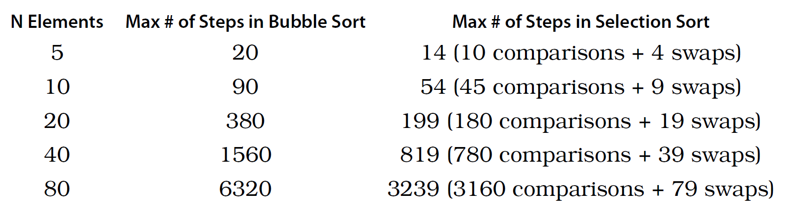

# Optimizing Code with and without Big O

## Selection Sort

- The steps of selection sort
  1. We check each cell of the array from left to right to determine which value is least.
  2. Once we’ve determined which index contains the lowest value, we swap its value with the value we began the pass-through with.
  3. Each pass-through consists of Steps 1 and 2. We repeat the pass-throughs until we reach a pass-through that would start at the end of the array.

## Selection Sort in Action

### Code Implementation: Selection Sort

```js
function selectionSort(arr) {
  for (let i = 0; i < arr.length - 1; i++) {
    let minIndex = i
    for (let j = i + 1; j < arr.length; j++) {
      if (arr[j] < arr[minIndex]) {
        minIndex = j
      }
    }
    if (minIndex !== i) {
      [arr[minIndex], arr[i]] = [arr[i], arr[minIndex]]
    }
  }
  return arr
}
```

## The Efficiency of Selection Sort

- bubble sort:
  - comparisons: (N-1) + (N-2) + ... + 2 + 1
  - swaps: (N-1) + (N-2) + ... + 2 + 1
- selection sort:
  - comparisons: (N-1) + (N-2) + ... + 2 + 1
  - swaps: N-1



- From this comparison, it’s clear Selection Sort takes about half the number of steps Bubble Sort does, indicating that Selection Sort is twice as fast.

