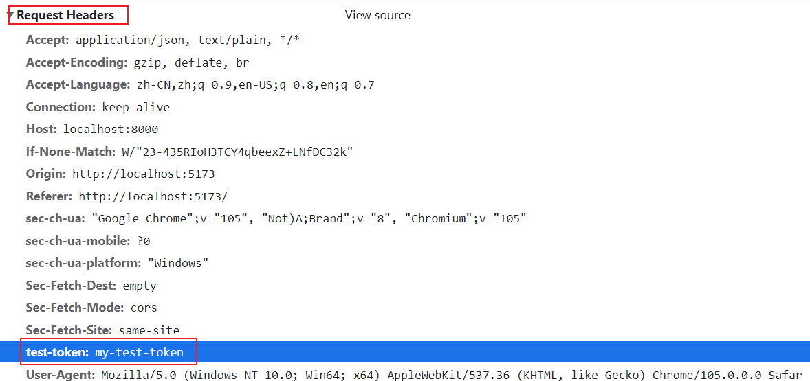

# Cookie

## What is cookie

- Cookie is string that is generated in the server and stored in the browser.
- Cookie is stored in `Set-Cookie` header in HTTP response and `Cookie` or custom header in subsequent HTTP request.

## Why need cookie

- Let servers know which user send requests.

## Reading Cookies

[Stop](https://javascript.info/cookie#reading-from-document-cookie)

## Refs

- [History of Authentication](https://www.cnblogs.com/moyand/p/9047978.html)
- [Cookie](https://juejin.cn/post/6844904034181070861#heading-3)
- [Cookie Practice](https://www.section.io/engineering-education/what-are-cookies-nodejs/)
- [Repo](https://github.com/Eathyn/authentication/tree/cookie)
