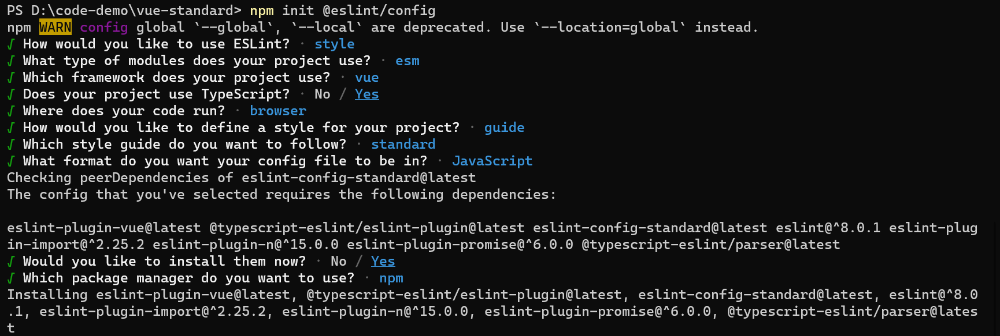
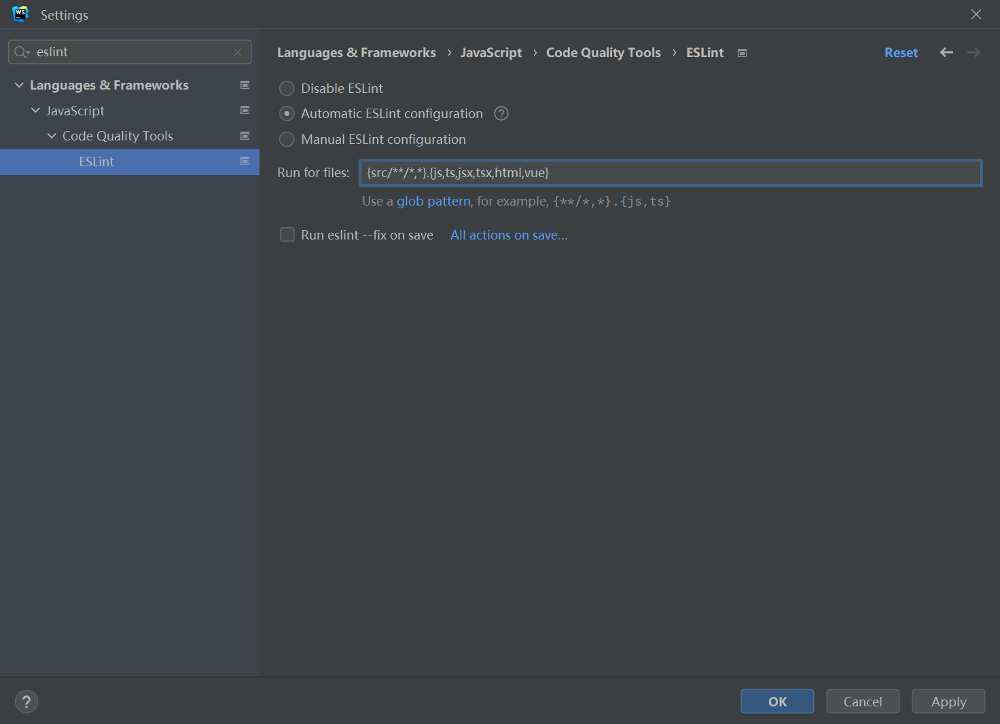
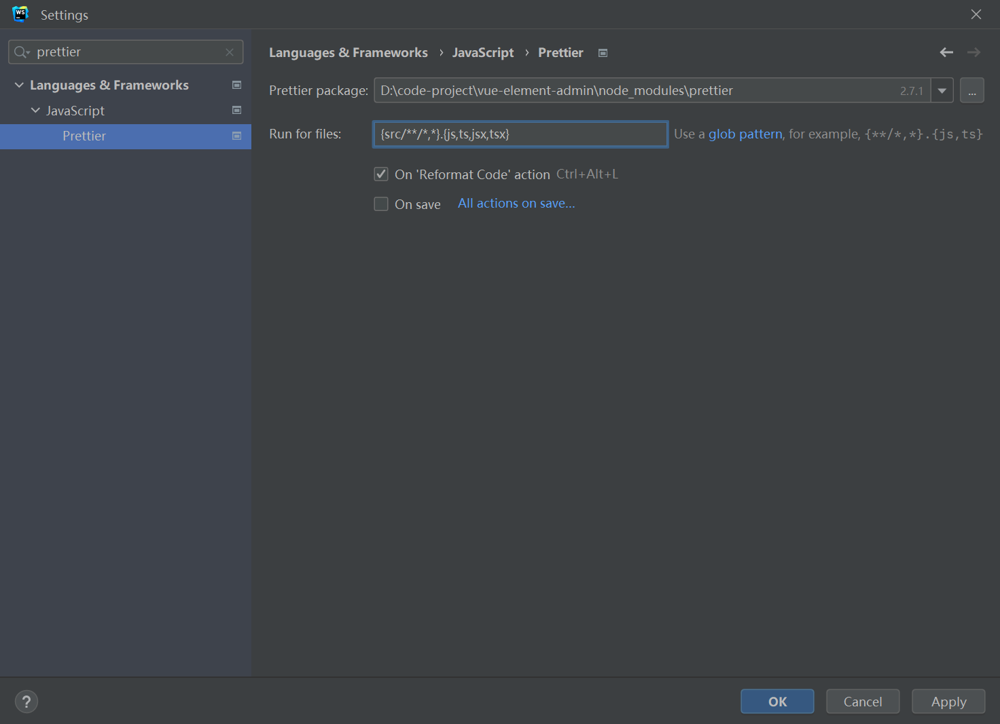

# 配置 Vue.js 项目

## Vite

### 创建项目

```bash
npm create vite@latest
```

### 配置路径

_vite.config.js_

```js
import { defineConfig } from 'vite'
import vue from '@vitejs/plugin-vue'
import { resolve } from 'path'

// https://vitejs.dev/config/
export default defineConfig({
  plugins: [vue()],
  resolve: {
    alias: {
      '@': resolve(__dirname, 'src'),
    },
    extensions: ['.js', '.json', '.vue'],
  },
  // server: {
  //   proxy: {
  //     '/xxx': {
  //       // ...
  //     }
  //   }
  // }
})
```

_jsconfig.js_

```js
module.exports = {
  compilerOptions: {
    paths: {
      '@/*': ['src/*'],
    },
  },
  exclude: ['node_modules', 'dist'],
}
```

## Vue Router

### 安装

```bash
npm install vue-router@4
```

### 使用

_src/router/index.js_

```js
import { createRouter, createWebHashHistory } from 'vue-router'

const routes = []

const router = createRouter({
  history: createWebHashHistory(),
  routes,
})

export default router
```

## Vuex

### 安装

```bash
npm install vuex@next --save
```

### 使用

_src/store/index.js_

```js
import { createStore } from 'vuex'
import count from '@/store/modules/count.js'

const store = createStore({
  modules: {
    countModule: count,
  },
})

export default store
```

_src/store/modules/count.js_

```js
const count = {
  state() {
    return {
      count: 1,
    }
  },
  getters: {
    doubleCount(state) {
      return state.count * 2
    },
  },
  mutations: {
    INCREMENT(state) {
      state.count++
    },
  },
  actions: {
    increment(context) {
      context.commit('INCREMENT')
    },
  },
}

export default count
```

## Element UI

### 安装

```bash
npm install element-plus --save
```

### 按需引入

#### 安装

```bash
npm install -D unplugin-vue-components unplugin-auto-import
```

#### 配置

_vite.config.js_

```js
import { defineConfig } from 'vite'
import AutoImport from 'unplugin-auto-import/vite'
import Components from 'unplugin-vue-components/vite'
import { ElementPlusResolver } from 'unplugin-vue-components/resolvers'

export default defineConfig({
  // ...
  plugins: [
    // ...
    AutoImport({
      resolvers: [ElementPlusResolver()],
    }),
    Components({
      resolvers: [ElementPlusResolver()],
    }),
  ],
})
```

## ESLint

### 安装 ESLint

```bash
npm i eslint --save-dev
```

### 配置 ESLint

```bash
npm init @eslint/config
```



### 增加 .eslintignore

```markdown
.vscode
node_modules
```

### Webstorm 设置 ESLint



## Prettier

### 安装 prettier

```bash
npm i --save-dev prettier
```

### 配置 `.prettierrc.cjs`

```js
module.exports = {
  semi: false,
  singleQuote: true,
  trailingComma: 'all',
  singleAttributePerLine: true,
}
```

### 配置 `.prettierignore`

```markdown
.vscode
node_modules
```

### Webstorm 配置 prettier



### 处理 ESLint 与 Prettier 的冲突

- 安装 [`eslint-config-prettier`](https://github.com/prettier/eslint-config-prettier)

```bash
npm install --save-dev eslint-config-prettier
```

- 配置 eslintrc.cjs

```js {5}
module.exports = {
  extends: [
    'plugin:vue/essential',
    'standard',
    'prettier',
  ],
}
```

## commitizen

### 原因

- 规范化 commit message

### 安装

```bash
npm install commitizen
```

- making repo commitizen friendly

```bash
npx commitizen init cz-conventional-changelog --save-dev --save-exact
```

- (automatically) config package.json

```json
{
  "config": {
    "commitizen": {
      "path": "./node_modules/cz-conventional-changelog"
    }
  }
}
```

### 使用

- run commitizen after `git add`

```bash
npx cz
```

- configure script `cz` in package.json

```json
{
  "scripts": {
    "cz": "cz"
  }
}
```

## commitlint

### 原因

- 检查 commit message 是否满足 commitizen 的格式

### 安装

```bash
npm install --save-dev @commitlint/config-conventional @commitlint/cli
```

### 配置

- configure commitlint to use conventional config
- change file format to **UTF-8**

```bash
echo "module.exports = {extends: ['@commitlint/config-conventional']}" > commitlint.config.cjs
```

## lint-staged

### 原因

- 只对暂存区中的文件进行操作

### 安装

```bash
npm install --save-dev lint-staged
```

### 配置

```json
{
  "scripts": {
    
  },
  "lint-staged": {
    "src/**/*.{js,vue}": [
      "eslint --fix",
      "prettier --write",
    ]
  }
}
```

## husky

### 原因

- 使用 commit-msg 钩子执行 commitlint
- 使用 pre-commit 钩子执行 lint-staged

### 安装

```bash
npm install husky --save-dev

npx husky install
```

### 配置

#### pre-commit

- create `pre-commit` hook

```bash
npx husky add .husky/pre-commit 'npx lint-staged'
```

#### commit-msg

- create `commit-msg` hook

```bash
npx husky add .husky/commit-msg 'npx --no-install commitlint --edit "$1"'
```

## Refs

- [commitizen](https://github.com/commitizen/cz-cli)
