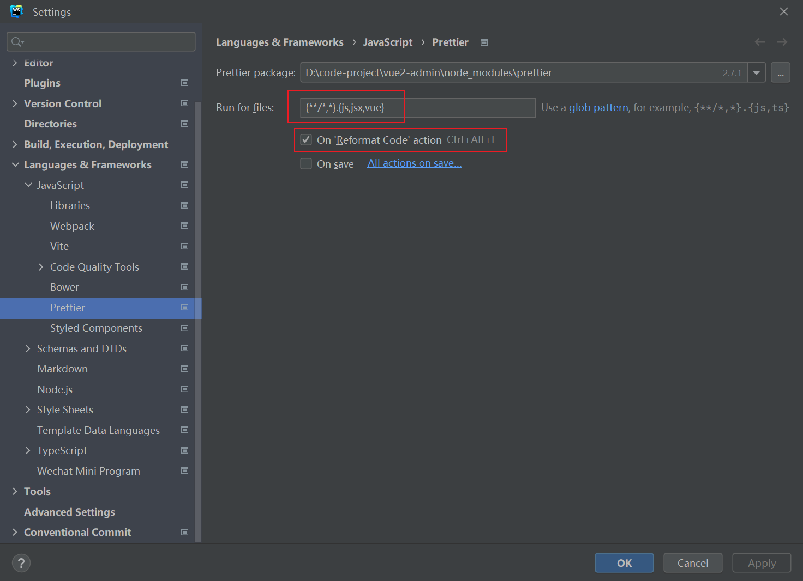

# Webstorm Prettier doesn't work

## Solution

1. Delete `node_modules`, `.idea` and `package-lock.json` or `yarn.lock`
2. Run `npm i` or `yarn` to install packages
3. Config prettier

## Refs

- [Solution](https://youtrack.jetbrains.com/issue/WEB-52034)
