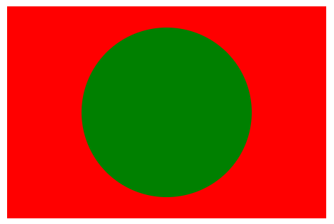

# Getting Started

## A Simple Example

```html
<svg
  version="1.1"
  width="300"
  height="200"
  xmlns="http://www.w3.org/2000/svg"
>
  <rect
    width="100%"
    height="100%"
    fill="red"
  />
  <circle
    cx="150"
    cy="100"
    r="80"
    fill="green"
  />
  <text
    x="150"
    y="125"
    font-size="60"
    text-anchor="middle"
    fill="white"
  >
    SVG
  </text>
</svg>
```

## Basic Properties of SVG Files

- Later elements are rendered atop previous elements.

```html
<svg
  version="1.1"
  width="300"
  height="200"
  xmlns="http://www.w3.org/2000/svg"
>
  <rect
    width="100%"
    height="100%"
    fill="red"
  />
  <circle
    cx="150"
    cy="100"
    r="80"
    fill="green"
  />
</svg>
```



## SVG File Types

- The recommended filename extension for svg file is '.svg'.
- The SVG specification also allows for gzip-compressed SVG files with filename extension `.svgz`

## Refs

- [Getting Started](https://developer.mozilla.org/en-US/docs/Web/SVG/Tutorial/Getting_Started)
