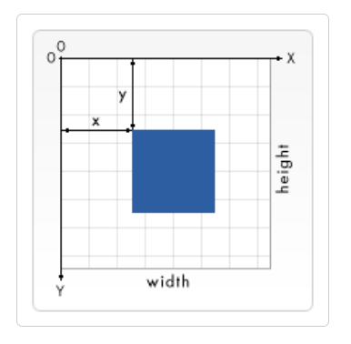

# Positions

- SVG uses a coordinate system or grid system similar to the one used by canvas.
- The top left corner of the document is considered to be the point (0,0), or point of origin.

## Refs

- [Positions](https://developer.mozilla.org/en-US/docs/Web/SVG/Tutorial/Positions)
