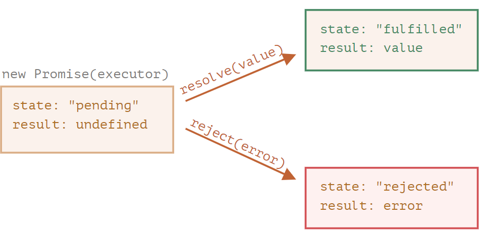

# Asynchronous

## Synchronous vs Asynchronous

- synchronous: the next task does NOT begin until the current task is completed
- asynchronous: the next task can begin before the current task is completed

## Callback

### What is Callback

- A callback is a function that you write and then pass to some other function. That other function then invokes (“calls
  back”) your function when some condition is met or some (asynchronous) event occurs.

### Why do We Need Callback

- A lot of behaviors in JavaScript are asynchronous. Callbacks are a way to make sure certain code doesn’t execute until other code has already finished execution.

_problem_

```js
let userInfo = null

function getUserInfo() {
  // fetch API is a microtask and is asynchronous
  fetch('https://api.github.com/users/eathyn')
    .then((response) => response.json())
    .then((data) => userInfo = data)
}

function showUserName() {
  console.log(userInfo.name)
}

getUserInfo()
// Uncaught TypeError: Cannot read properties of null (reading 'name')
showUserName()
```

_solution_

```js
let userInfo = null

// use callbacks to solve the above problems
function getUserInfo(callback) {
  fetch('https://api.github.com/users/eathyn')
    .then((response) => response.json())
    .then((data) => {
      userInfo = data
      callback()
    })
}

function showUserName() {
  console.log(userInfo.name)
}

getUserInfo(showUserName)
```

### Examples

#### Timers

- Call the callback function `greet` after the countdown.

```js
function greet() {
  console.log('hello')
}

setTimeout(greet, 1000)
```

#### Events

- Call the callback function `greet` after triggering a click event.

```js
function greet() {
  console.log('hello')
}

document.body.addEventListener('click', greet)
```

#### Network Events

- Call the callback function `showUserName` after retrieving data from the network.

```js
let userInfo = null

function getUserInfo(callback) {
  fetch('https://api.github.com/users/eathyn')
    .then((response) => response.json())
    .then((data) => {
      userInfo = data
      callback()
    })
}

function showUserName() {
  console.log(userInfo.name)
}

getUserInfo(showUserName)
```

#### Node.js

- Call the callback function `handleReadFile` after reading the file.

```js
const fs = require('fs')

fs.readFile('./data/config.json', 'utf-8', handleReadFile)

function handleReadFile(error, text) {
  if (error) {
    console.error('has error')
  } else {
    console.log(JSON.parse(text))
  }
}
```

### Disadvantages of Callback

- Easy to lead to callback hell which is hard to debug and add error handling to.

```js
setTimeout(() => {
  console.log('one')
  setTimeout(() => {
    console.log('two')
    setTimeout(() => {
      console.log('three')
      setTimeout(() => {
        console.log('four')
      }, 1000)
    }, 1000)
  }, 1000)
}, 1000)
```

## Promise

### Constructor

#### executor

- concept : the function passed to constructor
- when `new Promise` is created, the executor runs automatically

#### resolve / reject

- concept : callbacks provided by JavaScript engine
- if the job is finished, we should call `resolve`; if the job is fail, we should call `reject`

```js
const p = new Promise((resolve, reject) => {})
```

### Properties

Promise instance has `state` and `result` properties.



#### state

- initial value is `pending`
- state value will change to `fulfilled` when call `resolve` function
- state value will change to `rejected` when call `reject` function

#### result

- initial value is `undefined`

### APIs

#### Promise.all

##### Return Value

- an already fulfilled promise if the iterable passed is empty

_code_

```js
const p = Promise.all([])
p.then((result) => { console.log('success: ', result) })
```

_result_

> success: []

- an asynchronously fulfilled promise if the iterable passed contains no promises

_code_

```js
const p = Promise.all([1, 2, 3])
p.then((result) => { console.log('success: ', result) })
```

_result_

> success: [1, 2, 3]

- a pending promise in other cases

##### Examples

_success_

```js
const p = Promise.all([
  Promise.resolve(1),
  Promise.resolve(2),
  Promise.resolve(3),
])
// success: [1, 2, 3]
p.then((result) => { console.log(`success: ${result}`) })
```

_fail_

```js
const p = Promise.all([
  Promise.resolve(1),
  Promise.resolve(2),
  Promise.reject(new Error('custom error')),
])
// fail: custom error
p.catch((error) => { console.error(`fail: ${error}`) })
```

##### Attentions

- if one promise get rejects, `Promise.all` immediately rejects, completely forgetting about the other ones in the list

#### Promise.allSettled

##### Argument

- an iterable

##### Return Value

- an already fulfilled promise if the iterable passed is empty

```js
const p = Promise.allSettled([])
p.then((value) => { console.log(value) }) // []
```

- a pending promise that will be asynchronously fulfilled once every promise is settled

```js
const p = Promise.allSettled([
  Promise.resolve(1),
  Promise.reject(new Error('custom error')),
])

p.then((results) => {
  results.forEach((result) => {
    if (result.status === 'fulfilled') {
      console.log(`${result.status} - ${result.value}`)
    } else {
      console.log(`${result.status} - ${result.reason}`)
    }
  })
})
```

#### Promise.race

##### Return Value

- first settled promise

```js
const p = Promise.race([
  new Promise((resolve) => setTimeout(() => { resolve(1) }, 3000)),
  new Promise((_, reject) => setTimeout(() => { reject(2) }, 1000)),
])

// fail: 2
p.then((value) => {
  console.log('success: ', value)
}).catch((error) => {
  console.error('fail: ', error)
})
```

#### Promise.any

##### Return Value

- first fulfilled promise

```js
const p = Promise.any([
  new Promise((resolve) => setTimeout(() => { resolve(1) }, 3000)),
  new Promise((resolve) => setTimeout(() => { resolve(2) }, 1000)),
])

// success: 2
p.then((value) => {
  console.log('success: ', value)
})
```

#### Promise.prototype.then

##### Return Value

if handler function:

- returns a value => fulfilled promise with that value

```js
Promise
  .resolve(1)
  .then(() => 100)
  .then((value) => { console.log(value) }) // 100
```

- return nothing => fulfilled promise with `undefined` value

```js
Promise
  .resolve(1)
  .then(() => {})
  .then((value) => {
    console.log(value) // undefined
  })
```

- throws error => rejected promise with thrown error

```js
Promise
  .resolve()
  .then(() => { throw new Error('custom error') })
  .catch((reason) => { console.log('fail: ', reason) })
```

- returns already fulfilled promise => fulfilled promise

```js
Promise
  .resolve()
  .then(() => Promise.resolve(1))
  .then((value) => { console.log('success: ', value) }) // 1
```

- returns already rejected promise => rejected promise

```js
Promise
  .resolve()
  .then(() => Promise.reject(new Error('custom error')))
  .catch((reason) => { console.error('fail: ', reason) }) // custom error
```

#### Promise.prototype.finally

- handler function will be called after promise gets settled

```js
Promise
  .resolve(1)
  .finally(() => { console.log('run...') })

Promise
  .reject(new Error('custom error'))
  .finally(() => { console.log('run...') })
```

- If the handler throws an error or returns a rejected promise, the promise returned by finally() will be rejected with that value instead. Otherwise, the return value of the handler does not affect the state of the original promise.

```js
// throw error
Promise
  .resolve(1)
  .finally(() => { throw new Error('error 1') })
  .catch((reason) => { console.error('fail: ', reason) })

// return rejected promise
Promise
  .resolve(1)
  .finally(() => Promise.reject('error 2'))
  .catch((reason) => { console.error('fail: ', reason) })

// handler does not affect the promise
Promise
  .resolve(1)
  .finally(() => Promise.resolve(2))
  .then((value) => { console.log('success: ', value) }) // success: 1
```

- A `finally` callback will not receive any argument.

## Async Await

### What is async and await

- Async and await are keywords that help us write asynchronous code.

### Why do we need async and await

- Async and await keywords dramatically simplify the use of Promises and allow us to write Promise-based, asynchronous
  code that looks like synchronous code.

### Async keyword

- A function with `async` keyword means that function always returns a promise.

- If the return value of an async function is not explicitly a promise, it will be implicitly wrapped in a promise.

```js
async function fn() {
  return 1 // return Promise.resolve(1)
}

console.log(fn()) // Promise {<fulfilled>: 1}
```

- Even though the return value of an async function behaves as if it's wrapped in a `Promise.resolve`, they are not
  equivalent. An async function will return a different reference, whereas `Promise.resolve` returns the same reference
  if the given value is a promise.

```js
const p = new Promise((resolve) => {
  resolve(1)
})

async function asyncReturn() {
  return p
}

function basicReturn() {
  return Promise.resolve(p)
}

console.log(asyncReturn() === p) // false
console.log(basicReturn() === p) // true
```

- An async function will return a promise with the rejected state when that function throws an error or returns a
  rejected promise.

```js
async function f1() {
  throw new Error('error')
}

f1() // Uncaught (in promise) Error: error

async function f2() {
  return Promise.reject(new Error('error'))
}

f2() // Uncaught (in promise) Error: error
```

- The body of an async function can be thought of as being split by zero or more await expressions. Top-level code, up
  to and including the first await expression (if there is one), is run synchronously.

```js
async function fn() {
  console.log('first')
  const third = await Promise.resolve('third')
  console.log(third)
}

fn()
console.log('second')

// result: first, second, third
```

### Await keyword

- The keyword await makes JavaScript wait until that promise settles and returns its result.

- Let’s emphasize: await literally suspends the function execution until the promise settles, and then resumes it with
  the promise result. That doesn’t cost any CPU resources, because the JavaScript engine can do other jobs in the
  meantime: execute other scripts, handle events, etc.

- Modern browsers allow top-level `await` in modules.

_info.js (module)_

```js
const response = await fetch('https://api.github.com/users/eathyn')
const user = await response.json()

export { user }
```

_index.js_

```js
import { user } from './info.js'

console.log(user.name) // Eathyn
```

- Like `promise.then`, `await` allows us to use thenable objects (those with a callable then method). The idea is that a
  third-party object may not be a promise, but promise-compatible: if it supports .then, that’s enough to use it with
  await.

```js
async function fn() {
  const thenable = {
    then(resolve, reject) {
      resolve(1)
    }
  }
  console.log(await thenable)
}

fn() // 1
```

### Error Handling

- If a promise resolves normally, then await promise returns the result. But in the case of a rejection, it throws the
  error, just as if there were a throw statement at that line.

```js
async function fn() {
  return Promise.reject(new Error('error'))
  // is eqaul to: throw new Error('error')
}
```

- Use `try...catch` or `Promise.prototype.catch` to catch the error.

```js
// try...catch
async function fn1() {
  try {
    await Promise.reject(new Error('error'))
  } catch (error) {
    console.error(error)
  }
}

// Promise.prototype.catch
async function fn2() {
  await Promise.reject(new Error('error'))
}

fn2().catch((error) => {
  console.error(error)
})
```

## Refs

- [Synchronous vs Asynchronous](https://medium.com/from-the-scratch/wtf-is-synchronous-and-asynchronous-1a75afd039df)
- What is Callback : _JavaScript: The Definitive Guide, Chapter 13.1_
- [Why do We Need Callback](https://codeburst.io/javascript-what-the-heck-is-a-callback-aba4da2deced)
- Callback Examples : _JavaScript: The Definitive Guide, Chapter 13.1_
- [Disadvantages of Callback](https://dev.to/bhagatparwinder/callback-functions-callback-hell-79n)
- [Promise Basics](https://javascript.info/promise-basics)
- [Promise APIs](https://javascript.info/promise-api)
- [Promise.prototype.then](https://developer.mozilla.org/en-US/docs/Web/JavaScript/Reference/Global_Objects/Promise/then)
- [Promise.prototype.finally](https://developer.mozilla.org/en-US/docs/Web/JavaScript/Reference/Global_Objects/Promise/finally)
- [Modern JavaScript : async and await](https://javascript.info/async-await)
- [MDN : async function](https://developer.mozilla.org/en-US/docs/Web/JavaScript/Reference/Statements/async_function)
- [MDN : await](https://developer.mozilla.org/en-US/docs/Web/JavaScript/Reference/Operators/await)
