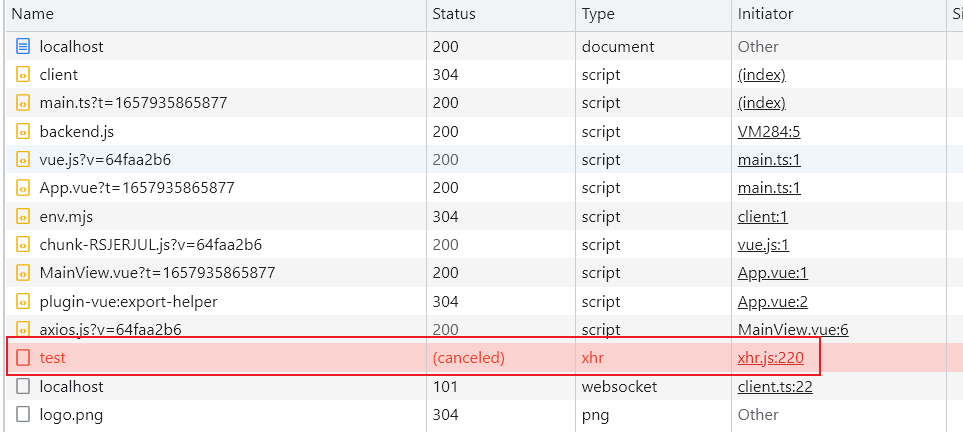
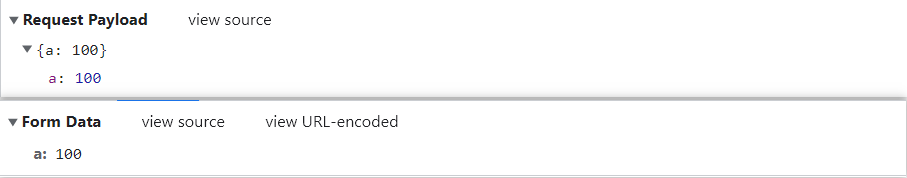

# Axios

## 定义

- 基于 Promise 的 HTTP 客户端

## 特点

- 浏览器环境使用 `XMLHttpRequest`
- Node.js 环境使用 `http`
- 支持 `Promise`
- 拦截请求和响应
- 改变请求和响应的数据
- 取消请求
- 自动将数据转化为 `JSON`
- 防止 `XSRF` 攻击

## interceptor 拦截器

- 拦截请求和响应

```js
const axiosInstance = axios.create({
  baseURL: 'http://localhost:4000',
  timeout: 1000,
})

axiosInstance.interceptors.request.use((config) => {
  // 拦截请求
  // ...
  return config
}, (error) => {
  return Promise.reject(error)
})

axiosInstance.interceptors.response.use((response) => {
  // 拦截响应
  // ...
  return response
}, (error) => {
  return Promise.reject(error)
})
```

## cancellation 取消请求

```js
const axiosInstance = axios.create({
  baseURL: 'http://localhost:4000',
  timeout: 1000,
})
const controller = new AbortController()

async function request() {
  const response = await axiosInstance.get('/test', {
    signal: controller.signal
  })
}

onMounted(() => {
  request()
  controller.abort()
})
```

_结果_



## URL-Encoding

- axios 默认情况下将对象序列化为 JSON 格式，想要将数据转变为 `application/x-www-form-urlencoded` 格式，需要使用 `URLSearchParams` 或 `qs` 库



### URLSearchParams

```js
async function request() {
  const params = new URLSearchParams()
  params.append('a', '100')
  await axiosInstance.post('/test-post', params)
}
```

### qs Library

```js
import qs from 'qs'

async function request() {
  const params = { a: 1 }
  await axiosInstance.post('/test-post', qs.stringify(params))
}
```

## Encapsulating GET and POST request

```js
const oneSecond = 1000
const baseURL = 'base-url'

function get(url, params, timeout = 10 * oneSecond) {
  return axios({
    method: 'GET',
    baseURL,
    url,
    params,
    timeout,
  })
}

function post(url, data, timeout = 10 * oneSecond) {
  return axios({
    method: 'POST',
    baseURL,
    url,
    data,
    timeout,
  })
}
```

## Refs

- [axios docs](https://axios-http.com/)
