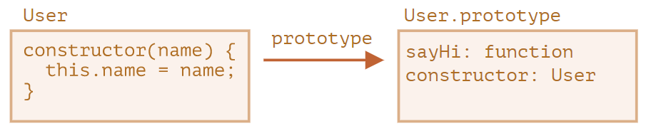
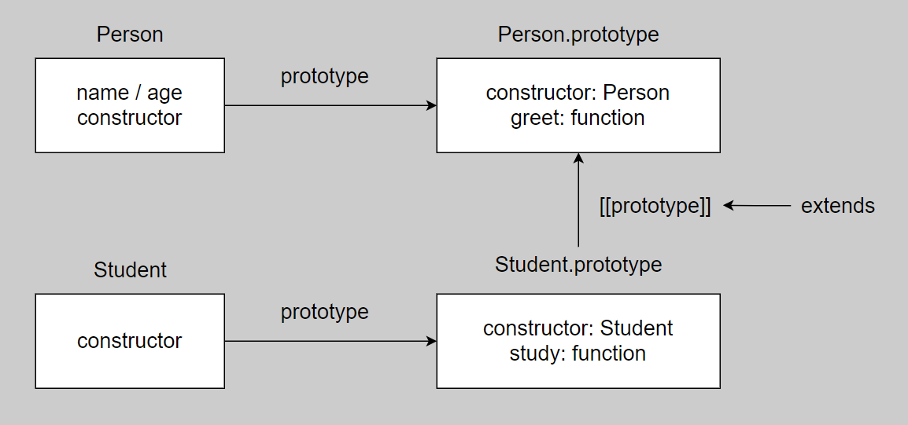
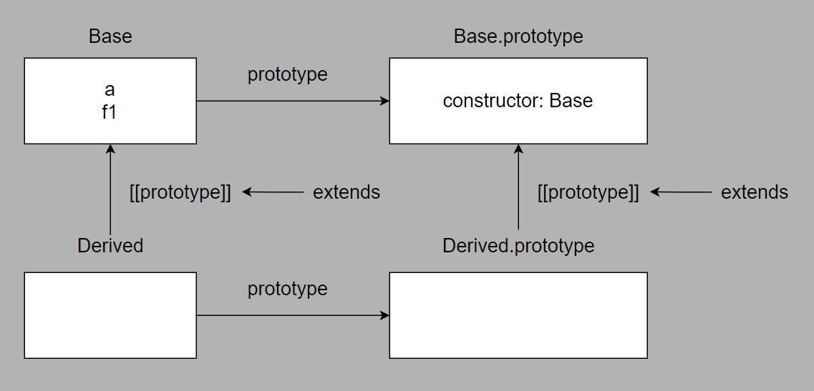

# Class

## Basis

### Definition

- A class is a kind of function.

```js
class User {}

console.log(typeof User) // function
```

### Procedure of Creating a Class

1. Create a function named `User`.
2. The function code is taken from the `constructor` method.
3. Stores class methods, such as `sayHi`, in `User.prototype`.

```js
// class
class User {
  constructor(name) {
    this.name = name
  }

  sayHi() {
    console.log(this.name)
  }
}

// function
function User(name) {
  this.name = name
}

User.prototype.sayHi = function() {
  console.log(this.name)
}
```



### Differences between Function and Class

- A function created by `class` is labelled by a special internal property `[[IsClassConstructor]]: true`. The language checks for that property in a variety of places. For example, unlike a regular function, it must be called with `new`.

```js
class User {
  constructor(name) {
    this.name = name
  }

  sayHi() {
    console.log(this.name)
  }
}

// Error: Class constructor User cannot be invoked without 'new'
User()
```

- A string representation of a class constructor in most JavaScript engines starts with the `“class…”`

```js
class User {
  constructor(name) {
    this.name = name
  }

  sayHi() {
    console.log(this.name)
  }
}

console.log(User) // class ...
```

- Class methods are non-enumerable.

_class_

```js
class User {
  constructor(name) {
    this.name = name
  }

  sayHi() {
    console.log(this.name)
  }
}

const u1 = new User('eathyn')

for (const property in u1) {
  console.log(property) // name
}
```

_function_

```js
function User(name) {
  this.name = name
}

User.prototype.sayHi = function() {
  console.log(this.name)
}

const u1 = new User('eathyn')

for (const property in u1) {
  console.log(property) // name sayHi
}
```

- All code inside the class construct is automatically in strict mode.

### Class Expression

- If a class expression has a name, it’s visible inside the class only.

```js
const User = class TheUser {
  constructor(name) {
    this.name = name
  }

  printClass() {
    console.log(TheUser)
  }
}

const u1 = new User('eathyn')

u1.printClass() // class TheUser {}
console.log(TheUser) // Error: TheUser is not defined
```

### Getters / Setters

```js
class User {
  constructor(name) {
    this._name = name
  }

  get name() {
    return this._name
  }

  set name(value) {
    this._name = value
  }

  getInfo() {
    console.log(this.name)
  }
}
```

### Computed Names

```js
class User {
  ['say' + 'Hi']() {
    console.log('Hi~')
  }
}

new User().sayHi()
```

### Losing `this`

`this` depends on the context of the call. If an object method is passed around and called in another context, this won’t be a reference to its object anymore.

```js
class Button {
  value = ''

  constructor(value) {
    this.value = value
  }

  click() {
    console.log(this.value)
  }
}

const button = new Button('hello')
setTimeout(button.click, 1000) // undefined
```

There are two solutions to fix the above problem.

_solution 1_

```js
class Button {
  value = ''

  constructor(value) {
    this.value = value
  }

  click() {
    console.log(this.value)
  }
}

const button = new Button('hello')
setTimeout(() => button.click(), 1000)
```

_solution 2_

```js
class Button {
  value = ''

  constructor(value) {
    this.value = value
  }

  click = () => {
    console.log(this.value)
  }
}

const button = new Button('hello')
setTimeout(button.click, 1000)
```

## Inheritance

### `extends` keyword

#### Example

```js
class Person {
  name = ''
  age = 0

  constructor(name, age) {
    this.name = name
    this.age = age
  }

  greet() {
    console.log(`Hi, I am ${this.name} and I am ${this.age} years old.`)
  }
}

class Student extends Person {
  constructor(name, age) {
    super(name, age)
  }

  study() {
    console.log('studying...')
  }
}

const s1 = new Student('eathyn', 18)
s1.study()
s1.greet()
```

#### Principle

Internally, `extends` keyword works using the good old prototype mechanics.



#### Function after `extends`

Class syntax allows to specify not just a class, but any expression after `extends`.

```js
function makeClass() {
  return class {
    fn() {
      console.log('fn')
    }
  }
}

class SubClass extends makeClass() {}
new SubClass().fn()
```

### Overriding Method

- `super.method()` to call methods of super class.
- `super()` to call the constructor of super class.

```js
class Person {
  name = ''
  age = 0

  constructor(name, age) {
    this.name = name
    this.age = age
  }

  greet() {
    return `Hi, I am ${this.name} and I am ${this.age} years old.`
  }
}

class Student extends Person {
  grade = 0

  constructor(name, age, grade) {
    super(name, age)
    this.grade = grade
  }

  greet() {
    return `${super.greet()} I am in grade ${this.grade}.`
  }
}

const s1 = new Student('eathyn', 18, 4)
console.log(s1.greet())
```

### Overriding Constructor

- Constructors in inheriting classes must call `super(...)`, and do it **before** using `this`.

- A derived constructor has a special internal property `[[ConstructorKind]]:"derived"`. That label affects its behavior with `new`. When a regular function is executed with `new`, it creates an empty object and assigns it to `this`. But when a derived constructor runs, it doesn’t do this. It expects the parent constructor to do this job. So a derived constructor must call `super` in order to execute its parent (base) constructor, otherwise the object for `this` won’t be created. And we’ll get an error.

### Overriding Class Fields

[To be Continued...](https://javascript.info/class-inheritance#overriding-class-fields-a-tricky-note)


## Static Properties and Methods

### Reason

Static properties and methods are used to implement functions that belong to the class as a whole, but not to any particular object of it.

### Static Methods

- Static methods are properties of a class / function.

```js
class User {
  static staticMethod() {}
}

// property of class
class User {}
User.staticMethod = function() {}

// property of function
function User() {}
User.staticMethod = function() {}
```

- The value of `this` in static method is a class.

```js
class User {
  static staticMethod() {
    console.log(this === User)
  }
}

User.staticMethod() // true
```

### Static Properties

```js
class Test {
  static a = 1
}

console.log(Test.a) // 1
```

### Inheritance

- Static properties and methods are inherited.
- The `extends` keyword creates two `[[prototype]]` reference:
  - `Derived` function inherits from `Base` function.
  - `Derived.prototype` inherits from `Base.prototype`.

```js
class Base {
  static a = 1
  static f1() {}
}

class Derived extends Base {}

console.log(Object.getPrototypeOf(Derived)) // Base
console.log(Derived.a) // 1
console.log(Derived.f1) // f1
```



## Private, Protected and Public

### Types

- `private` : accessible only from inside the class.
- `protected` : accessible only from inside the class and those extending it.
- `public` : accessible from anywhere.

### Public

- `public` : don't need prefix.

```js
class User {
  name = '' // public

  constructor(name) {
    this.name = name
  }
}

const user = new User('eathyn')
console.log(user.name) // eathyn
```

### Protected

- `protected` prefixed with `_`
- JavaScript do not implement `protected` type.

```js
class Person {
  _name = '' // protected

  constructor(name) {
    this._name = name
  }

  get name() {
    return this._name
  }

  set name(value) {
    this._name = value
  }
}

const p1 = new Person('eathyn')
p1.name = 'eaven'
console.log(p1.name) // eaven
```

- Protected fields are inherited.

```js
class Person {
  _name = ''

  constructor(name) {
    this._name = name
  }

  get name() {
    return this._name
  }

  set name(value) {
    this._name = value
  }
}

class Student extends Person {
  _grade = 0

  constructor(name, grade) {
    super(name)
    this._grade = grade
  }

  get grade() {
    return this._grade
  }

  set grade(value) {
    this._grade = value
  }
}

const s1 = new Student('eathyn', 4)
s1.grade = 3
console.log(s1.name)
console.log(s1.grade)
```

### Private

- `private` prefixed with `#`.

```js
class User {
  #name = '' // private

  constructor(name) {
    this.#name = name
  }

  getName() {
    return this.#name
  }
}

const user = new User('eathyn')

// Error
// console.log(user.#name)

console.log(user.getName()) // eathyn
```

- Private fields are not inherited.

## Refs

- [Class Basis](https://javascript.info/class)
- [Static Properties and Methods](https://javascript.info/static-properties-methods)
- [Private, Protected and Public](https://javascript.info/private-protected-properties-methods)
