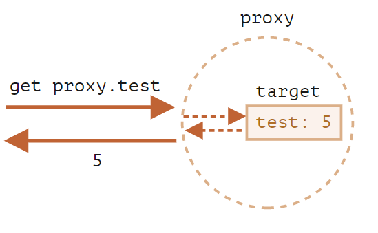
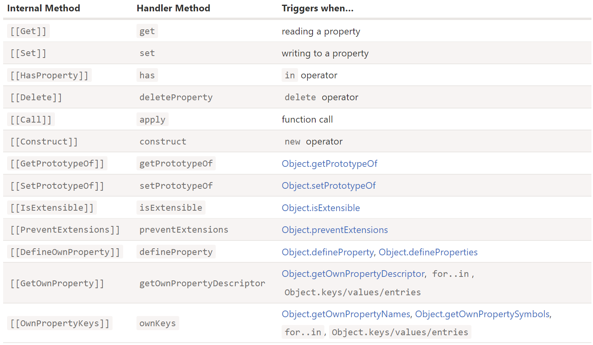

# Proxy

## What is Proxy

- A Proxy object wraps another object and intercepts operations.

## Why do we need Proxy

- Proxies are used in many libraries and some browser frameworks.

## Syntax

> new Proxy(target, handler)

- target: an object to wrap
- handler: an object with “traps”, methods that intercept operations

## Empty Handler

- With an empty handler all operations on proxy are forwarded to target.



```js
const target = {}
const proxy = new Proxy(target, {})

// A writing operation proxy.test = sets the value on target
proxy.test = 5

// A reading operation proxy.test returns the value from target
console.log(proxy.test) // 5
console.log(target.test) // 5

// Iteration over proxy returns values from target
for (const key in proxy) {
  console.log(key) // test
}
```

## Non-empty Handler

- For most operations on objects, there’s a so-called “internal method” in the JavaScript specification that describes
  how it works at the lowest level.

- Internal methods are only used in the specification, we can’t call them directly by name.

- Proxy traps intercept invocations of these internal methods.



- JavaScript enforces some invariants – conditions that must be fulfilled by internal methods and traps. For
  example, \[\[Set\]\] must return `true` if the value was written successfully, otherwise `false`.

## "get" trap

- The proxy should totally replace the target object everywhere. No one should ever reference the target object after it
  got proxied. Otherwise, it’s easy to mess up.

```js
// target object
let numbers = [1, 2, 3]

// the proxy replaces the target object
numbers = new Proxy(numbers, {
  get(target, prop) {
    if (prop in target) {
      return target[prop]
    } else {
      return 0
    }
  }
})

console.log(numbers[0]) // 1
console.log(numbers[100]) // 0
```

## "set" trap

- The set trap should return `true` if setting is successful, and `false` otherwise (triggers TypeError).

```js
let numbers = []

numbers = new Proxy(numbers, {
  set(target, prop, val) {
    if (typeof val === 'number') {
      target[prop] = val
      return true
    } else {
      return false
    }
  }
})

console.log(numbers) // Proxy {}

// the built-in functionality of arrays is still working
numbers.push(1)
console.log(numbers) // Proxy {0: 1}

// Uncaught TypeError: 'set' on proxy: trap returned falsish for property '1'
numbers.push('a')
```


## Refs

- [Proxy](https://javascript.info/proxy)
