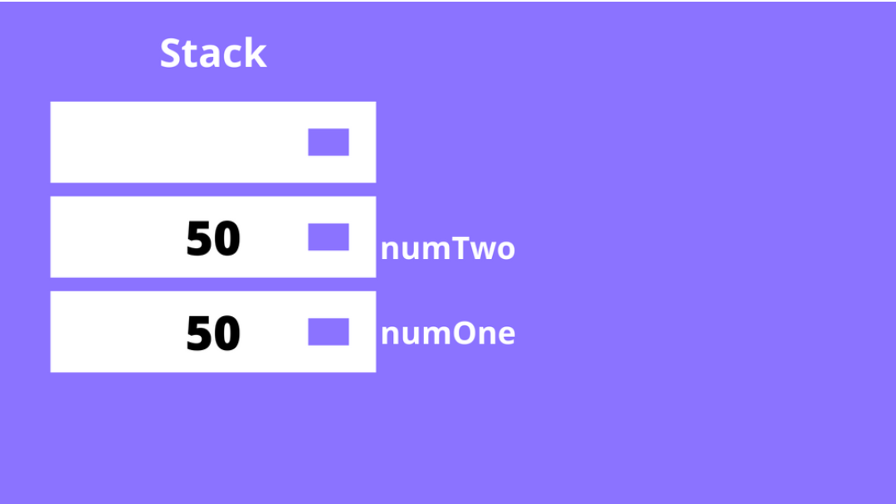
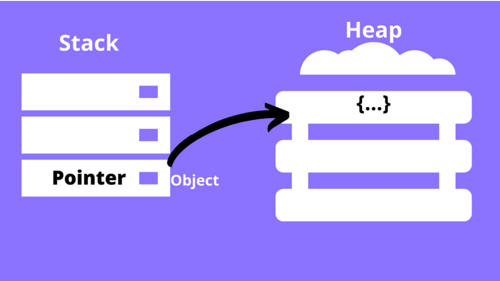

# Variable Store

## Content

- 基本数据类型存储在栈中，复制后不会相互影响

- 对象类型存储在堆中，栈中保存的是指向堆内存的地址，复制后会相互影响

## Refs

- [Variable Store](https://www.freecodecamp.org/news/primitive-vs-reference-data-types-in-javascript/)
