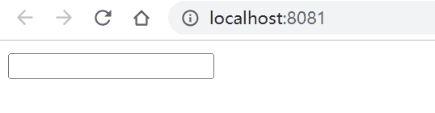

# Custom Directive

## Introduction

- Vue.js allows developers to create directives like `v-if`.
- Custom directives are mainly intended for reusing logic that involves low-level DOM access on plain elements.
- In `<script setup>`, any camelCase variable that starts with the `v` prefix can be used as a custom directive.
- If not using `<script setup>`, custom directives can be registered using the `directives` option.

```vue
<template>
  <input v-focus type="text">
</template>

<!-- composition api -->
<script setup>
const vFocus = {
  mounted: (el) => el.focus()
}
</script>

<!-- options api -->
<script>
export default {
  name: 'MainView',
  directives: {
    focus: {
      mounted: (el) => el.focus(),
    },
  },
}
</script>
```



- Registering directive in global.

```js
import { createApp } from 'vue'
import App from './App.vue'
import router from './router'
import store from './store'

const app = createApp(App)

app.directive('focus', {
  mounted: (el) => el.focus()
})

app.use(store).use(router).mount('#app')
```

## Directive Hooks

- A directive definition object can provide several hook functions.

```js
const myDirective = {
  created(el, binding, vnode, prevVnode) {},
  beforeMount(el, binding, vnode, prevVnode) {},
  mounted(el, binding, vnode, prevVnode) {},
  beforeUpdate(el, binding, vnode, prevVnode) {},
  updated(el, binding, vnode, prevVnode) {},
  beforeUnmount(el, binding, vnode, prevVnode) {},
  unmounted(el, binding, vnode, prevVnode) {}
}
```

### Hook Arguments

- `el`: the element the directive is bound to.
- `binding`: an object containing the following properties
  - `value`: The value passed to the directive.
  - `oldValue`: The previous value, only available in `beforeUpdate` and `updated`.
  - `arg`: The argument passed to the directive, if any.
  - `modifiers`: An object containing modifiers, if any.
  - `instance`: The instance of the component where the directive is used.
  - `dir`: the directive definition object.
- `vnode`: the underlying VNode representing the bound element.
- `prevNode`: the VNode representing the bound element from the previous render. Only available in the beforeUpdate and updated hooks.

```vue
<template>
  <div v-test:[arg].kkk="val">hello</div>
</template>

<script setup>
import { ref } from 'vue'

const vTest = {
  created: (el, binding, vnode, prevNode) => {
    console.log('created')
    console.log('el', el)
    console.log('binding', binding)
    console.log('vnode', vnode)
    console.log('prevNode', prevNode)
  },
}

const val = ref(100)
const arg = ref('aaa')
</script>
```

_binding output:_

```js
{
  arg: "aaa"
  modifiers: { kkk: true }
  oldValue: undefined
  value: 100
}
```

## Vue.js 2

_main.js_

```js
import Vue from 'vue'
import App from './App.vue'
import router from './router'

Vue.config.productionTip = false

Vue.directive('focus', {
  inserted: function(el) {
    el.focus()
  }
})

new Vue({
  router,
  render: h => h(App)
}).$mount('#app')
```

_Main.vue_

```vue
<template>
  <div>
    <input
      v-model="text"
      v-focus
      type="text"
    >
  </div>
</template>

<script>
export default {
  name: 'Main',
  data() {
    return {
      text: ''
    }
  }
}
</script>
```


## Refs

- [Custom Directive in Vue-3.x](https://vuejs.org/guide/reusability/custom-directives.html)
- [Custom Directive in Vue-2.x](https://v2.vuejs.org/v2/guide/custom-directive.html)
