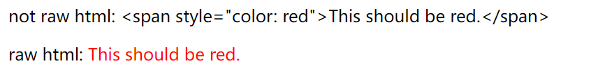
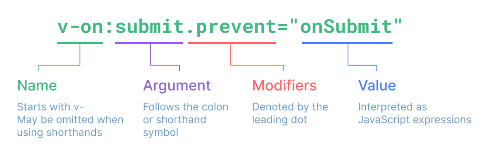
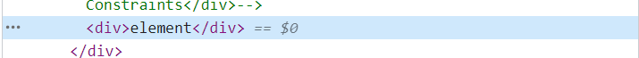

# Template Syntax

## Raw HTML

- Using `v-html` to output real HTML.

```vue
<template>
  <p>not raw html: {{ rawHtml }}</p>
  <p>raw html: <span v-html="rawHtml"></span></p>
</template>

<script setup>
import { ref } from 'vue'

const rawHtml = ref('<span style="color: red">This should be red.</span>')
</script>
```



- Dynamically rendering arbitrary HTML on your website can be very dangerous because it can easily lead to XSS vulnerabilities. Only use v-html on trusted content and never on user-provided content.

## Attribute Bindings

- `v-bind:argument="value"` means to binding `value` to `argument`.
- The attribute is removed if the `value` is `null` or `undefined`.
- `v-bind:arg="val"`'s shorthand is `:arg="val"`

```vue
<template>
  <div v-bind:id="id1">id one</div>
  <div :id="id2">id two</div>
</template>

<script setup>
import { ref } from 'vue'
const id1 = ref('a')
const id2 = ref('b')
</script>
```

### Dynamically Binding Multiple Attributes

- `v-bind="object"`

```vue
<template>
  <div v-bind="objectAttributes">attribute bindings</div>
</template>

<script setup>
import { reactive } from 'vue'

const objectAttributes = reactive({
  id: 'id-test',
  class: 'class-test',
})
</script>
```

## Using JavaScript Expressions

### Restricted Globals Access

- Template expressions are sandboxed and only have access to a restricted list of globals.
- Globals not explicitly included in the list, for example user-attached properties on window, will not be accessible in template expressions.
- You can, however, explicitly define additional globals for all Vue expressions by adding them to `app.config.globalProperties`.

## Directives



### Dynamic Arguments

```vue
<template>
  <a v-bind:[attributeName]="url"> ... </a>
</template>
```

#### Dynamic Argument Value Constraints

- The attribute will be removed if the attribute name is `null`.

```vue
<template>
  <div :[attrName]="attrVal">element</div>
</template>

<script setup>
import { ref } from 'vue'
const attrVal = ref('attr-val-test')
</script>
```



#### Dynamic Argument Syntax Constraints

- We can't use expression for dynamic argument.

```vue
<template>
  <div :['foo' + bar]="attrVal">Dynamic Argument Syntax Constraints</div>
</template>

<script setup>
import { ref } from 'vue'
const bar = ref('bar')
</script>
```
