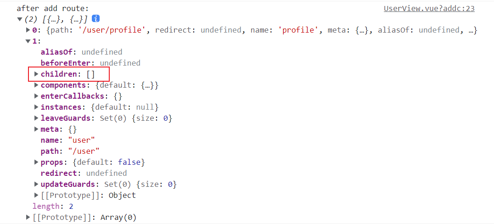

# Dynamic Routing

- Dynamic routing is adding or removing routes while the application is already running.
- `$router.options.routes` will only have the initial set of routes. Anything added with `addRoutes` will be not present there.

```vue
<script setup>
import { useRouter } from 'vue-router'

const router = useRouter()

function addRoute() {
  console.log('routes before updating: ', router.getRoutes().length) // 1
  router.addRoute({
    path: '/user',
    name: 'user',
    component: () => import('@/views/UserView'),
  })
  console.log('routes after updating: ', router.getRoutes().length) // 2
}
</script>
```

## Adding Routes

- `router.addRoute()` and `router.removeRoute()` only register a new route, meaning that if the newly added route matches the current location, it would require you to manually navigate with `router.push()` or `router.replace()` to display that new route.

_App.vue_

```vue
<template>
  <button @click="addRoute">add about route</button>
  <router-view />
</template>

<script setup>
import { useRouter } from 'vue-router'

const router = useRouter()

function addRoute() {
  router.addRoute({
    path: '/about',
    name: 'about',
    component: () => import('@/views/AboutView'),
  })
  router.replace(router.currentRoute.value.fullPath)
}
</script>
```

_router/index.js_

```js
const routes = [
  {
    path: '/:articleName',
    name: 'article',
    component: () => import('@/views/ArticleView'),
  },
]
```

## Adding Routes inside Navigation Guards

Q : demo fail : route infinitely

## Removing Routes

- Methods for removing route
  - adding the same route
  - calling the callback returned by `router.addRoute()`
  - calling `router.removeRoute()`

```vue
<script setup>
import { useRouter } from 'vue-router'

const router = useRouter()

function removeRoute() {
  console.log('before remove: ', router.getRoutes())

  // adding the same route
  router.addRoute({
    path: '/user2',
    name: 'user',
    component: () => import('@/views/UserView'),
  })

  // calling the callback returned by `router.addRoute()`
  const removeRoute = router.addRoute({
    path: '/user',
    name: 'user',
    component: () => import('@/views/UserView'),
  })
  removeRoute()

  // calling `router.removeRoute()`
  router.removeRoute('user')

  console.log('after remove: ', router.getRoutes())
}
</script>
```

- Whenever a route is removed, all of its aliases and children are removed with it.

## Adding Nested Routes

```js
router.addRoute(
  'user',
  {
    path: 'profile',
    name: 'profile',
    component: () => import('@/components/ProfileComponent'),
  },
)
```

- Q: the nested route did not being added to children property of parent route.



## Looking at Existing Routes

```vue
<script setup>
  import { useRouter } from 'vue-router'

  const router = useRouter()

  console.log(router.hasRoute('user'))
  console.log(router.getRoutes())
</script>
```

## Refs

- [Dynamic Routing](https://router.vuejs.org/guide/advanced/dynamic-routing.html)
