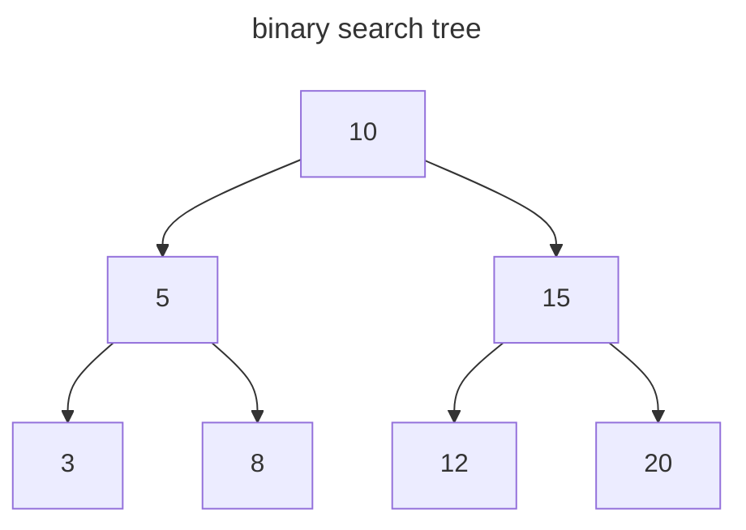

# Binary Search Tree

## 其他的数据结构

- ordered array
  - search: O(logN) binary search
  - insertion: O(N) worst case
  - deletion: O(N) worst case

- hash table
  - search: O(1)
  - insertion: O(1)
  - deletion: O(1)
  - but hash table is unordered

## 概念

二叉搜索树（binary search tree）：
  - 每个节点最多有两个子节点（二叉树的特性）。
  - 左子节点的值小于它的父节点值，右子节点的值大于它的父节点值。
  - 当前节点值大于所有属于左子树的后代节点值，当前节点值小于所有属于右子树的后代节点值（由上一条特性推导得出）。



## 查找

> Reference
> - _A Common-Sense Guide to Data Structures and Algorithms_ : p251-256

### 算法

- 比较查询值（searchValue）和当前节点值（node.value）；
- 如果相等，则说明找到了（递归的基准条件）；
- 如果查询值比当前节点值大，那么根据二叉查找树的特性排除掉左子树，往当前节点的右子树查找；
- 如果查询值比当前节点值小，那么根据二叉查找树的特性排除掉右子树，往当前节点的左子树查找；
- 如果当前节点为 null，说明查询到叶子节点的子节点也查不到，结束查询（递归的基准条件）。


### 实现

```js
function search(searchValue, node) {
  // base case: 找不到查询的值
  if (node === null) {
    return null
  }

  // base case: 找到查询的值
  if (searchValue === node.value) {
    return node
  }

  // 查询的值比当前节点的值大，则往右子树查找
  if (searchValue > node.value) {
    return search(searchValue, node.rightChild)
  } else { // 查询的值比当前节点的值小，则往左子树查找
    return  search(searchValue, node.leftChild)
  }
}
```

### 复杂度

- 因为二叉搜索树每次查找都向下移动一层，因此它的时间复杂度与树的层数相关联。

- 最差的情况是变成退化树，此时 `N` 个结点会形成有 `N` 层的树。所以时间复杂度是 `O(N)`。

- 平均的情况是变成平衡树，此时 `N` 个结点会形成有 `logN` 层的树，每次递归都会把范围缩小到左子树或右子树，即排除一半的节点，所以时间复杂度是 `O(logN)`。

## 插入

### 算法

1. currentNode 指向根节点。
2. 如果插入的值等于 currentNode 的值，则提示节点已存在；如果插入的值比 currentNode 的值小，则 currentNode 指向左子树；反之 currentNode 指向右子树。
3. 直到找到一个空位置并插入到这个位置。

### 实现

```js
function insert(value, node) {
  if (value === node.value) {
    throw new Error('the node is exist')
  }

  if (value < node.value) {
    if (node.leftNode === null) {
      node.leftNode = new TreeNode(value)
    } else {
      insert(value, node.leftNode)
    }
  }

  if (value > node.value) {
    if (node.rightNode === null) {
      node.rightNode = new TreeNode(value)
    } else {
      insert(value, node.rightNode)
    }
  }
}
```

### 复杂度

原理与查找操作的时间复杂度一样：
- 如果树是退化树，则插入操作的时间复杂度为 `O(N)`。
- 如果树是平衡树，则插入操作的时间复杂度为 `O(logN)`。

:::tip
有序数组插入操作的时间复杂度：

- 使用二分查找确定位置，时间复杂度为：O(logN)。
- 如果在数组的开头插入数据，那么后面的数据都需要向后移动一位，时间复杂度为：O(N)。
- 总和：O(logN + N) => O(N)。
:::

## 删除

> A Common-Sense Guide to DSA: p260 - 271

### 算法

- 如果待删除的节点没有子节点，则直接删除。
- 如果待删除的节点只有一个子节点，则该子节点替代待删除节点，然后删除待删除节点。
- 如果待删除的节点有两个子节点，就需要先寻找后续节点（successor node）：后续节点是待删除节点的右子树中的最小值。然后分两种情况处理：
  - 后续节点没有右子节点：后续节点替换待删除节点
  - 后续节点有右子节点：后续节点替换待删除节点，并且后续节点的右子节点作为后续节点的原父节点的右子节点。

### 实现

```js
// delete operation in binary search tree
export default function deleteNode(valueToDelete, node) {
  if (node === null) {
    return null
  } else if (valueToDelete < node.value) {
    node.leftNode = deleteNode(valueToDelete, node.leftNode)
    return node
  } else if (valueToDelete > node.value) {
    node.rightNode = deleteNode(valueToDelete, node.rightNode)
    return node
  } else if (valueToDelete === node.value) {
    // 处理三种情况：
    // 1. 当前节点没有左子节点
    // 2. 当前节点没有右子节点
    // 3. 当前节点没有子节点
    if (node.leftNode === null) {
      return node.rightNode
    } else if (node.rightNode === null) {
      return node.leftNode
    } else {
      // 处理当前节点有两个子节点的情况
      node.rightNode = lift(node.rightNode, node)
      return node
    }
  }
}

function lift(node, nodeToDelete) {
  if (node.leftNode) {
    // 寻找可以替换待删除节点的节点（即 successor node）：
    // 1. 大于待删除节点的值
    // 2. 步骤-1 中所有节点的最小值
    node.leftNode = lift(node.leftNode, nodeToDelete)
    return node
  } else {
    // 将 successor node 的右子节点当作 successor node 的原父节点的右子节点
    nodeToDelete.value = node.value
    return node.rightNode
  }
}
```

### 复杂度

原理与查找操作的时间复杂度一样：

- 如果树是退化树，则插入操作的时间复杂度为 O(N)。
- 如果树是平衡树，则插入操作的时间复杂度为 O(logN)。

## 遍历

> Book: A Common-Sense Guide to DSA: p272 - p277

树的遍历的时间复杂度是 `O(N)`。

### 中序遍历 inorder traverse

根节点的遍历顺序位于中间：遍历左子树，然后根节点，最后右子树。

```js
// inorder traverse in tree
export function traverse(node) {
  // base case
  if (node === null) {
    return
  }

  traverse(node.leftNode)
  console.log(node.value)
  traverse(node.rightNode)
}
```

### 前序遍历 preorder traverse

根节点的遍历顺序位于最前：遍历根节点，然后左子树，最后右子树。

```js
// preorder traverse in tree
export function preorderTraverse(node) {
  // base case
  if (node === null) {
    return
  }

  console.log(node.value)
  preorderTraverse(node.leftNode)
  preorderTraverse(node.rightNode)
}
```

### 后序遍历 postorder traverse

根节点的遍历顺序位于最后：遍历左子树，然后右子树，最后根节点。

```js
// postorder traverse in tree
export function postorderTraverse(node) {
  // base case
  if (node === null) {
    return
  }

  postorderTraverse(node.leftNode)
  postorderTraverse(node.rightNode)
  console.log(node.value)
}
```
