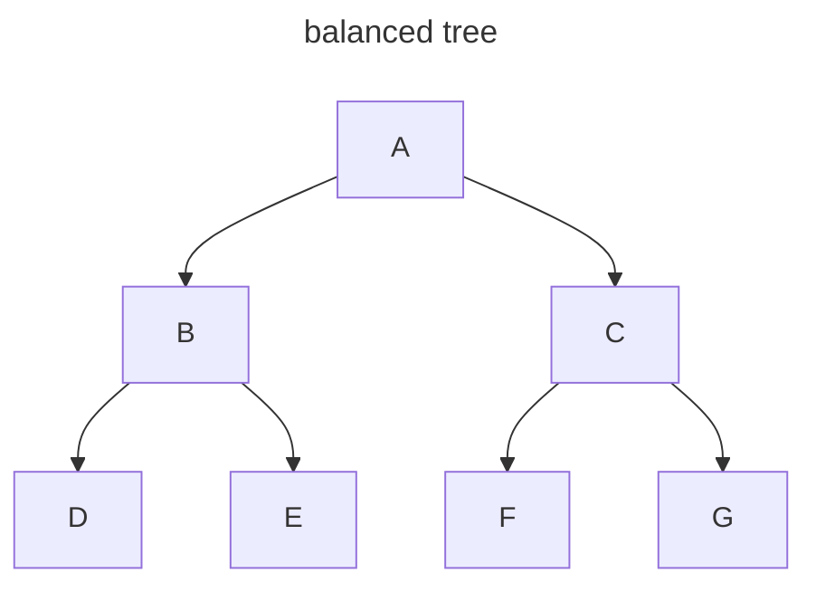
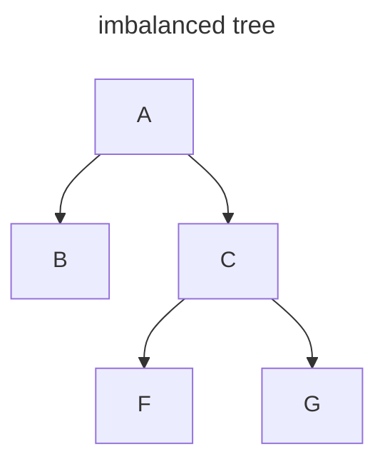
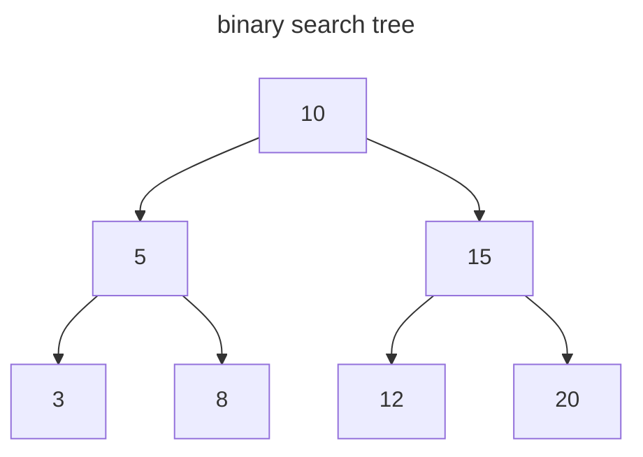

# Binary Search Tree

## Other Data Structure

- ordered array
  - search: O(n) binary search
  - insertion: O(n) worst case
  - deletion: O(n) worst case
- hash table
  - search: O(1)
  - insertion: O(1)
  - deletion: O(1)
  - but hash table is unordered

## Concept

- 平衡树（balanced tree）：所有子树的节点数都相同。如图所示：



- 不平衡树（imbalanced tree）：有子树的节点数不相同。如图所示：



- 二叉树（binary tree）：每个节点只有 0 / 1 / 2 个子节点。

- 二叉搜索树（binary search tree）：
  - 每个节点最多只有 1 个左子节点和 1 个右子节点。
  - 左子节点的值小于节点值，右子节点的值大于节点值。
  - 节点值大于所有属于左子树的后代节点值，节点值小于所有属于右子树的后代节点值。



## 查找

- 当平衡树有 `N` 个节点时，它有 `logN` 层。因为二叉搜索树每次查找都向下移动一层，因此它的时间复杂度和层数一样，是 `O(logN)`。

- 在查找方面，二叉搜索树和有序数组的时间复杂度都是 `O(logN)`。

## 插入

有序数组插入操作的时间复杂度：

- 使用二分查找确定位置，时间复杂度为：O(logN)。
- 如果在数组的开头插入数据，那么后面的数据都需要向后移动一位，时间复杂度为：O(N)。
- 总和：O(logN) + O(N) = O(N)。

二叉搜索树插入操作的时间复杂度：

- 确定位置：时间复杂度为：O(logN)。
- 不需要移动其他节点的位置，因此总时间复杂度为 O(logN)。

## 线性结构的树

> Book: A Common-Sense Guide to DSA: p259 - p260

线性结构的树指的是节点值从上到下是有序的。如图所示：


线性结构的树在查找方面的时间复杂度是 `O(N)`。

## 删除

> A Common-Sense Guide to DSA: p260 - 271

二叉查找树的删除操作的时间复杂度是 `O(logN)`。

### 算法

- 如果待删除的节点没有子节点，则直接删除。
- 如果待删除的节点只有一个子节点，则该子节点替代待删除节点，然后删除待删除节点。
- 如果待删除的节点有两个子节点，就需要先寻找后续节点（successor node）：后续节点是待删除节点的右子树中的最小值。然后分两种情况处理：
  - 后续节点没有右子节点：后续节点替换待删除节点
  - 后续节点有右子节点：后续节点替换待删除节点，并且后续节点的右子节点作为后续节点的原父节点的右子节点。

### 代码

```js
// delete operation in binary search tree
export default function deleteNode(valueToDelete, node) {
  if (node === null) {
    return null
  } else if (valueToDelete < node.value) {
    node.leftNode = deleteNode(valueToDelete, node.leftNode)
    return node
  } else if (valueToDelete > node.value) {
    node.rightNode = deleteNode(valueToDelete, node.rightNode)
    return node
  } else if (valueToDelete === node.value) {
    // 处理三种情况：
    // 1. 当前节点没有左子节点
    // 2. 当前节点没有右子节点
    // 3. 当前节点没有子节点
    if (node.leftNode === null) {
      return node.rightNode
    } else if (node.rightNode === null) {
      return node.leftNode
    } else {
      // 处理当前节点有两个子节点的情况
      node.rightNode = lift(node.rightNode, node)
      return node
    }
  }
}

function lift(node, nodeToDelete) {
  if (node.leftNode) {
    // 寻找可以替换待删除节点的节点（即 successor node）：
    // 1. 大于待删除节点的值
    // 2. 步骤-1 中所有节点的最小值
    node.leftNode = lift(node.leftNode, nodeToDelete)
    return node
  } else {
    // 将 successor node 的右子节点当作 successor node 的原父节点的右子节点
    nodeToDelete.value = node.value
    return node.rightNode
  }
}
```

## 遍历

> Book: A Common-Sense Guide to DSA: p272 - p277

树的遍历的时间复杂度是 `O(N)`。

### 中序遍历 inorder traverse

根节点的遍历顺序位于中间：遍历左子树，然后根节点，最后右子树。

```js
// inorder traverse in tree
export function traverse(node) {
  // base case
  if (node === null) {
    return
  }

  traverse(node.leftNode)
  console.log(node.value)
  traverse(node.rightNode)
}
```

### 前序遍历 preorder traverse

根节点的遍历顺序位于最前：遍历根节点，然后左子树，最后右子树。

```js
// preorder traverse in tree
export function preorderTraverse(node) {
  // base case
  if (node === null) {
    return
  }

  console.log(node.value)
  preorderTraverse(node.leftNode)
  preorderTraverse(node.rightNode)
}
```

### 后序遍历 postorder traverse

根节点的遍历顺序位于最后：遍历左子树，然后右子树，最后根节点。

```js
// postorder traverse in tree
export function postorderTraverse(node) {
  // base case
  if (node === null) {
    return
  }

  postorderTraverse(node.leftNode)
  postorderTraverse(node.rightNode)
  console.log(node.value)
}
```
