# Binary Tree

## Binary Tree

### 概念

二叉树（binary tree）：每个节点最多有两个子节点，即每个节点可以有 0 / 1 / 2 个子节点。

### 例子

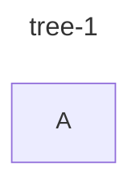

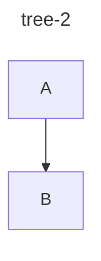

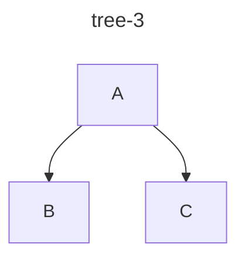

## Full Binary Tree

> [wiki](https://en.wikipedia.org/wiki/Binary_tree#:~:text=A-,full%20binary%20tree,-(sometimes%20referred%20to)

### 概念

- 满二叉树（full binary tree）：每个节点都有零个或两个子节点。
- full binary tree 又称作 proper / plane / strict binary tree。

### 例子

- tree-1 是满二叉树，因为每个节点都有零个或两个子节点。

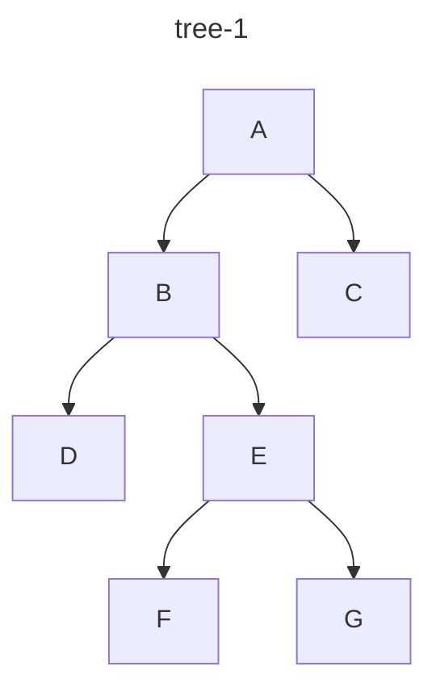

- tree-2 不是满二叉树，因为节点 C 只有一个子节点。

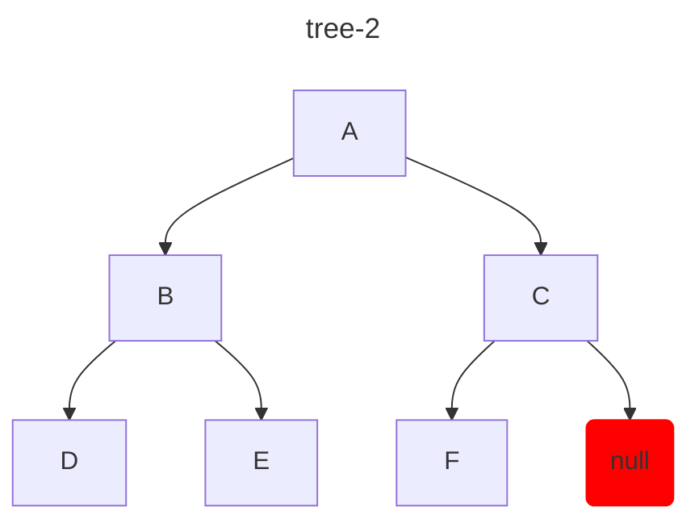

## Perfect Binary Tree

> [Blog](https://www.programiz.com/dsa/perfect-binary-tree)

### 概念

完美二叉树（perfect binary tree）：所有内部节点（即有子节点的节点）都有两个子节点且所有叶子节点都在同一层。

### 例子

- 单个节点也属于完美二叉树，如 tree-1：

- tree-2 属于完美二叉树，因为所有内部节点（A）都有两个子节点且所有叶子节点（B/C）都在同一层。

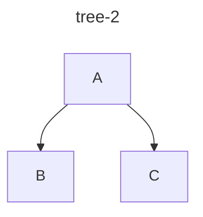

- tree-3 属于完美二叉树，因为所有内部节点（A/B/C）都有两个子节点且所有叶子节点（D/E/F/G）都在同一层。

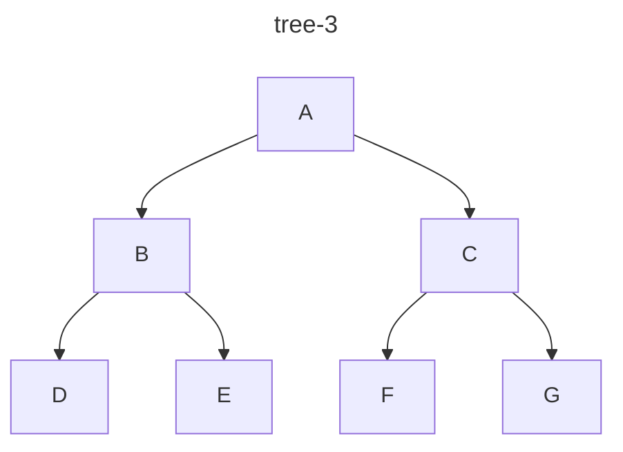

## Complete Binary Tree

> - [blog-1](https://www.interviewcake.com/concept/java/complete-binary-tree)
> - [blog-2](https://www.programiz.com/dsa/complete-binary-tree)

### 概念

完全二叉树（complete binary tree）需要满足两个条件：
1. 除了最后一层，其他层的节点都是满的，没有空余的位置。
2. 最后一层的节点必须尽量的向左靠拢，节点的左边不能存在空余的位置。

::: tip
满二叉树一定是完全二叉树，但完全二叉树不一定是满二叉树。
:::

### 例子

- tree-1 是完全二叉树，满足了完全二叉树的两个条件。

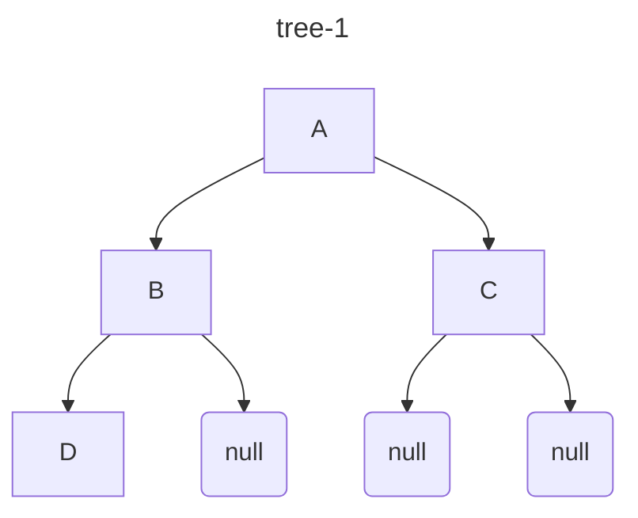

- tree-2 不是完全二叉树，没有满足完全二叉树的第一个条件。

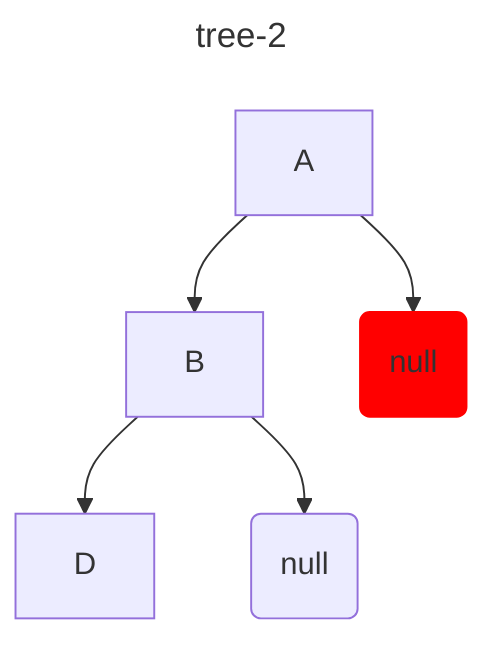

- tree-3 不是完全二叉树，没有满足完全二叉树的第二个条件。

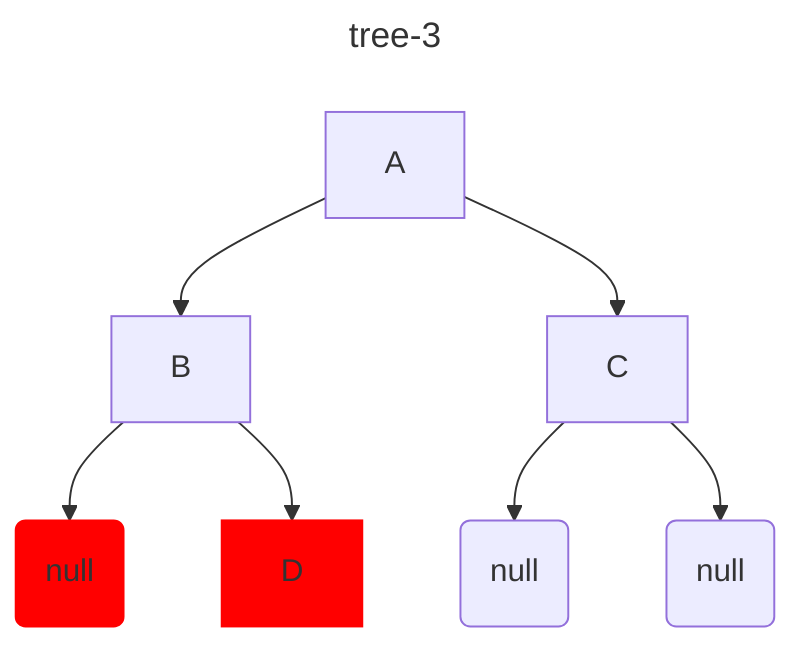

### 规律-1

- 用数组表示二叉树结构，假设 N 为节点的总数，`Math.floor(N / 2) - 1` 为最后一个非叶子节点的索引。
- 最后一个非叶子节点的索引：`Math.floor(6 / 2) - 1 = 2`。

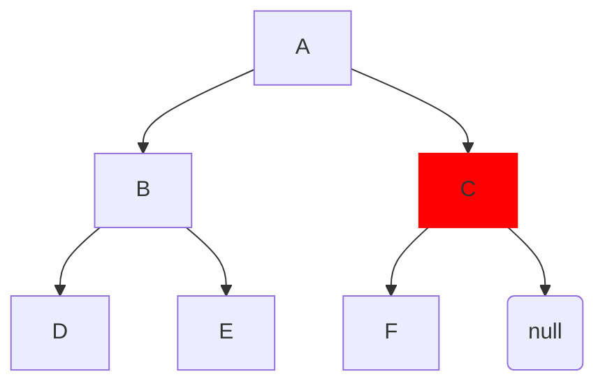

## Balanced Binary Tree

### 概念

平衡二叉树（balanced binary tree）又称为高度平衡二叉树（height-balanced binary tree），指的是每个内部节点的左子树和右子树的高度差不超过 1。

### 例子

- tree-1 是平衡二叉树：
  - A 的左右子树的高度差为 $|1 - 1| = 0$
  - B 的左右子树的高度差为 $|0 - 0| = 0$
  - C 的左右子树的高度差为 $|0 - 0| = 0$

- tree-2 是平衡二叉树：
  - A 的左右子树的高度差为 $|1 - 0| = 1$
  - B 的左右子树的高度差为 $|0 - 0| = 0$

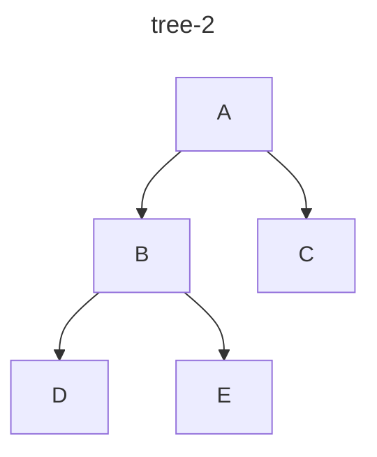

- tree-3 不是平衡二叉树：
  - A 的左右子树的高度差为 $|2 - 0| = 2$
  - B 的左右子树的高度差为 $|1 - 0| = 1$

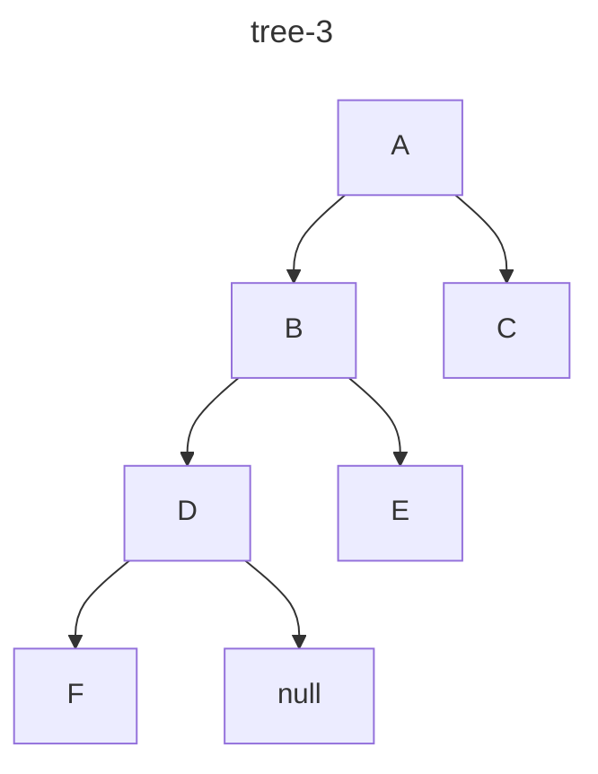

## Degenerate Tree

### 概念

- 退化树（degenerate tree）指的是每个内部节点只有一个子节点，形成类似单链表的结构。
- 退化树又称为 pathological tree。

### 例子

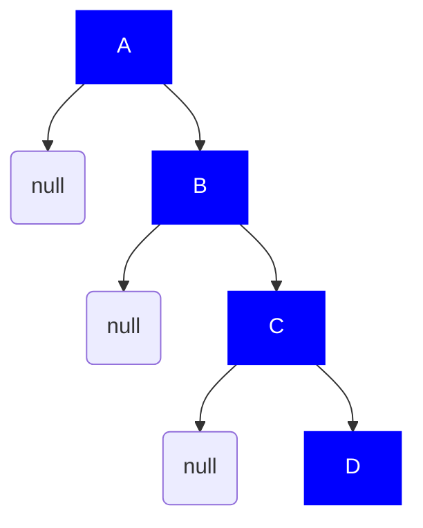
