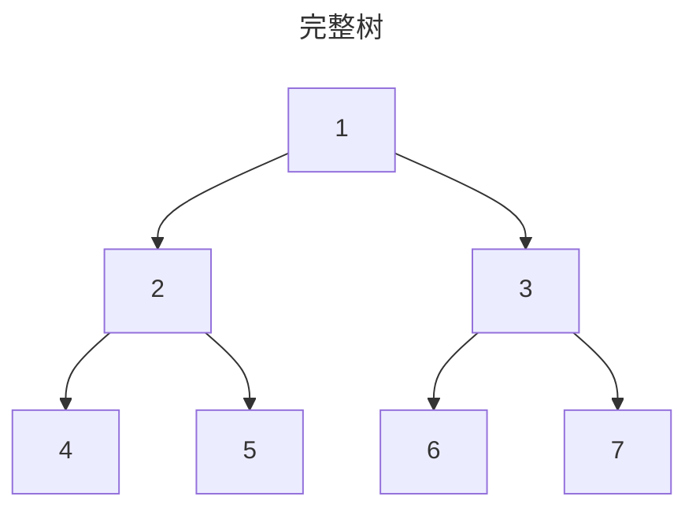
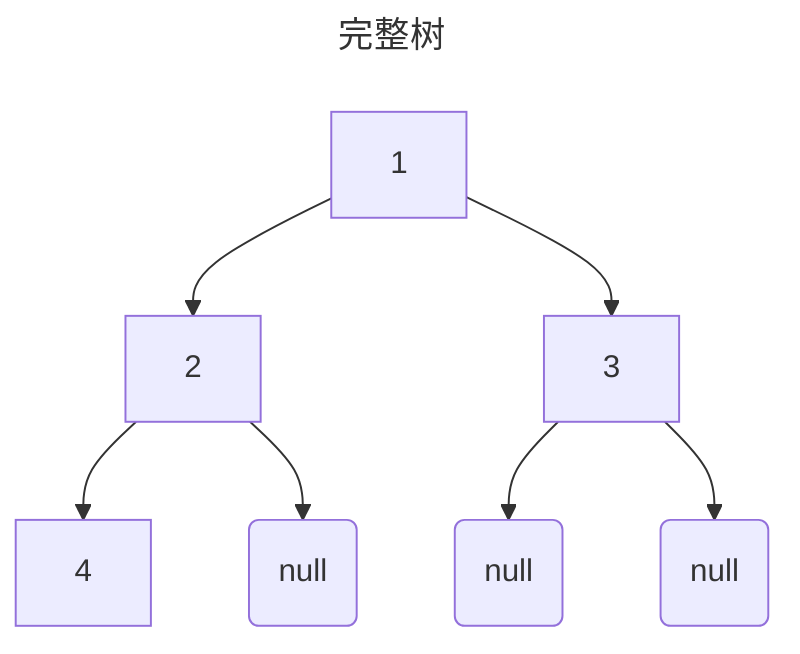
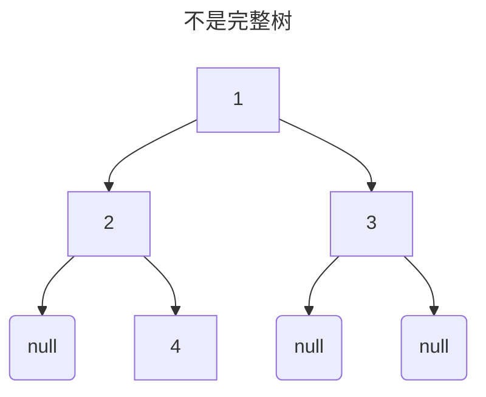
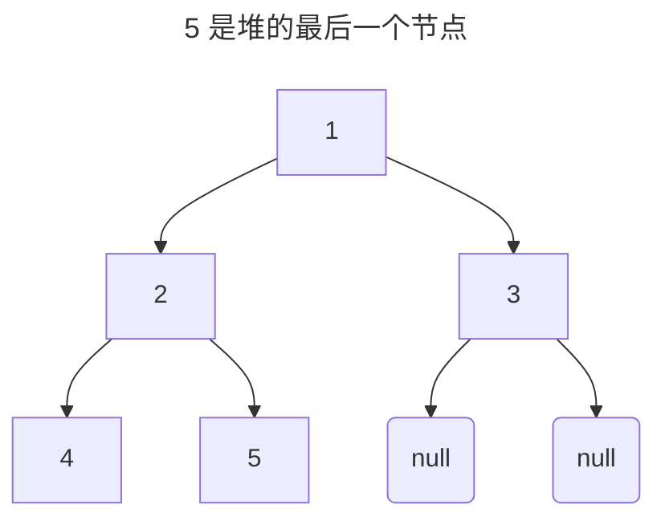
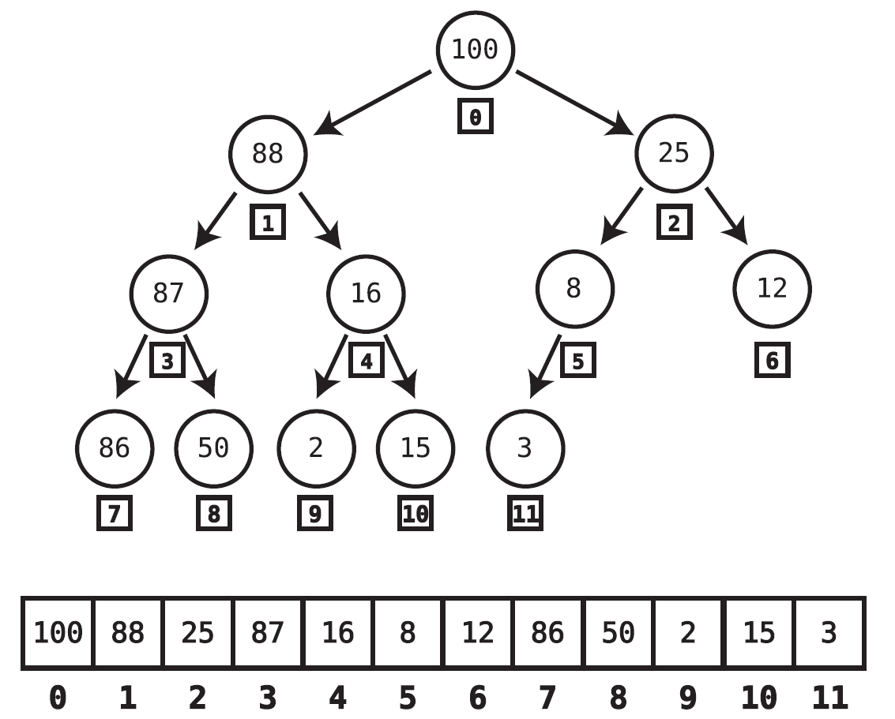

# Priority Queue

## 优先队列的特点

> Book: A Common-Sense Guide to DSA: p279

- 优先队列的删除和访问操作和队列相同。
- 优先队列的插入操作和有序数组相同。

## 使用数组实现优先队列的缺点

> Book: A Common-Sense Guide to DSA: p281

- 插入操作的时间复杂度为 `O(N)`，因为需要移动元素。

## 关于二叉堆

> Book: A Common-Sense Guide to DSA: p281

- 二叉堆（binary heap）是一种特殊的二叉树。
- 二叉堆分为两种：
  - 大根堆（max-heap）：每个节点的值都比它的子孙节点的值大。
  ```mermaid
  ---
  title: 大根堆
  ---
  flowchart TB
  7 --> 5
  7 --> 6
  5 --> 1
  5 --> 2
  6 --> 3
  6 --> 4
  ```
  - 小根堆（min-heap）：每个节点的值都比它的子孙节点的值小。
  ```mermaid
  ---
  title: 小根堆
  ---
  flowchart TB
    1 --> 2
    1 --> 3
    2 --> 4
    2 --> 5
    3 --> 6
    3 --> 7
  ```

- 二叉堆的特点：
  - 每个节点的值都比它的子孙节点的值大，这个规则称为堆条件（heap condition）。
  - 树必须是完整的。

- 完整树的定义：
  - 除了最后一层，其他层没有空节点。
  - 最后一层的节点尽可能往左靠。







> Book: A Common-Sense Guide to DSA: p284

堆的最后一个节点：堆的最低层的最右边的节点。



## 二叉堆的插入操作

### 算法

> Book: A Common-Sense Guide to DSA: p285

1. 生成新节点，让这个节点成为二叉堆的最后一个节点。
2. 比较新节点和它的父节点，如果新节点的值比它的父节点的值大，则交换新节点和它的父节点。
3. 重复第二步。

### 时间复杂度

> A Common-Sense Guide to DSA: p287

二叉树插入算法的时间复杂度为 `O(logN)`。主要执行的是插入算法第二步，因为对于 `N` 个节点来说，堆的高度为 `log(N)`。

### 实现

> Book: A Common-Sense Guide to DSA: p298 - p299

> [complete code](https://github.com/Eathyn/BOOK-a-common_sense-guide-to-DSA/blob/main/16_heap/heap.js#L28)

```js
function insert(value) {
  this.data.push(value)

  // 堆中只有一个根节点，不需要进行交换操作
  if (this.data.length === 1) {
    return
  }
  
  let newNodeIndex = this.data.length - 1
  let parentIndex = this.parentIndex(newNodeIndex)

  // 如果新节点比它的父节点大，则交换值
  while (this.data[newNodeIndex] > this.data[parentIndex]) {
    // 交换新节点和它的父节点的值
    [this.data[newNodeIndex], this.data[parentIndex]] = [this.data[parentIndex], this.data[newNodeIndex]]

    // 更新新节点和父节点索引，用于下一次比较
    newNodeIndex = parentIndex
    parentIndex = this.parentIndex(newNodeIndex)
  }
}
```

## 二叉堆的删除操作

### 算法

> Book: A Common-Sense Guide to DSA: p288 - p290

1. 堆的最后一个节点代替根节点作为新的根节点。
2. 比较新的根节点的左右子节点，获取较大的子节点。新的根节点与值较大的子节点替换。
3. 重复步骤二直到新的根节点的值比左右子节点都大。

### 时间复杂度

> Book: A Common-Sense Guide to DSA: p292

二叉树删除算法的时间复杂度为 `O(logN)`。主要执行的是删除算法第二步，因为对于 `N` 个节点来说，堆的高度为 `log(N)`。

### 实现

> Book: A Common-Sense Guide to DSA: p299 - p300

> [complete code](https://github.com/Eathyn/BOOK-a-common_sense-guide-to-DSA/blob/main/16_heap/heap.js#L50)

```js
function deleteOperation() {
  // 堆没有节点时不进行后续操作
  if (this.data.length === 0) {
    return
  }

  // 堆的最后一个节点代替根节点作为新的根节点
  this.data[0] = this.data.pop()
  let currentNodeIndex = 0

  // 新的根节点与值较大的子节点替换
  while (this.hasGreaterChild(currentNodeIndex)) {
    const childIndex = this.calculateLargerChildIndex(currentNodeIndex)
    [this.data[currentNodeIndex], this.data[childIndex]] = [this.data[childIndex], this.data[currentNodeIndex]]
    // 交换后需要更新 currentNodeIndex
    currentNodeIndex = childIndex
  }
}

// 判断节点的左或右子节点是否大于它
function hasGreaterChild(index) {
  const currentNode = this.data[index]
  const leftChild = this.leftChildIndex(index)
  const rightChild = this.rightChildIndex(index)
  return currentNode < leftChild || currentNode < rightChild
}

// 获取较大的子节点
function calculateLargerChildIndex(index) {
  const leftChild = this.data[this.leftChildIndex(index)]
  const rightChild = this.data[this.rightChildIndex(index)]
  return leftChild >= rightChild ? this.leftChildIndex(index) : this.rightChildIndex(index)
}
```

## 使用数组实现堆

> Book: A Common-Sense Guide to DSA: p295

堆可以使用数组来实现，这种实现方式可以很快地找到堆的最后一个节点：



### 遍历

> Book: A Common-Sense Guide to DSA: p297, p298

使用数组实现的堆不像树的数据结构一样通过内存地址找到左右子节点，但是可以通过以下的规则确定左右子节点和父节点：

- 左子节点：`index * 2 + 1`
- 右子节点：`index * 2 + 2`
- 父节点：`(index - 1) / 2`（去除小数位）
