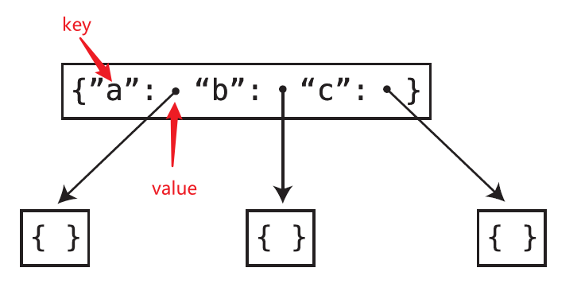
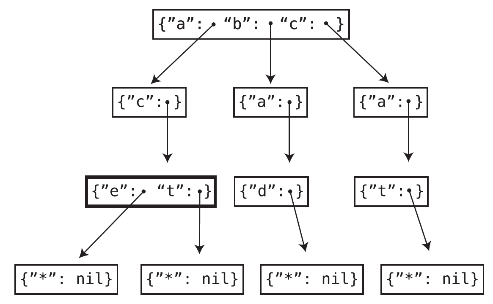
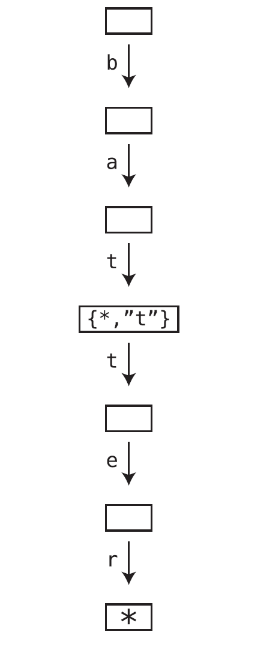

# Tire

## 介绍

- tire 可用于文本的自动完成和自动修正。
- tire 属于树的一种。
- tire 来源于单词 retrieval。
- tire 的发音理论上是 tree，但这与 tree 混淆了，所以很多人把 tire 发音为 try。
- tire 的其他名字为 prefix tree（前缀树）或 digital tree（字典树）。

## 数据结构

- 字典树节点可以拥有多个子节点。
- 字典树节点是一个哈希表，键是字母，值是另一个字典树节点。



## 存储方式

单词的最后一个字母的值是一个哈希表，这个哈希表的键是星号（*），值是空值（null）。



单词可能是另一个单词的一部分。



## 搜索

### 方式

> Book: A Common-Sense Guide to DSA: p311

- 搜索单词是否在字典树中
- 搜索单词是否为某个单词的前缀（以下算法和代码根据这种搜索）

### 算法

> Book: A Common-Sense Guide to DSA: p311

1. 声明 currentNode 变量，该变量指向字典树的根节点。
2. 遍历单词的字母
   - 如果当前节点的哈希表中无法找到该字母，则说明单词不在字典树中。
   - 如果找到该字母，则 currentNode 向下移动一位，开始遍历单词的下一个字母。

### 实现

```javascript
function search(word) {
 let currentNode = this.root
 for (const char in word) {
   if (currentNode.hasOwnProperty(char)) {
     currentNode = currentNode.children[char]
   } else {
     return
   }
 }
 // 返回 currentNode 用于实现自动完成功能
 return currentNode
}
```

### 时间复杂度

> Book: A Common-Sense Guide to DSA: p315 - p316

- 不是 O(1)：这个算法的时间复杂度不是 O(1)，因为算法的执行次数不是固定的，而是取决于单词的字母个数。
- 不是 O(N)：O(N) 的含义是算法的执行次数随着单词数量的增加而增加。
- O(K)：O(K) 的含义是算法的执行次数随着要查找单词的字母数量的增加而增加。
- 如果使用数组有序地保存所有单词，那么查找操作的时间复杂度是 O(logN)，相比于 O(K) 较慢。

## 插入

### 算法

> Book: A Common-Sense Guide to DSA: p316 - p319

1. 创建 currentNode 变量指向字典树的根节点。
2. 从要查找单词的第一个字母开始遍历，如果 currentNode 指向的哈希表有这个字母，则 currentNode 向下移动一位。否则在当前哈希表中添加键值对，键是找不到的字母，值是新的哈希表。
3. 重复步骤二直到结束遍历。
4. 结束后添加键值对，键是 *，值是 null。

### 实现

```js
function insert(word) {
   let currentNode = this.root
   for (const char of word) {
      if (currentNode.children.hasOwnProperty(char)) {
        currentNode = currentNode.children[char]
      } else {
        currentNode.children[char] = new TireNode()
        currentNode = currentNode.children[char]
      }

      // 代码优化
      // if (!currentNode.children.hasOwnProperty(char)) {
      //    currentNode.children[char] = new TireNode()
      // }
      // currentNode = currentNode.children[char]
   }
   currentNode.children['*'] = null
}
```

### 时间复杂度

和搜索算法的时间复杂度一样

## 自动完成算法

### 初级算法

遍历字典树，把所有单词保存到数组中，返回这个数组。

```js
function collectAllWords(node = null, word = '', words = []) {
  let currentNode = node || this.root
  for (const char in currentNode.children) {
    if (char === '*') {
      words.push(word)
    } else {
      this.collectAllWords(currentNode.children[char], `${word}${char}`, words)
    }
  }
  return words
}
```
