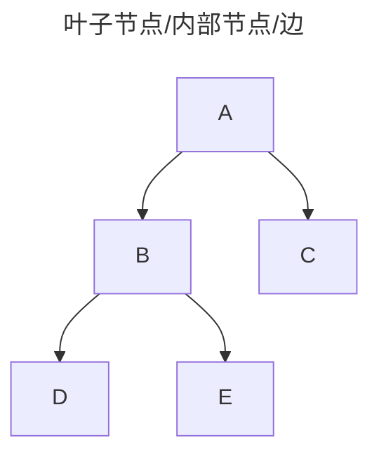
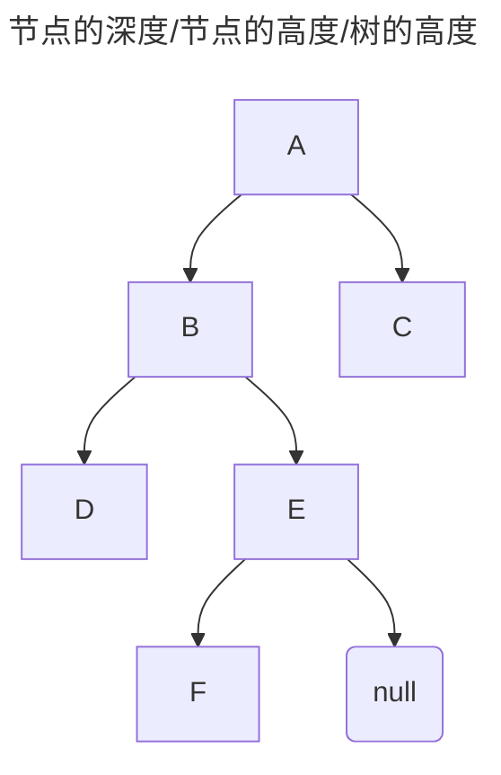

# Tree

## Terminology

### Leaf and Internal Node / Edge
 
> Ref: [leaf node, external node, edge](https://www.programiz.com/dsa/trees)

- 叶子节点（leaf node）/ 外部节点（external node）：没有子节点的节点（D/E/C）。

- 内部节点（internal node）：至少有一个子节点的节点（A/B）。

- 边（edge）：连接两个节点的链接。

### Depth and Height of Node / Height of Tree

> Ref: [height and depth of node](https://www.geeksforgeeks.org/height-and-depth-of-a-node-in-a-binary-tree/)

- 节点的深度：根节点到该节点的路径上出现的边（edge）的数量。
  - A 的深度是 0。因为根节点到 A 的路径上出现的边的数量为 0。
  - B 的深度是 1。因为根节点到 B 的路径上出现的边的数量为 1。
  - F 的深度是 3。因为根节点到 F 的路径上出现的边的数量为 3。

- 节点的高度：该节点到任意叶子节点（leaf node）的最长路径上出现的边（edge）的数量。
  - A 的高度是 3。因为 A 到 F 的路径上出现的边的数量为 3。
  - C 的高度是 0。因为 C 到 C 的路径上出现的边的数量为 0。

- 树的高度：根节点的高度或最深的节点的深度。
  - 下图的树的高度是 3。

