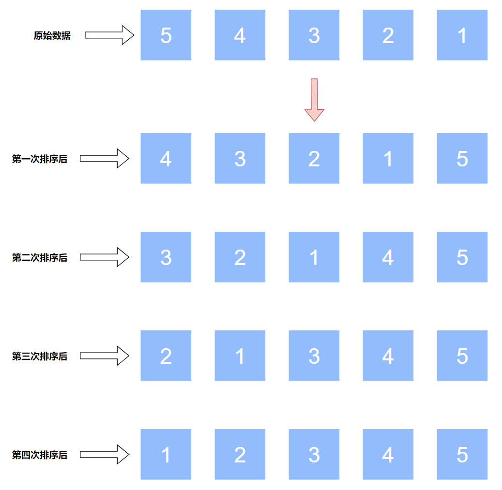

# Bubble Sort

## 原理

遍历数组，如果前一位大于后一位，则交换位置，否则不交换位置。

## 实现

```js
function bubbleSort(arr) {
  for (let i = 0; i < arr.length; i++) {
    for (let j = 0; j < arr.length; j++) {
      if (arr[j] > arr[j + 1]) {
        [arr[j], arr[j + 1]] = [arr[j + 1], arr[j]]
      }
    }
  }
}
```

## 优化-1

- 外层循环只需要 `arr.length - 1` 次，因为到第 `n - 1` 次时已经排序好了。



- 内层循环只需要 `arr.length - 1` 次，如果将 `j < arr.length - 1` 改成 `j < arr.length`；那么 `arr[j + 1]` 就超过了数组范围。

```js
function bubbleSort(arr) {
  // 到第 `n - 1` 次时已经排序好了
  for (let i = 0; i < arr.length - 1; i++) {
    // 如果改成 j < arr.length；那么 arr[j + 1] 就超过了数组范围
    for (let j = 0; j < arr.length - 1; j++) {
      if (arr[j] > arr[j + 1]) {
        [arr[j], arr[j + 1]] = [arr[j + 1], arr[j]]
      }
    }
  }
}
```

## 优化-2

- 每次外循环结束后，会形成已排序部分和未排序部分。例如，对于数组 `[5,4,3,2,1]`，第一次外循环结束后数组变为 `[4,3,2,1,5]`。`[4,3,2,1]` 称为未排序部分，`[5]` 称为已排序部分；第二次外循环结束后数组变为 `[3,2,1,4,5]`。`[3,2,1]` 称为未排序部分，`[4,5]` 称为已排序部分。
- 因为已排序部分不需要参与到以后的比较操作中，所以内层循环从 `for (let j = 0; j < arr.length - 1; j++)` 改为 `for (let j = 0; j < i; j++)`，并且外层循环要使用降序的方式，从 `for (let i = 0; i < arr.length - 1; i++)` 改为 `for (let i = arr.length - 1; i > 0; i--)`。

```js
function bubbleSort_2(arr) {
  // 外层循环要使用降序的方式
  for (let i = arr.length - 1; i > 0; i--) {
    // 已排序部分不需要参与到以后的比较操作中
    for (let j = 0; j < i; j++) {
      if (arr[j] > arr[j + 1]) {
        [arr[j], arr[j + 1]] = [arr[j + 1], arr[j]]
      }
    }
  }
}
```

## 优化-3

- 如果在某次内层循环中，没有执行过 `if (arr[j] > arr[j + 1])`，说明每一次比较中，前一个值总是小于后一个值，即数组是升序的或已排序的。那么就不需要执行后续的外层循环了。
- 在外层循环中增加 `isSorted` 标记，如果已排序，则不再执行后续的外层循环。

```js
function bubbleSort(arr) {
  for (let i = arr.length - 1; i > 0; i--) {
    // 标记
    let isSorted = true
    for (let j = 0; j < i; j++) {
      if (arr[j] > arr[j + 1]) {
        [arr[j], arr[j + 1]] = [arr[j + 1], arr[j]]
        isSorted = false
      }
    }
    // 如果已排序，则不再执行后续的外层循环
    if (isSorted) {
      break
    }
  }
}
```

## 时间复杂度

- 最坏的情况是数组是降序的，需要 `O(N^2)` 次比较和 `O(N^2)` 次交换。因此时间复杂度为 `O(N^2)`。
- 最坏的情况是数组是升序的，采用 `优化-3` 中的算法，只需要 `O(N)` 次比较。因此时间复杂度为 `O(N)`。
