# Quick Sort

## 原理

> Reference: A Common-Sense Guide to DSA: p199-202

1. 分区（partition）：选择一个基准点（pivot），排序后基准点左边（即左分区）的数据都小于它，基准点右边（即右分区）的数据都大于它。
2. 对左分区和右分区递归地执行步骤一，直到左分区和右分区只有一个元素。

::: tip 翻译
- pivot: a fixed point supporting something that turns or balances.
- partition: one of the parts or sections of a whole.
:::

## 分区

### 原理

> Reference: A Common-Sense Guide to DSA: p199-202

1. 如果 leftIndex 指向的值小于 pivotIndex 指向的值，则 leftIndex 指针向右移动一位。
2. 如果 rightIndex 指向的值大于 pivotIndex 指向的值，则 rightIndex 指针向左移动一位。
3. 如果 leftIndex 小于 rightIndex，则交换 leftIndex 指向的值和 rightIndex 指向的值。然后递归执行赋值操作、步骤一、步骤二。
4. 如果 leftIndex 大于或等于 rightIndex，则交换 leftIndex 指向的值和 pivotIndex 指向的值，完成排序，这时候 pivotIndex 指向的值比左分区的所有值大，比右分区的所有值小，即左分区的所有值比右分区的所有值小。

### 图解

> Reference: A Common-Sense Guide to DSA: p199-202

- pivotIndex 指向最后一个值（3），leftIndex 指向第一个值（0），rightIndex 指向 pivotIndex 左边的值（6）。


- 因为 leftIndex 指向的值（0）小于 pivotIndex 指向的值（3），所以 leftIndex 向右移动一位。

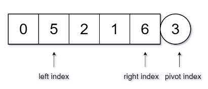

- 因为 leftIndex 指向的值（5）大于 pivotIndex 指向的值（3），所以 leftIndex 暂停移动。


- 因为 rightIndex 指向的值（6）大于 pivotIndex 指向的值（3），所以 rightIndex 向左移动一位。


- 因为 rightIndex 指向的值（1）小于 pivotIndex 指向的值（3），所以 rightIndex 暂停移动。


- 因为 leftIndex（1）小于 rightIndex（3），所以 leftIndex 指向的值（5）与 rightIndex 指向的值（1）交换位置。


- 因为 leftIndex 指向的值（1）小于 pivotIndex 指向的值（3），所以 leftIndex 向右移动一位。


- 因为 leftIndex 指向的值（2）小于 pivotIndex 指向的值（3），所以 leftIndex 向右移动一位。


- 因为 leftIndex 指向的值（5）大于 pivotIndex 指向的值（3），所以 leftIndex 暂停移动。


- 因为 rightIndex 指向的值（5）大于 pivotIndex 指向的值（3），所以 rightIndex 向左移动一位。


- 因为 rightIndex 指向的值（2）小于 pivotIndex 指向的值（3），所以 rightIndex 暂停移动。


- 因为 leftIndex（3）大于 rightIndex（2），所以 leftIndex 指向的值（5）与 pivotIndex 指向的值（3）交换位置。


- 算法完成。此时 leftIndex 左边（即左分区）的数据（0,1,2）都小于 leftIndex 指向的值（3）；leftIndex 右边（即右分区）的数据（6,5）都大于 leftIndex 指向的值（3）。数值 3 位于正确的位置。

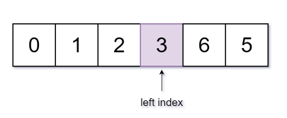

### 实现

> Reference: A Common-Sense Guide to DSA: p202-205

```js
function partition(arr, leftIdx = 0, rightIdx = arr.length - 2) {
  if (arr.length === 0) {
    console.error('the array is empty')
    return
  } else if (arr.length === 1) {
    console.error('the array only has one item')
    return
  }
  
  // 最后一个值设定为 pivotIndex
  const pivotIndex = arr.length - 1

  // leftIndex 为第一个值的索引
  let leftIndex = leftIdx

  // rightIndex 为倒数第二个值的索引
  let rightIndex = rightIdx

  // 如果 leftIndex 指向的值小于 pivotIndex 指向的值，则 leftIndex 指针向右移动一位
  while (leftIndex < arr.length - 1 && arr[leftIndex] < arr[pivotIndex]) {
    leftIndex++
  }

  // 如果 rightIndex 指向的值大于 pivotIndex 指向的值，则 rightIndex 指针向左移动一位
  while (rightIndex > -1 && arr[rightIndex] > arr[pivotIndex]) {
    rightIndex--
  }

  if (leftIndex < rightIndex) {
    // 如果 leftIndex 小于 rightIndex，则交换 leftIndex 指向的值和 rightIndex 指向的值
    [arr[leftIndex], arr[rightIndex]] = [arr[rightIndex], arr[leftIndex]]
    // 递归执行赋值操作、左指针的移动操作、右指针的移动操作
    partition(arr, leftIndex, rightIndex)
  } else {
    // 如果 leftIndex 大于或等于 rightIndex，则交换 leftIndex 指向的值和 pivotIndex 指向的值
    // 完成排序，这时候 pivotIndex 指向的值比左分区的所有值大，比右分区的所有值小，即左分区的所有值比右分区的所有值小。 
    [arr[leftIndex], arr[pivotIndex]] = [arr[pivotIndex], arr[leftIndex]]
  }
}
```

## 递归执行分区操作

### 原理

> Reference: A Common-Sense Guide to DSA: p205

- 经过一次分区操作后会形成左分区和右分区，分别对左右分区递归地执行分区操作，直到只有一项或没有项。

### 图解

> Reference: A Common-Sense Guide to DSA: p205-210

- 对数值 3 的左分区（0,1,2）递归地进行分区操作。leftIndex 指向 0，rightIndex 指向 1，pivotIndex 指向 2。

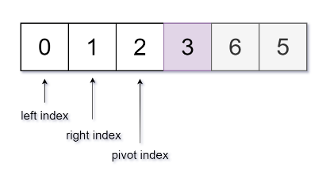

- 因为 leftIndex 指向的值（0）小于 pivotIndex 指向的值（2），所以 leftIndex 向右移动一位。

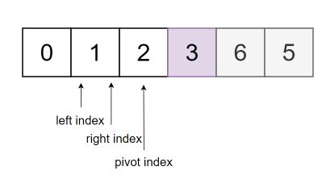

- 因为 leftIndex 指向的值（1）小于 pivotIndex 指向的值（2），所以 leftIndex 向右移动一位。

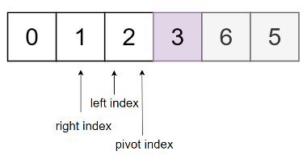

- 因为 leftIndex 指向的值（2）等于 pivotIndex 指向的值（2），所以 leftIndex 暂停移动。

- 因为 rightIndex 指向的值（1）小于 pivotIndex 指向的值（2），所以 rightIndex 暂停移动。

- 因为 leftIndex（2）大于 rightIndex（1），所以 leftIndex 指向的值（2）与 pivotIndex 指向的值（2）进行交换。数值 2 位于正确位置。

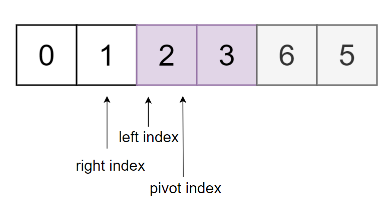

- 对数值（2）的左分区进行分区操作。leftIndex 和 rightIndex 指向 0，pivotIndex 指向 1。

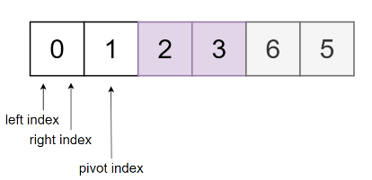

- 因为 leftIndex 指向的值（0）小于 pivotIndex 指向的值（1），所以 leftIndex 向右移动一位。

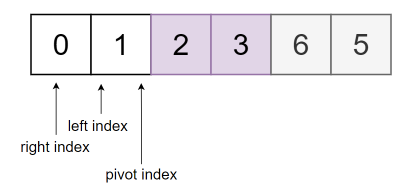

- 因为 leftIndex 指向的值（1）等于 pivotIndex 指向的值（1），所以 leftIndex 暂停移动。

- 因为 rightIndex 指向的值（0）小于 pivotIndex 指向的值（1），所以 rightIndex 暂停移动。

- 因为 leftIndex 大于 rightIndex，所以 leftIndex 指向的值（1）与 rightIndex 指向的值交换。数值 1 位于正确的位置。

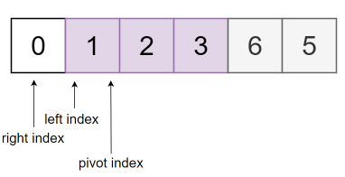

- 对数值 1 的左分区进行分区操作，leftIndex，rightIndex 和 pivotIndex 都指向 0。

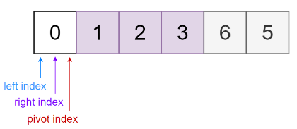

- 因为 leftIndex 指向的值（0）等于 pivotIndex 指向的值（0），所以 leftIndex 暂停移动。

- 因为 rightIndex 指向的值（0）等于 pivotIndex 指向的值（0），且 rightIndex 已经位于最左边的一位无法向左移动，所以 rightIndex 暂停移动。

- 因为 leftIndex 等于 rightIndex，所以交换 leftIndex 指向的值和 pivotIndex 指向的值。数值 0 位于正确的位置。

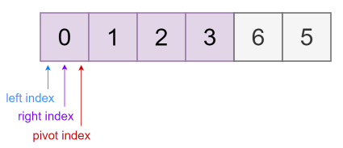

- 对数值 3 的右分区（6,5）递归地进行分区操作，过程与上述的过程类似，不再重复。

### 实现

> Reference: A Common-Sense Guide to DSA: p210-211

