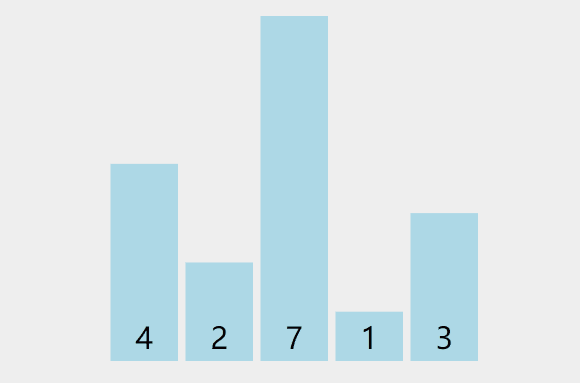

# Selection Sort

## 原理

从左到右进行遍历，获取最小值后与最开始进行遍历的地方交换值。



## 实现

- `i < arr.length - 1`：最后一项不需要排序

```js
function insertionSort(arr) {
  // `i < arr.length - 1`：最后一项不需要排序
  for (let i = 0; i < arr.length - 1; i++) {
    // `lowestNumberIndex`：每次最开始遍历的地方的索引
    let lowestNumberIndex = i
    for (let j = i + 1; j < arr.length; j++) {
      if (arr[j] < arr[lowestNumberIndex]) {
        lowestNumberIndex = j
      }
    }
    if (lowestNumberIndex !== i) {
      [arr[lowestNumberIndex], arr[i]] = [arr[i], arr[lowestNumberIndex]]
    }
  }
}
```

## 时间复杂度

## 空间复杂度

## 优化

## 时间复杂度

## 空间复杂度

## Refs

- _A Common-Sense Guide to DSA_: p63-p71
