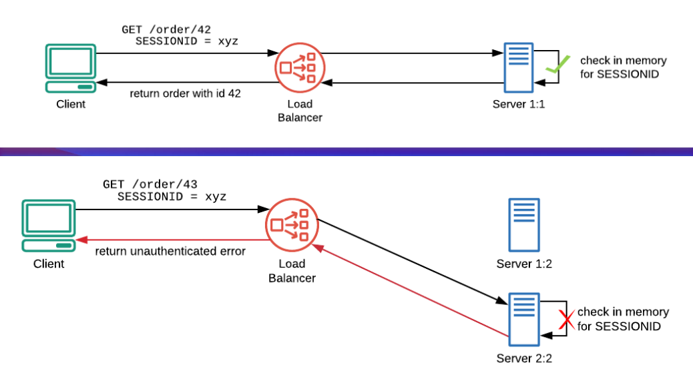
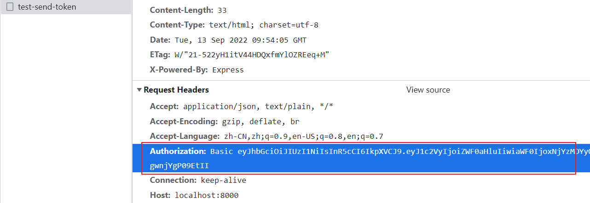

# JWT

## Why need JWT

- It's complicated to access sessions among multiple servers



## Process

1. the server generates a token
2. the server sends the token to the browser
3. the browser stores the token in the cookie or localStorage
4. the browser sends request with `Authorization` HTTP header which consists of [authorization schema](https://developer.mozilla.org/en-US/docs/Web/HTTP/Authentication#authentication_schemes) and token

## Differences between JWT and Session

- token is stored in the browser, session is stored in the server
- token is safer

## Demo

_front end_

```js
async function handleLogin() {
  const res = await request({
    url: '/login',
    method: 'post',
    headers: {
      'Content-Type': 'application/json',
    },
    data: JSON.stringify(account),
  })
  const { data } = res
  setToken(data.token)
  await router.push({ name: 'main' })
}

export const request = axios.create({
  baseURL: 'http://localhost:8000',
})

request.interceptors.request.use((config) => {
  if (getToken()) {
    config.headers.Authorization = `Basic ${getToken()}`
  }
  return config
}, (error) => {
  return Promise.reject(error)
})
```

_back end_

```js
const express = require('express')
const cookieParser = require('cookie-parser')
const jwt = require('jsonwebtoken')
const accounts = require('./accounts.js')

const app = express()
const port = 8000
const JWT_SECRET = 'jwt-secret'

app.use(cookieParser())
app.use(function(req, res, next) {
  res.setHeader('Access-Control-Allow-Origin', 'http://localhost:5173')
  res.setHeader('Access-Control-Allow-Methods', 'GET, POST, OPTIONS')
  res.setHeader('Access-Control-Allow-Headers', 'Content-Type, Authorization')
  next()
})
app.use(express.json())

function accountMatch(name, password) {
  let isMatch = false
  accounts.forEach((account) => {
    isMatch = account.name === name && account.password === password;
  })
  return isMatch
}

app.post('/login', (req, res) => {
  const { name, password } = req.body
  const isMatch = accountMatch(name, password)
  if (isMatch) {
    const token = jwt.sign({ user: 'eathyn' }, JWT_SECRET)
    res.status(200).send({ token })
  } else {
    res.status(401).send('Account or password is wrong.')
  }
})

app.listen(port, () => console.log(`server running at port ${port}...`))
```



## Refs

- [The Problem of Session](https://medium.com/swlh/why-do-we-need-the-json-web-token-jwt-in-the-modern-web-8490a7284482)
- [JWT Definition](http://www.ruanyifeng.com/blog/2018/07/json_web_token-tutorial.html)
- [JWT Demo](https://jsramblings.com/authentication-with-node-and-jwt-a-simple-example/)
- [Authentication Schemas](https://developer.mozilla.org/en-US/docs/Web/HTTP/Authentication#authentication_schemes)
- [Differences between JWT and Session](https://juejin.cn/post/6844904034181070861#heading-9)
- [Authentication Summary](https://juejin.cn/post/6844904034181070861)
- [JWT Code Repo](https://github.com/Eathyn/authentication/tree/jwt)
