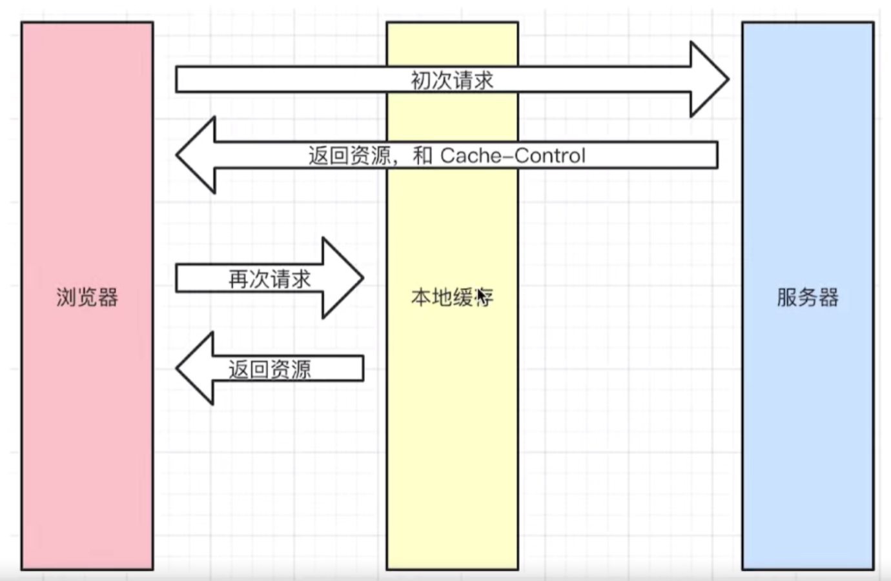
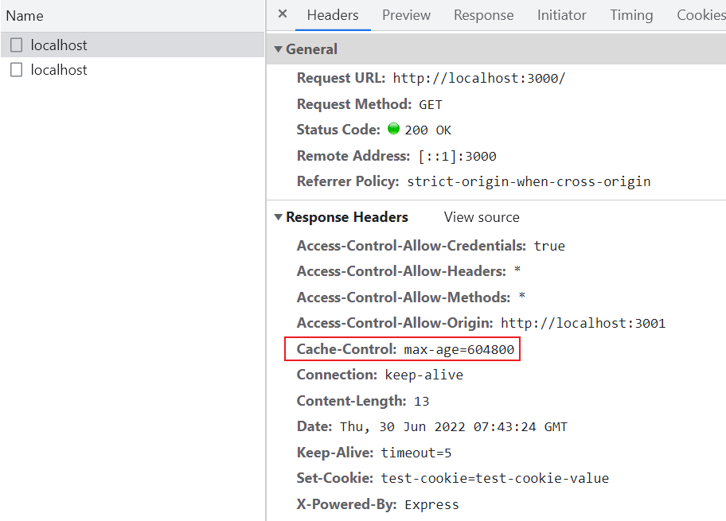
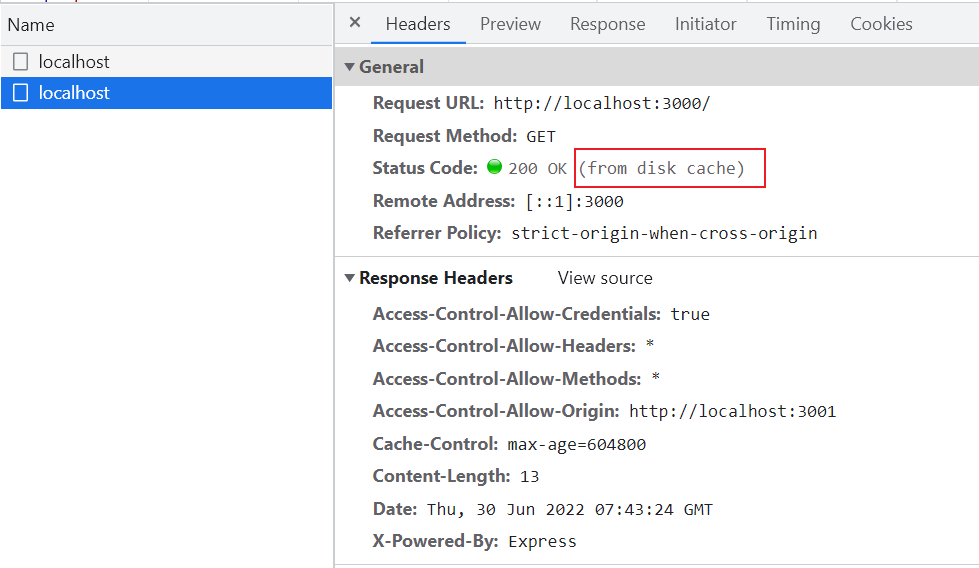
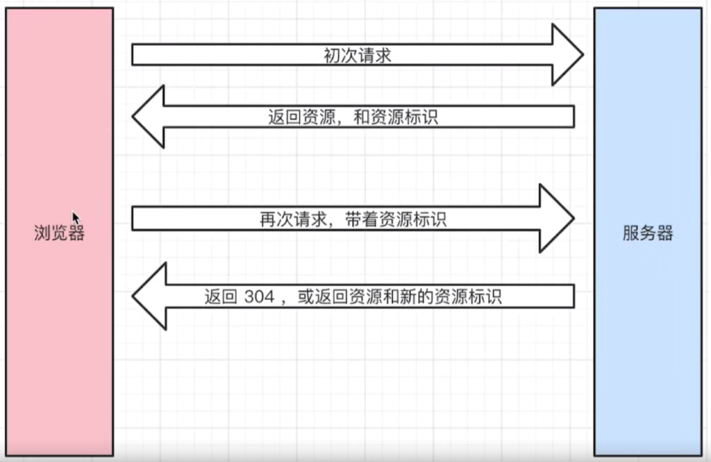
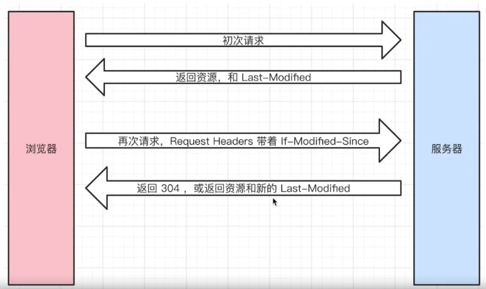
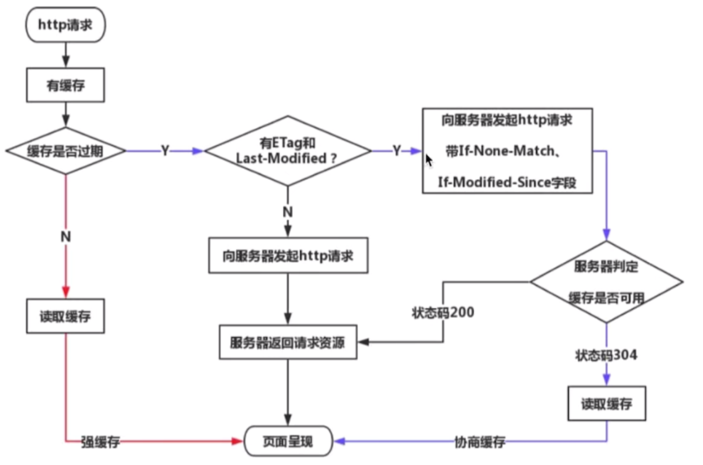

# Cache

## 原因

- 没有修改过的资源不需要重复向服务器获取，直接从缓存中获取可以更快地展示页面

## 强制缓存

### 概念

- 服务器设置 `Cache-Control`，后续针对该请求，浏览器直接从缓存中获取数据，不需要通过服务器



### 代码

- 前端

```js
function fetchData() {
  fetch('http://localhost:3000', {
    credentials: 'include',
  })
}
```

- 后端

```js
app.get('/', (req, res) => {
  res.set({
    'Cache-Control': 'max-age=604800',
  })
  res.end(JSON.stringify({
    a: 1,
    b: 2,
  }))
})
```

### 结果

- 第一次请求从服务器获取数据



- 第二次请求开始从缓存获取数据



### 注意

- 静态资源适合缓存，如图片
- Cache-Control : max-age=xx -> 在 xx 秒之内，数据从缓存里读取
- Cache-Control : no-store -> 数据从服务器读取
- Cache-Control : no-cache -> 数据没有改变就从缓存中读取，有改变则从服务器读取
- Cache-Control : private -> 数据只能缓存在用户的浏览器
- Cache-Control : public -> 数据可以缓存在浏览器和代理等中间设备

## 协商/对比缓存

### 概念

- 服务器判断浏览器缓存里的资源是否和服务器一致，若一致则返回 304，浏览器从缓存中获取资源；不一致则返回 200 和新资源



### 过程

#### Last-Modified / If-Modified-Since

- `Last-Modified` 和 `If-Modified-Since` 的值是表示时间的字符串

1. 浏览器初次请求，服务器返回资源和 `Last-Modified`，浏览器把该资源缓存下来
2. 浏览器再次请求时携带 `If-Modified-Since` 头部
3. 服务器收到请求后对比 `Last-Modified` 和 `If-Modified-Since`，如果两者相同说明资源没有更新，返回 304 响应状态码，浏览器从缓存中获取资源；如果两者不同说明资源已更新，返回新资源和新 `Last-Modified`



#### Etag / If-None-Match

- `Etag` / `If-None-Match` 的值是表示资源特定版本的标识符
- 过程与 `Last-Modified` 和 `If-Modified-Since` 类似

### 注意

- `Last-Modified` 没有 `Etag` 精准
- 优先选择 `Etag`，`Last-Modified` 作为备用方案

## 总结



## Refs

- [no-store vs. no-cache](https://developer.mozilla.org/en-US/docs/Web/HTTP/Headers/Cache-Control)

## Translation

- 强制缓存 : strong cache
- 协商缓存 : negotiation cache
