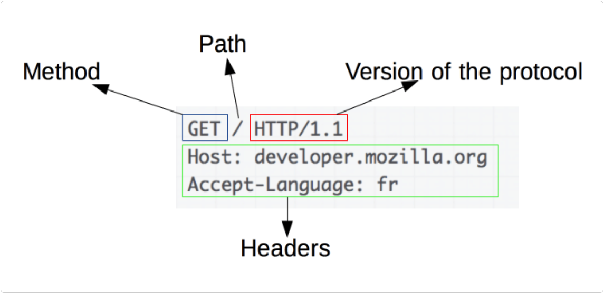
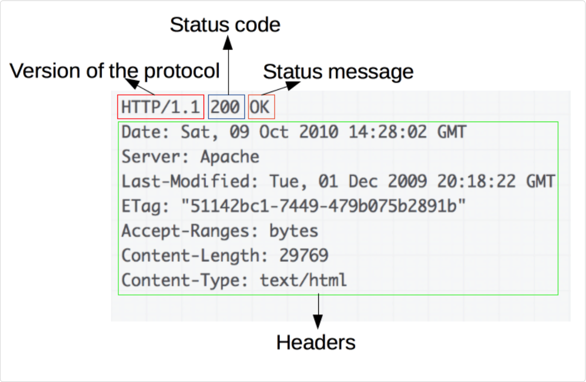

# HTTP Message

- two types of HTTP messages: request and response

### Request

- HTTP method
- resource path
- version of the protocol
- headers
- body

### Response

- version of the protocol
- status code
- status message
- headers
- body

## Refs

- [MDN: HTTP Overview](https://developer.mozilla.org/en-US/docs/Web/HTTP/Overview)
