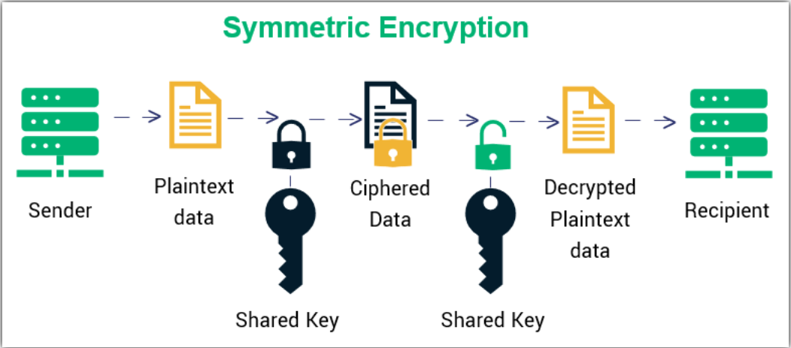
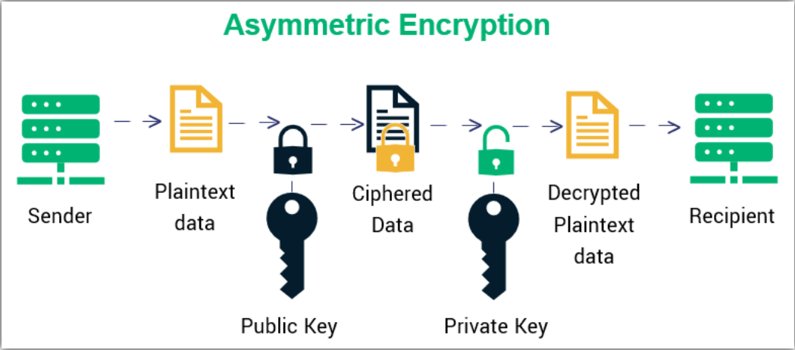
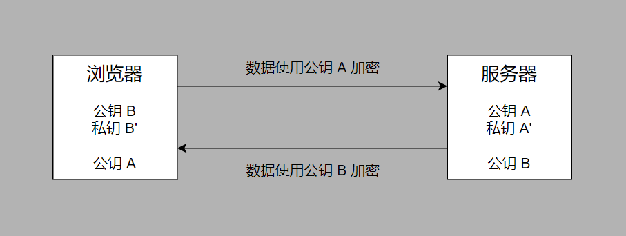

# HTTPS (Http Secure)

## 原因

- HTTP 使用明文传输，浏览器到服务器中间会经过很多其他设备，可能会被劫持，即中间人攻击

## HTTPS 的组成

- HTTPS = HTTP + 通信加密 + 证书 + 完整性保护
- HTTPS 是 HTTP 的加密版本，通信接口使用 TLS / SSL 代替

## 对称加密

### 概念

- 使用同一个密钥对信息进行加密和解密

### 缺点

- 服务器将密钥传输给浏览器的过程中可能会被劫持，然后攻击者就可以使用密钥解密信息

## 非对称加密

### 概念

- 用公钥加密的数据只能用私钥解开，用私钥加密的数据只能用公钥解开

### 过程

1. 服务器第一次通信时将公钥和使用私钥加密过的数据传给浏览器
2. 浏览器使用公钥将数据解密，获取未加密的数据
3. 浏览器使用公钥将数据进行加密并传给服务器
4. 服务器使用私钥将浏览器传递过来的数据进行解密

### 优点

- 攻击者就算把浏览器发送给服务器的数据劫持下来也无法解密，因为私钥只存在于服务器，即 B 端到 S 端的数据可以安全地传输

### 缺点

- 服务器将公钥传递给浏览器的过程中可能会被劫持，然后攻击者就可以使用公钥解密服务器发送给浏览器的数据，即 S 端到 B 端的数据无法安全地传输

## 非对称加密改良版

### 概念

- 使用两对公私钥，浏览器和服务器把各自的公钥发送给对方，使用各自的私钥加密数据，浏览器和服务器用对方的公钥解密数据

### 过程

1. 服务器有公钥 A 和私钥 A'，浏览器有公钥 B 和私钥 B'
2. 浏览器把公钥 B 发送给服务器，服务器把公钥 A 发送给浏览器
3. 服务器使用浏览器的公钥 B 加密数据并发送给浏览器，浏览器使用浏览器的私钥 B' 解密数据
4. 浏览器使用服务器的公钥 A 加密数据并发送给服务器，服务器使用服务器的私钥 A' 解密数据

### 优点

- 解决了非对称加密中服务器发送给浏览器的数据会被劫持的问题

### 缺点

- 非对称加密算法相比于对称加密慢很多

## 非对称加密 + 对称加密

### 过程

1. 服务器有公钥 A 和私钥 A'
2. 服务器将公钥 A 传给浏览器
3. 浏览器随机生成密钥 X，并使用服务器的公钥 A 加密 X 得到 X'，将 X' 传递给服务器
4. 服务器使用私钥 A' 解密 X'，获取浏览器的密钥 X
5. 此时浏览器和服务器都拥有密钥 X 且没有被中间人劫持，之后的通信可以使用对称加密

### 优点

- 只用了一次非对称加密，之后的通信都使用对称加密，性能获得了提升
- 由于密钥只有浏览器和服务器知道，所以两个方向的通信都是安全的

### 缺点

- 中间人劫持了服务器的公钥 A，然后用自己的公钥 B 代替服务器的公钥 A，从而获取浏览器要发送给服务器的密钥 X:
  1. 服务器有公钥 A 和私钥 A'，中间人有公钥 B 和私钥 B'
  2. 服务器传输给浏览器的公钥 A 被中间人劫持，然后中间人用自己的公钥 B 代替服务器的公钥 A 传给浏览器
  3. 浏览器误以为公钥 B 是服务器的公钥，随机生成密钥 X 并使用公钥 B 进行加密生成密钥 X'，然后把 X' 传给服务器
  4. 中间人劫持了浏览器传递给服务器的 X'，并使用私钥 B' 解密了密钥 X' 获取密钥 X，然后用服务器的公钥 A 加密了密钥 X 生成 X' 发送给了服务器 
  5. 服务器使用私钥 A' 解密 X' 获取了密钥 X，服务器与浏览器后续的通信都使用密钥 X 进行对称加密
  6. 此时浏览器、服务器和中间人都拥有密钥 X，中间人可以解密浏览器和服务器通信的所有加密数据

## 如何证明浏览器收到的公钥一定是服务器的公钥

- 使用 HTTPS 之前需要向 CA 机构申领数字证书，数字证书中包含证书持有者信息和公钥信息等
- 服务器将数字证书传递给浏览器，浏览器从数字证书中获取服务器的公钥

## 如何防止数字证书在传递的过程中被篡改

- 对比证书内容即明文和签名是否一致就能判别是否被篡改

### 签名制作过程

1. CA 机构拥有非对称加密的公钥和私钥
2. CA 机构对证书明文数据 T 进行 hash
3. 使用私钥对 hash 后的值进行加密，得到数字签名 S
4. 明文和数字签名共同组成了数字证书颁发给服务器

### 浏览器验证过程

1. 服务器向浏览器发送数字证书
2. 浏览器对数字证书的明文进行 hash 得到 T'
3. 浏览器用 CA 机构的公钥对数字签名解密得到 S'
4. 如果 T' 和 S' 相等，则说明证书没有被篡改

## Refs

- [HTTPS Basics](https://zhuanlan.zhihu.com/p/43789231)
