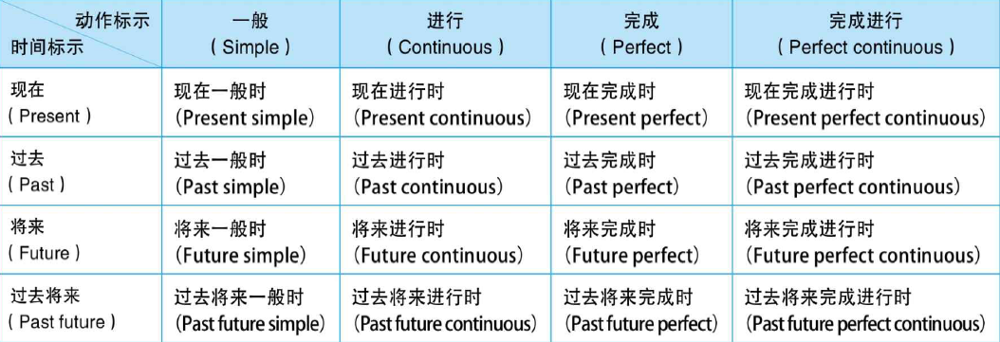

# 时态

## 时 Tense

> Reference: 英语语法新思维: p319

- 现在时 present
- 过去时 past
- 将来时 future
- 过去将来时 past future

## 态 Aspect

> Reference: 英语语法新思维: p319

态：这个动作是固定不变的还是动态变化的；是完成了的还是在延续的；持续的时间是很短还是很长等等。

- 简单体 simple
- 进行体 continuous
- 完成体 perfect
- 完成进行体 perfect continuous

## 时态组合

> Reference: 英语语法新思维: p320

