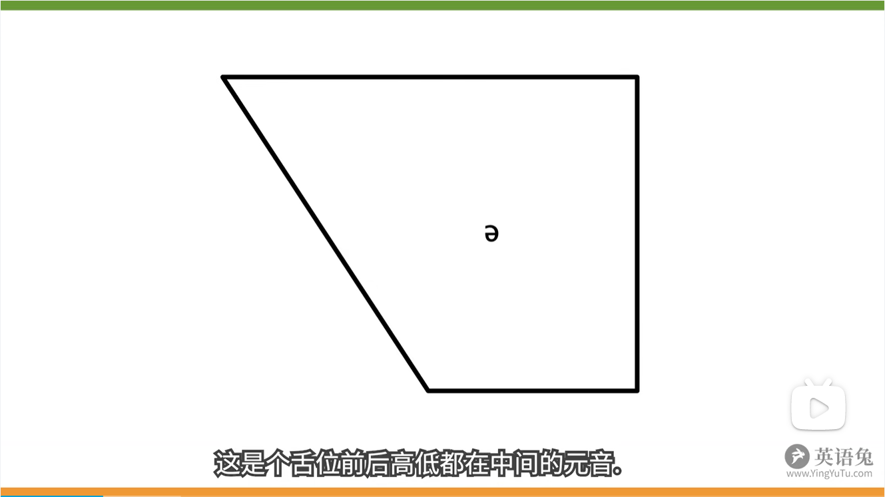
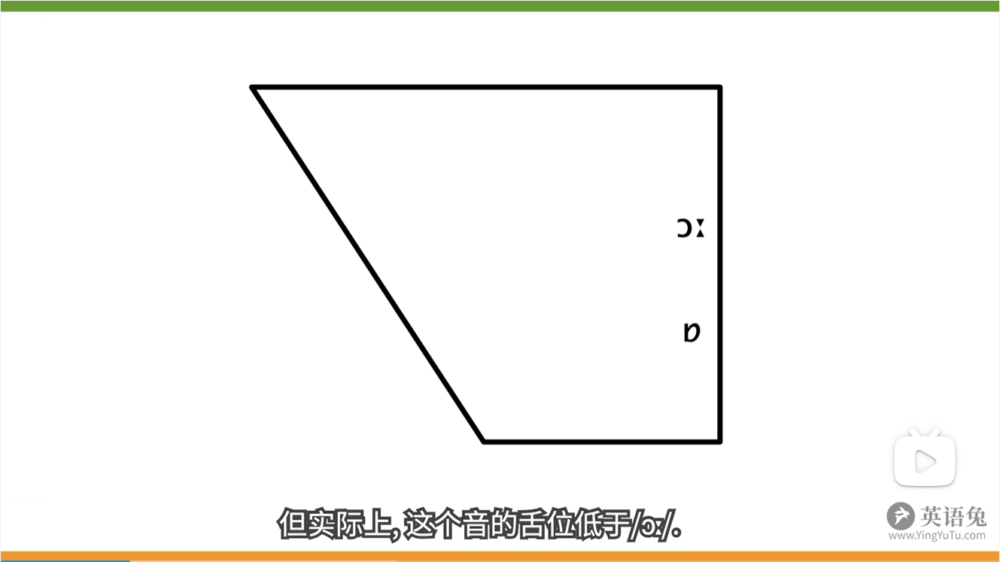

# 音标 - 英语兔

## P2 主要音标体系

- 国际音标（International Phonetic Alphabet）：给世界上所有语言注音的音标符号
- DJ 音标（IPA-63）：Daniel Jones 使用国际音标给英式英语注音，并做了少许改动
- Gimson 音标（IPA-88）：Daniel Jones 的学生 Gimson 改进的音标
- KK 音标：John Kenyon 和 Thomas Knott 使用国际音标给美式英语注音，更改了一些符号，使其更方便美式英语的标注
- 韦式音标：韦式词典使用的注音体系

## P3 辅音三要素

区分辅音的三要素
- 清浊：声带是否震动
- 调音部位：发音时最主要用到的阻挡气流的发音器官

- 调音方式：以什么样的方式阻塞气流发出辅音

所有音标的调音方式与调音部位：

## P4 人类发音过程

清音与浊音：
- 清音（unvoiced sound）：声带不震动
- 浊音（voided sound）：声带震动

元音与辅音：
- 元音（vowel）/ 母音：发音过程中，气流通过口腔时不受阻碍发出的音。通过改变舌头的“形状”发音，舌头不与任何口腔部位接触，嘴唇也不能闭合，否则就阻碍气流了。
- 辅音（consonant）/ 子音：发音过程中，气流通过口腔时在全部时间或者一部分时间被阻碍发出的音

组合：

|     |元音|辅音|
|-----|--|-----|
|浊音|浊元音|浊辅音|
|清音|~~清元音~~|清辅音|

## P5 元音三要素

区分元音的三要素：
- 舌位的前后
- 舌位的高低
- 圆唇度

舌位：发音时舌面隆起的最高点在口腔中的位置

舌位的高低和前后会影响嘴巴的“开口度”：
- 舌位高，开口度小
- 舌位低，开口库大

## P6 元音图

通过元音图可以看到舌位的高低和前后：

把同一舌位上不圆唇的元音标注在前，圆唇的元音标注在后：

## P7 /iː/ - /i/

例子：bee / fee / pea

## P8 /ɪ/

例子：bit / fit / pit / lit / hit / fish

## P9 /uː/ - /u/

例子：too / food / loose / music / news / student

`/juː/` 读作 you，在美音中 `j` 部分不发音

## P10 /ʊ/ - /ᴜ/

例子：book / look / good / took / bush / would

## P11 /e/

例子：bed / get / pet / let / met / set

## P12 /ɜː/

例子：her / person / learn / bird / word / fur（不是美音的翘舌读法）

## P13 /ə/

例子：about / problem / easily / memory / supply / analysis

把 `ə` 重读（舌头和口腔肌肉紧张）并读足时长，则变成 `ɜː`。对比 `the` 与 `her`

英语中所有的元音字母（a e i o u）和半元音字母（y） 都有可能发 `ə`。很多非重读音节里的元音都会“弱化”为 `ə`，即元音弱化或弱读（weak forms）

## P14 /ʌ/

例子：but / hut / must / sun / ton / done

英音比美音的舌位低

## P15 /ɔː/

caught / bought / law / saw / door / four

美国很多地区习惯把 /ɔː/ 变成 /ɑː/，语音学称其为 `cot-caught` 合并

## P16 /æ/

例子：bad / fat / pat / lad / mat / sat

美音中的 /æ/ 舌位上升，嘴型更扁

很多单词在英音中包含 /ɑː/ 的音在美音中读作 /æ/。例如：fast / last / glass

## P17 /ɑː/

例子：father / fast / glass / car / park / mark

有些单词在英音中包含 /ɑː/ 的音在美音中依然读作 /ɑː/，例如：father / spa。但是有些单词在英音中包含 /ɑː/ 的音在美音中依然读作 /æ/，例如：bath / ask / glass

很多词在美音中的 /ɑː/（用 DJ 音标标注美音）对应英音中的 /ɒ/，例如：hot / top / box

## P18 /ɒ/

例子：top / hot / lot / box / stop / wash 

英音中的 /ɒ/ 在美音中转变为 /ɑː/

## P19 /eɪ/ - /e/

例子：make / date / cake

## P20 /ɔɪ/

例子：boy / toy / voice / noise / moist

## P21 /aɪ/

例子：bike / nice / time / like / site / life

## P22 /aʊ/

例子：how / cow / allow / house / loud / mouse

## P23 /əʊ/ - /o/

例子：open / hope / post / coat / boat / soap

DJ 音标标注美音

## P24 /ʊə/ - /ᴜr/

例子：tour / poor / moor / pure / cure / lure

DJ 音标中的 /ʊə/ 使用 /ᴜr/ 给美音注音：tour（/tʊə/ -> /tᴜr/），美音中有R-化音

英音和美音中，很多单词的 /ʊə/ 可以转为 /ɔː/
- 英音：tour（/tʊə/ -> /tɔː/）、sure（/ʃʊə/ -> /ʃɔː/）
- 美音：tour（/tᴜr/ -> /tɔːr/）、sure（/ʃᴜr/ -> /ʃɔːr/）

## P25 /eə/ - /ɛr/

例子：hair / pair / chair / fare / care / dare

DJ 音标中的 /eə/ 使用 /er/ 给美音注音

## P26 /ɪə/ - /ɪr/

例子：dear / fear / here / beer / cheer / idea

DJ 音标中的 /ɪə/ 使用 /ɪr/ 给美音注音

## P28 /p/ & /b/

例子：peak / pet / pig / beak / bed / big

### /p/

辅音的三个阶段：
1. 成阻（catch）：气流被阻塞。
2. 持阻（hold）：气流持续往外冲，但仍被阻塞。
3. 除阻（release）：阻塞被去除，气流冲出。

音位变体：
1. 送气：/p/ 后面有元音，在持阻时有较强烈的向外气流释放，这样的音叫做送气辅音。例如：peak。
2. 不送气：/p/ 前有字母，在持阻时没有强烈的向外气流释放，这样的音叫做不送气辅音。例如：speak / on top of。
3. 无声除阻：/p/ 紧跟辅音，/p/ 在除阻时只有很微弱的气流释放。例如：help me。

音位与音位变体：
- 同位异音：同一个音位（/p/）上有不同的音位变体（送气、不送气、无声除阻）。
- 音标标注的是音位，而不是音位变体。

### /b/

例子：beak / bed / big / rabbit / lab 

在快速语流中或词首时，/b/ 可能发清辅音。例如：bye。

元音后的 /b/ 一般是浊辅音。例如：abide。

## P29 /t/ & /d/

### /t/

例子：tip / tea / test

音位变体：
1. 送气：/t/ 后有元音。例如：top。
2. 不送气：/t/ 前面有 s 。例如：stop。
3. 无声除阻：/t/ 后紧跟某些辅音。例如：setback / forget me
4. 闪音：在美音中，元音之间的字母 t 在非重读音节中通常发闪音。例如：water / better
5. 喉塞音：英音方言，了解即可。
6. 鼻音除阻：/t/ 后紧跟鼻音，那么 /t/ 的除阻可以直接和鼻音衔接上。例如：button / certain
7. 边音除阻：/t/ 后紧跟边音，那么 /t/ 的除阻可以直接和边音衔接上。例如：spotless / butler / little
8. 省略：在美音中，鼻音之后的 /t/ 听不见。例如：winter / interview

### /d/

例子：dip / deep / desk

音位变体：
1. 无声除阻：landmine。
2. 闪音：medal。
3. 鼻音除阻：sudden。
4. 边音除阻：badly。

## P30 /k/ & /g/

### /k/

例子：kit / Kate / cup

音位变体：
1. 送气：/k/ 后有元音。例如：kite。
2. 不送气：/k/ 前有 s 。例如：sky。
3. 无声除阻：/k/ 后紧跟某些辅音。例如：doctor / make dinner

### /g/

例子：git / gate / gut / pig / peg

## P31 /m/ & /n/ & /ŋ/

### /m/

例子：sum / map / met / meat / room / Tom / sin

### /n/

例子：sun / nap / net / neat / noon / run

舌尖抵住上齿龈

### /ŋ/

例子：sung / sing / long 

用舌后端抵住软腭

英语母语人士在发包含字母组合 ing 的单词时，/ŋ/ 会出现尾音 /g/。例如：sing / sung

## P32 /f/ & /v/

### /f/

例子：fat / fit / ferry / fest / life / leaf

### /v/

例子：valley / visit / very / vest / drive / leave

## P33 /s/ & /z/

### /s/

例子：sip / soon / soup / lesson / once / peace

英语中很多单词拼写为 s，但是读作 /z/：is / his / whose / apples / names / boys 

### /z/

例子：zip / zoom / zoo / reason / lose / please

## P34 /θ/ & /ð/

### /θ/

例子：three / thin / thank / thigh / bath / breath

### /ð/

例子：there / that / those / the / bathe / breathe

## P35 /ʃ/ & /ʒ/

### /ʃ/

例子：mesh / fresh / leash / attention / shall / shame

### /ʒ/

例子：measure / pleasure / decision / occasion / usual / regime

## P36 /tʃ/ & /dʒ/

### /tʃ/

例子：chuck / chop / choke / catch / pitch

### /dʒ/

例子：jug / job / joke / page / college

> Q: /ʒ/ vs /dʒ/

## P37 /h/

例子：hat / hot / high / home / house / him

## P38 /w/

例子：was / why / wide / wet / we / wood

## P39 /r/

例子：rat / red / read / rice / right / room

音位变体：
1. 齿龈近音。例如：right
2. r 化：元音 + r 时。例如：car

## P40 /j/

例子：yes / yard / yellow / young / use

美音中会把 /t/ | /d/ | /n/ 后面的 /j/ 省略，例如：student / news

## P41 /l/

例子：lack / lake / all 

音位变体：
1. 清晰 L：/l/ 后有元音。例如：light。
2. 模糊 L：/l/ 后无元音。例如：all / help / mile / girl / school / full。
3. 不发音 L。例如：calm / palm / folk。

英音和美音的 /l/ 音节划分不同：
- 英音：
  - million -> mi + llion
  - value -> va + lue
- 美音：
  - million -> mill + ion
  - value -> val + ue 

## P42 /ts/ & /tz/

### /ts/

例子：bats / dates / kites / lots

### /dz/

例子：bands / deeds / kids / leads

## P43 /tr/ & /dr/

### /tr/

例子：trip / true / tree / try / country / pantry

/tr/ 与 /tʃ/ 的区别：ture - choose

### /dr/

例子：drip / drew / dream / dry / laundry / hundred

/dr/ 与 /dʒ/ 的区别：drop - job

## Refs

[英语兔-音标](https://www.bilibili.com/video/BV1iV411z7Nj?p=2&share_source=copy_web)
