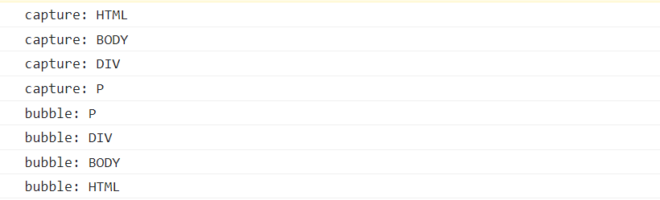

# Bubble and Capture

## Bubble

- 事件从最内层的元素发生，一直向上传播

- 阻止事件冒泡

```html

<div class="outer">
  <button class="inner">click me</button>
</div>
```

```js
const inner = document.querySelector('.inner')
const outer = document.querySelector('.outer')

inner.addEventListener('click', (evt) => {
  evt.stopPropagation()
  console.log('run')
})

outer.addEventListener('click', (evt) => {
  console.log('not run') // not run
})
```

## Capture

- 事件从最外层的元素发生，一直向下传播

## event.target vs this

- event.target : 初始化事件的元素
- this : 当前运行事件处理函数的元素

```html

<div class="outer">
  <button class="inner">click me</button>
</div>
```

```js
const outer = document.querySelector('.outer')
outer.addEventListener('click', function(evt) {
  console.log(evt.target) // button
  console.log(this) // div
})
```

## 事件传播的三个阶段

- 捕获阶段 : 事件从最外层元素流到触发该事件的元素
- 命中阶段 : 事件到达触发该事件的元素
- 冒泡阶段 : 事件从触发该事件的元素冒泡到最外层元素

```html
<div>
  outer
  <p>inner</p>
</div>
```

```js
for (const element of document.querySelectorAll('*')) {
  // capture
  element.addEventListener('click', () => {
    console.log(`capture: ${element.tagName}`)
  }, true)
  // bubble
  element.addEventListener('click', () => {
    console.log(`bubble: ${element.tagName}`)
  })
}
```



## Refs

- [Bubble and Capture](https://javascript.info/bubbling-and-capturing)
