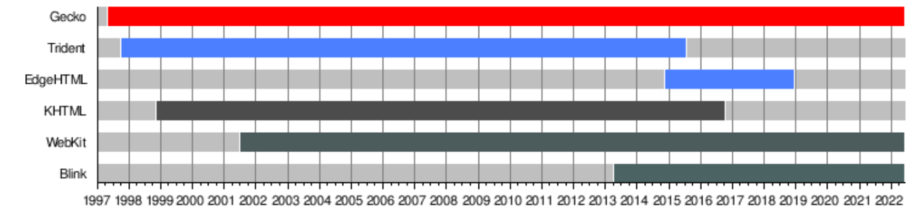
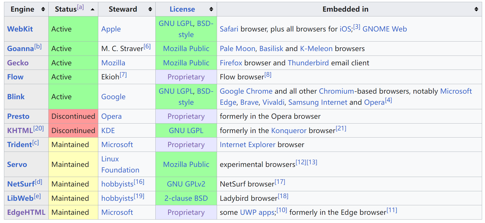

# Rendering Engine

> Reference
> - [Wikipedia: browser engine](https://en.wikipedia.org/wiki/Browser_engine)
> - [Wikipedia: browser engine comparison](https://en.wikipedia.org/wiki/Comparison_of_browser_engines)

## Introduction

- Apple 通过复刻（fork） KHTML 渲染引擎创建了 WebKit，并将 WebKit 作为 Safari 浏览器的渲染引擎。所有在 IOS 上运行的浏览器的渲染引擎都是 WebKit。
- Google 最开始使用 WebKit 作为谷歌浏览器的渲染引擎，后来通过复刻 WebKit 创建了 Blink 渲染引擎。现在所有基于 Chromium 的浏览器都使用 Blink 渲染引擎。
- Microsoft 创建的 Trident 作为 IE 浏览器的渲染引擎。后来推出的 Edge 浏览器最开始使用 EdgeHTML 作为渲染引擎，后来使用谷歌的 Blink 作为渲染引擎。
- Mozilla 创建的 Gecko 作为 Firefox 浏览器的渲染引擎。

## Timeline

## Status

- 虽然有很多浏览器渲染引擎，但是保持活跃并且占据大部分市场份额的只有 Blink、WebKit 和 Gecko。

