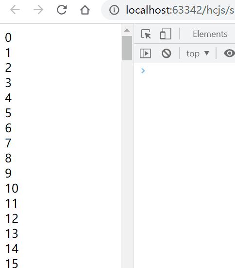
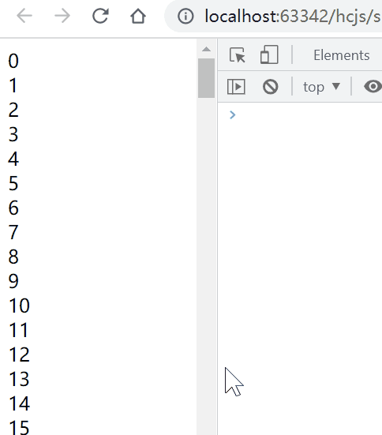

# Scrolling Basic

## Scrolling on Window or Element

### Window

- 当视图的内容高度高于屏幕高度时，可以产生滚动操作：

```js
const body = document.querySelector('body')
for (let i = 0; i < 1000; i++) {
  const div = document.createElement('div')
  div.innerText = `${i}`
  body.append(div)
}

body.addEventListener('scroll', () => {
  console.log('scroll')
})
```

### Element

- 当元素内容高于元素高度时，可以产生滚动操作：
  - 注意1：需要设置 `overflow: true`
  - 注意2：如果需要监听元素的滚动事件，需要在元素上监听，而不是在 `window` 上监听

```js
const container = document.querySelector('#container')
for (let i = 0; i < 1000; i++) {
  const div = document.createElement('div')
  div.innerText = `${i}`
  container.append(div)
}

container.addEventListener('scroll', () => {
  console.log('scroll')
})
```

## Prevent Scrolling

- `event.preventDefault()` 无法阻止通过鼠标滚轮产生的滚动事件，因为鼠标滚轮产生的滚动事件发生在 `event.preventDefault()` 之前：

```js
const container = document.querySelector('#container')
for (let i = 0; i < 1000; i++) {
  const div = document.createElement('div')
  div.innerText = `${i}`
  container.append(div)
}

container.addEventListener('scroll', (evt) => {
  evt.preventDefault() // 无法阻止通过鼠标滚轮产生的滚动事件
  console.log('scroll')
})
```

- `keydown` 和 `keyup` 事件可以产生 `scroll` 事件。例子如下：当用户按下向下的按键时，先调用 `keydown` 事件的回调函数，再调用 `scroll` 事件的回调函数。

_代码如下：_

```js
const body = document.querySelector('body')
// 形成滚动条
for (let i = 0; i < 1000; i++) {
  const div = document.createElement('div')
  div.innerText = `${i}`
  body.append(div)
}

// 先调用 `keydown` 事件的回调函数
window.addEventListener('keydown', () => {
  console.log('keydown')
})

// 再调用 `scroll` 事件的回调函数
window.addEventListener('scroll', () => {
  console.log('scroll')
})
```

_演示如下：_



- `event.preventDefault()` 可以阻止通过其他事件产生的滚动事件，例如阻止 `keydown` 和 `keyup` 事件造成的 `scroll` 事件。例子如下：用户按下向下的按键时调用 `keyup` 事件的回调函数，在回调函数中执行 `evt.preventDefault()` 后会阻止 `scroll` 事件的产生，因此 `scroll` 事件的回调函数不会执行。

_代码如下：_

```js
const body = document.querySelector('body')
for (let i = 0; i < 1000; i++) {
  const div = document.createElement('div')
  div.innerText = `${i}`
  body.append(div)
}

window.addEventListener('keydown', (evt) => {
  // 阻止触发 scroll 事件
  evt.preventDefault()
  console.log('keydown')
})

// 不会触发 scroll 事件
window.addEventListener('scroll', () => {
  console.log('scroll')
})
```

_演示如下：_



## Refs

- [scrolling](https://javascript.info/onscroll)
