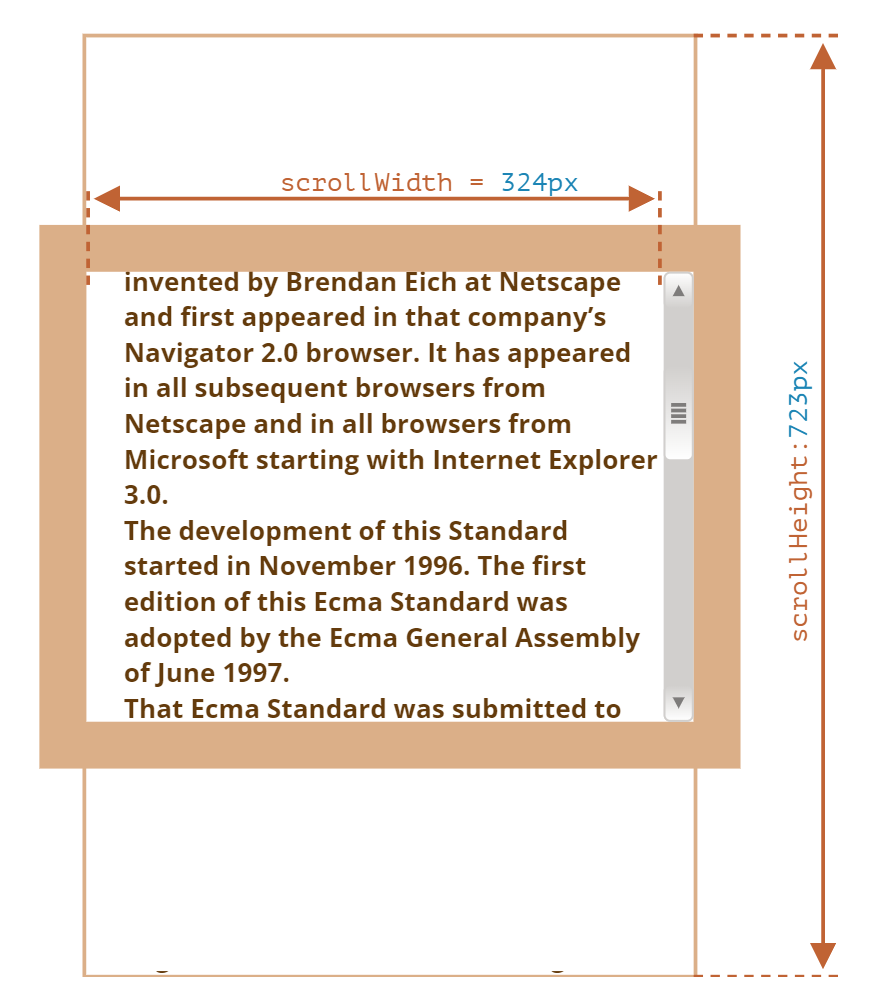
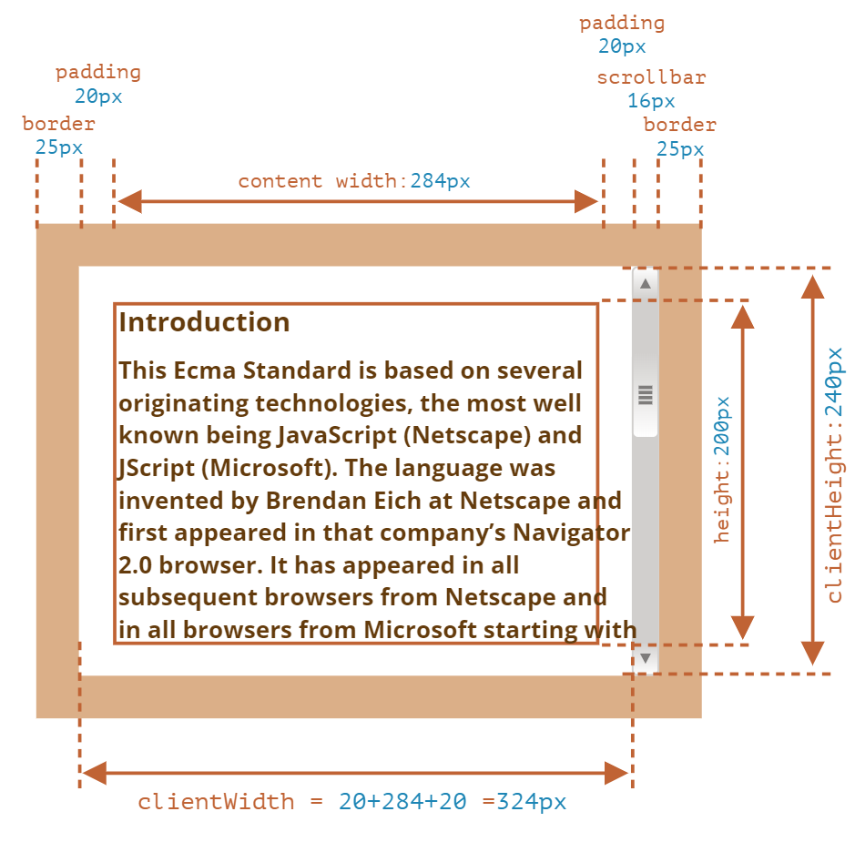
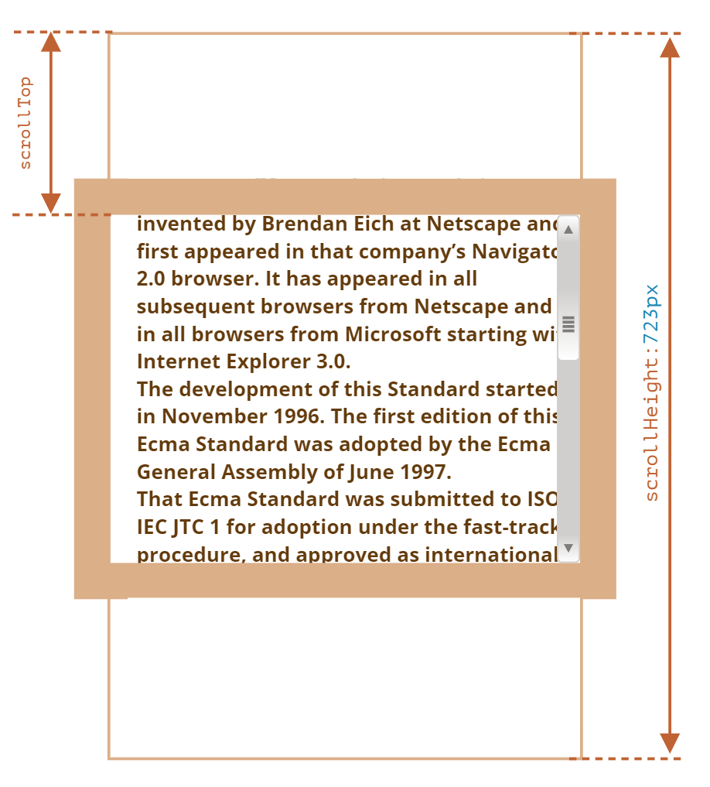

# Detect whether Scrolling Reach bottom

## `scrollHeight`, `clientHeight` and `scrollTop`

- scrollHeight: the height of an element's content, including content not visible on the screen due to overflow



- clientHeight: the height of content plus padding



- scrollTop: the height of the hidden part of the element



## Detect Method

- `scrollTop` is a non-rounded number, while `scrollHeight` and `clientHeight` are rounded. So the only way to determine if the scroll area is scrolled to the bottom is by seeing if the scroll amount is close enough to some threshold (in this example `1`).

```js
Math.abs(element.scrollHeight - element.clientHeight - element.scrollTop) < 1
```

## Refs
- [scrollHeight, clientHeight and scrollTop](https://javascript.info/size-and-scroll)
- [Method of Detecting whether Scrolling Reach bottom](https://developer.mozilla.org/en-US/docs/Web/API/Element/scrollHeight#determine_if_an_element_has_been_totally_scrolled)
