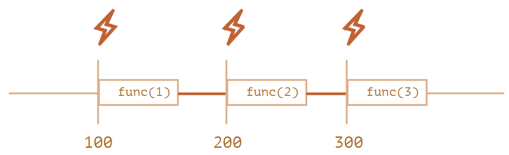
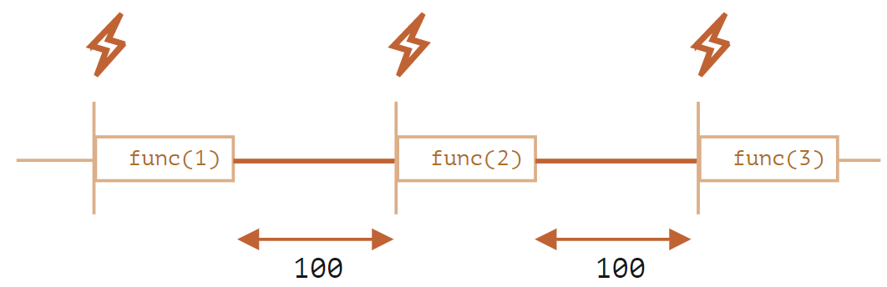

# The Problem of `setInterval`

## Problem

- `setInterval` 会把执行回调函数所花费的时间也算在间隔时间里，导致实际的间隔时间为间隔时间减执行回调函数的时间，甚至执行回调函数的时间比间隔还要长

```js
let i = 1

function func(n) {
  console.log(n)
}

let timerId = setInterval(() => {
  func(i++)
}, 100)
```



## Solution

- 嵌套 `setTimeout` 不会把回调函数所花费的时间算在间隔时间里，所以间隔时间是准确的

```js
let i = 1
let timerId = 0

function func(n) {
  console.log(n)
  timerId = setTimeout(() => {
    func(n++)
  }, 100)
}

timerId = setTimeout(func, 100, i)
```



## Refs

- [The Problem of `setInterval`](https://javascript.info/settimeout-setinterval#nested-settimeout)
