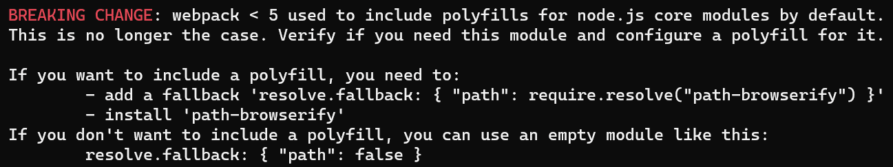
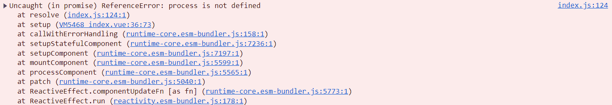

# Node Core Modules

> Reference:
> - [Node.js core modules in webpack](https://webpack.js.org/configuration/resolve/#resolvefallback)

webpack 5 之前自动添加了可以在浏览器上运行的 Node.js 核心模块，如 `path`，所以在代码中可以直接引入这些核心模块。webpack 5 取消了自动添加这些模块，需要手动下载这些模块并且进行配置 `resolve.fallback` 才能使用。如果没有下载和配置，就会出现以下报错：



下载 `path` 模块：

```dash
npm i path-browserify
```

配置 `resolve.fallback`：

```js
module.exports = {
  resolve: {
    fallback: {
      path: require.resolve('path-browserify'),
    },
  },
}
```

因为 `path` 模块 的 `resolve` 方法依赖于 `process` 模块，所以需要下载 `process` 模块，否则报错：



下载 `process` 模块：

```dash
npm i process
```

配置 `webpack` 使用 `process` 模块：

```js
const { ProvidePlugin } = require('webpack')

module.exports = {
  plugins: [
    new ProvidePlugin({
      process: 'process/browser',
    }),
  ],
}
```
