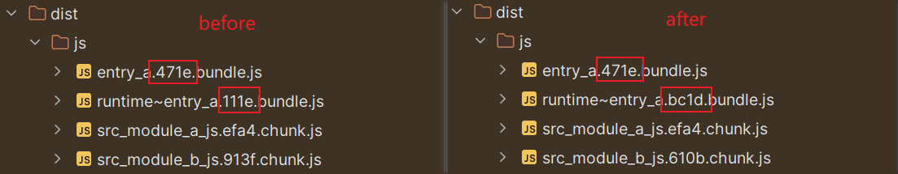

# Runtime Chunk

> Reference
> - [my blog: non-initial chunk affects initial chunk](/blog/front_end/bundler/webpack/hash/#non-initial-chunk-affects-initial-chunk)
> - [docs: runtime chunk](https://webpack.js.org/configuration/optimization/#optimizationruntimechunk)

## Role

- `runtimeChunk` 会添加一个包含每个文件的运行时（runtime）的 chunk。使用 runtime chunk 之后有利于游览器的缓存，因为一些代码改动只会影响 runtime chunk，不会影响 main chunk。

## Example

- 根据[博客](/blog/front_end/bundler/webpack/hash/#non-initial-chunk-affects-initial-chunk)可知，non-initial chunk 的改变会影响 initial chunk。设置 `runtimeChunk` 之后，non-initial chunk 的改变会影响 runtime chunk，而不会影响 initial chunk。

::: code-tabs
@tab webpack.config.js
```js {3}
module.exports = {
  optimization: {
    runtimeChunk: true,
  },
}
```

@tab entry_a.js
```js
import('./module_a.js')
```

@tab module_a.js
```js
import('./module_b.js')
```

@tab module_b.js
```js
// before
console.log('hello')

// after
console.log('hi')
```
:::


