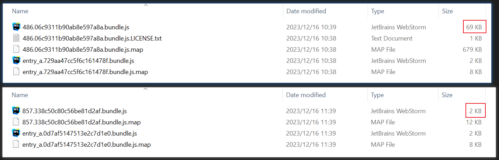

# Tree Shaking

## Role

tree shaking 可以阻止将没有过的代码模块打包进输出文件。

## Method

tree shaking 可以通过以下方式实现：
  - usedExports
  - sideEffects
  - pure function

## UsedExports

`usedExports: true` 表示 webpack 只会把**导出的**且**被使用的**模块打包进输出文件。

### Condition

使用 tree shaking 有两个条件：

  - 一是将 webpack 配置文件中的 `optimization.usedExports` 设置为 `true`。
  
  - 二是启动代码压缩功能，可以通过以下三种方式：
    - 配置 webpack 配置文件中的 `mode` 为 `production`；
    - 配置 webpack 配置文件中的 `optimization.minimize` 为 `true`；
    - 配置 webpack 配置文件中的 `optimization.minimizer`；

### Example

::: code-tabs
@tab webpack.config.js
```js
module.exports = {
  mode: 'development',
  entry: {
    entry_a: resolve(__dirname, 'src/entry_a.js'),
  },
  optimization: {
    minimize: true,
    usedExports: true,
  },
}
```

@tab entry_a.js
```js
import { greet1 } from './module_a'
greet1('eathyn')
```

@tab module_a.js
```js
export const greet1 = (name) => {
  console.log(`hello ${name}`)
}
// greet2 没有使用到
export const greet2 = (name) => {
  console.log(`hi ${name}`)
}
```
:::


### Principle

1. `usedExports: true` 标记出**导出的**且**没有被使用过**的模块。
2. 使用代码压缩插件删除第一步中标记出来的模块。

## SideEffects

### Prerequisite

- `import` 有四种使用方式：
  - named import: `import { export1, export2 } from 'module-name'`
  - default import: `import defaultExport from 'module-name'`
  - namespace import: `import * as name from 'module-name'`
  - side effect import: `import 'module-name'`

- `dead code`: 使用 `export` 导出且没有被使用的代码，例如 `num2`：

::: code-tabs
@tab index.js
```js
import { num1 } from './module'
console.log(num1)
```

@tab module.js
```js
export const num1 = 1
export const num2 = 2 // dead code
```
:::

- `global code`: 没有使用 `export` 导出的代码，例如 `num2`：

```js
export const num1 = 1
const num2 = 2 // global code
```

### Role

对于 `named import`, `default import` 和 `namespace import`，`usedExports` 结合 `terser` 可以阻止将 dead code 打包进输出文件；但是对于 `side effect import`，`usedExports` 会将全局代码（global code）打包进输出文件。

::: code-tabs
@tab webpack.config.js
```js {7-8}
module.exports = {
  mode: 'development',
  entry: {
    entry_a: resolve(__dirname, 'src/entry_a.js'),
  },
  optimization: {
    usedExports: true,
    minimize: true,
  },
}
```

@tab entry_a.js
```js {1} 
import './module_a'
```

@tab module_a.js
```js {9}
export function fn1() {
  return 1
}

export function fn2() {
  return 2
}

document.title = 'this is a side effect'
```

@tab output
```js {5-7}
/*! For license information please see entry_a.5e4cda9e81a7e9f592ab.bundle.js.LICENSE.txt */
(() => {
  'use strict'
  var e = {
    './src/module_a.js': (e, r, t) => {
      document.title = 'this is a side effect'
    },
  }, r = {}

  function t(o) {
    var s = r[o]
    if (void 0 !== s) return s.exports
    var a = r[o] = {exports: {}}
    return e[o](a, a.exports, t), a.exports
  }

  t.d = (e, r) => {
    for (var o in r) t.o(r, o) && !t.o(e, o) && Object.defineProperty(e, o, {enumerable: !0, get: r[o]})
  }, t.o = (e, r) => Object.prototype.hasOwnProperty.call(e, r), t('./src/module_a.js')
})()
//# sourceMappingURL=entry_a.5e4cda9e81a7e9f592ab.bundle.js.map
```
:::


`sideEffects` 的作用是对于 `side effect import` 的这种引入方式，`sideEffects` 可以阻止全局代码（global code）打包进输出文件。

::: code-tabs
@tab package.json
```json {2}
{
  "sideEffects": false
}
```

@tab entry_a.js
```js {1}
import './module_a'
```

@tab module_a.js
```js {9}
export function fn1() {
  return 1
}

export function fn2() {
  return 2
}

document.title = 'this is a side effect'
```

@tab output
```js
/******/ (() => { // webpackBootstrap
  /******/ 	"use strict";
  /******/ 	// The require scope
  /******/ 	var __webpack_require__ = {};
  /******/
  /************************************************************************/
  /******/ 	/* webpack/runtime/make namespace object */
  /******/ 	(() => {
    /******/ 		// define __esModule on exports
    /******/ 		__webpack_require__.r = (exports) => {
      /******/ 			if(typeof Symbol !== 'undefined' && Symbol.toStringTag) {
        /******/ 				Object.defineProperty(exports, Symbol.toStringTag, { value: 'Module' });
        /******/ 			}
      /******/ 			Object.defineProperty(exports, '__esModule', { value: true });
      /******/ 		};
    /******/ 	})();
  /******/
  /************************************************************************/
  var __webpack_exports__ = {};
  /*!************************!*\
    !*** ./src/entry_a.js ***!
    \************************/
  __webpack_require__.r(__webpack_exports__);


  /******/ })()
;
//# sourceMappingURL=entry_a.16e69da7a9cb032e1e1d.bundle.js.map
```
:::

如上代码所示，`"sideEffects": false` 表示所有的模块都没有副作用，因此全局代码 `document.title = 'this is a side effect'` 没有被打包进输出文件。

### Condition

使用 sideEffects 的条件：
  - 要确保模块中没有全局代码，否则会导致全局代码没有打包进输出文件
  - 配置 package.json 的 sideEffects 字段，值为 false 或数组

## Pure Function

### Pure and Impure Function

- 如果函数没有依赖或影响外部作用域，那么这个函数就是纯函数（pure function）；反之函数为非纯函数（impure function）。

::: code-tabs
@tab pure function
```js
function fn(a, b) {
  return a + b
}
```

@tab impure function
```js
function fn(a, b) {
  // fn 依赖于外部作用域的 c 变量，所以 fn 是非纯函数
  return a + b + window.c
}
```
:::

### Pure Notation

- 待学习

## Babel

> Reference:
> - [Webpack5 核心原理与应用实践: chapter28](https://juejin.cn/book/7115598540721618944?utm_source=course_list)

Tree shaking 目前只支持 `ESM`，如果 Babel 将 `ESM` 转化为 `CommonJS`，Webpack 就无法使用 tree shaking。

::: code-tabs
@tab babel.config.js
```js {6-7}
module.exports = {
  "presets": [
    [
      "@babel/preset-env",
      {
        // "modules": false // 表示保留 ESM，不将 ESM 转化为其他模块类型，例如 CommonJS
        "modules": "commonjs" // 表示将 ESM 转化为 CommonJS，tree shaking 会因此失效
      }
    ]
  ]
}
```

@tab webpack.config.js
```js
module.exports = {
  mode: 'development',
  entry: {
    entry_a: resolve(__dirname, 'src/entry_a.js'),
  },
  optimization: {
    usedExports: true,
    minimize: true,
  },
}
```

@tab entry_a.js
```js
import { fn1 } from './module_a'

fn1()
```

@tab module_a.js
```js
export function fn1() {
  return 1
}

export function fn2() {
  return 2
}
```

@tab output
```js {9-11}
(() => {
  'use strict'
  var e, r = {
    './src/entry_a.js': (e, r, o) => {
      (0, o('./src/module_a.js').fn1)()
    }, './src/module_a.js': (e, r, o) => {
      o('./node_modules/@babel/runtime-corejs3/core-js-stable/object/define-property.js')(r, '__esModule', {value: !0}), r.fn1 = function () {
        return 1
      }, r.fn2 = function () {
        return 2
      }
    },
  }, o = {}
})()
```
:::

如上代码所示，`modules: "commonjs"` 表示将 `ESM` 转化为 `CommonJS`，tree shaking 会因此失效，所以即使 `fn2` 没有使用，依然被打包进输出文件。

最佳实践：如果不需要兼容不支持 ESM 的浏览器，就应该将 `modules` 设置为 `false`。如果需要支持，就将 `modules` 设置为默认值 `"auto"`。

## ESM Package

> Reference:
> - [Webpack5 核心原理与应用实践: chapter28](https://juejin.cn/book/7115598540721618944?utm_source=course_list)
> - [Publish your npm package as ES Module, and backward compatibility CommonJS](https://gist.github.com/aelbore/65a4d2e86c3326f36607db111a7b6887)

- NPM 包最开始都是使用 CommonJS，因为 tree shaking 目前只支持 ESM，所以越来越多的包优先使用 ESM，而将 CommonJS 作为后备方案。下面对比一下 `lodash` 和 `lodash-es`（lodash 的 ESM 格式）打包后的文件大小：
    
::: code-tabs
@tab lodash
```js
const { add } = require('lodash')
console.log(add(1, 2))
```

@tab lodash-es
```js
import { add } from 'lodash-es'
console.log(add(1, 2))
```
:::



## Dynamic Import

dynamic import 默认无法使 tree shaking 生效：

::: code-tabs
@tab webpack.config.js
```js
module.exports = {
  mode: 'development',
  entry: {
    entry_a: resolve(__dirname, 'src/entry_a.js'),
  },
  optimization: {
    splitChunks: {
      minSize: 0,
      chunks: 'all',
    },
    usedExports: true,
    minimize: true,
  },
}
```

@tab entry_a.js
```js {1}
import('./module_a')
  .then((module) => {
    module.fn1()
  })
```

@tab module_a.js
```js
export function fn1() {
  return 1
}

export function fn2() {
  return 2
}
```

@tab output
```js {3-9}
(self.webpackChunkwebpack_performance = self.webpackChunkwebpack_performance || []).push([['src_module_a_js'], {
  './src/module_a.js': (e, n, r) => {
    function c() {
      return 1
    }

    function u() {
      return 2
    }

    r.r(n), r.d(n, {fn1: () => c, fn2: () => u})
  },
}])
```
:::

添加注释 `webpackExports` 可以让 dynamic import 的 tree shaking 生效：

::: code-tabs
@tab webpack.config.js
```js
module.exports = {
  mode: 'development',
  entry: {
    entry_a: resolve(__dirname, 'src/entry_a.js'),
  },
  optimization: {
    splitChunks: {
      minSize: 0,
      chunks: 'all',
    },
    usedExports: true,
    minimize: true,
  },
}
```

@tab entry_a.js
```js {1}
import(/* webpackExports: ['fn1'] */ './module_a')
  .then((module) => {
    module.fn1()
  })
```

@tab module_a.js
```js
export function fn1() {
  return 1
}

export function fn2() {
  return 2
}
```

@tab output
```js {3-5}
(self.webpackChunkwebpack_performance = self.webpackChunkwebpack_performance || []).push([['src_module_a_js'], {
  './src/module_a.js': (e, c, r) => {
    function s() {
      return 1
    }

    r.d(c, {fn1: () => s})
  },
}])
```
:::

## CSS Tree Shaking

> Reference: 
> - [PurgeCSS Webpack Configuration](https://purgecss.com/plugins/webpack.html)
> - [CodeWhy](https://youtu.be/yiiVUpVXpMA?feature=shared&t=2634)

- 使用 `PurgeCSS` 对 CSS 进行 tree shaking。
