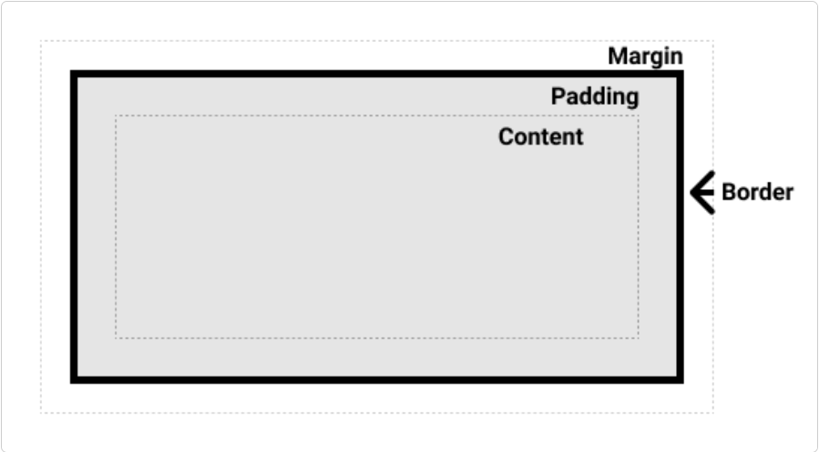

# Box Model

## What is box model

- The CSS box model as a whole applies to block boxes and defines how the different parts of a box — margin, border, padding, and content — work together to create a box that you can see on a page.
- Inline boxes use just some behavior defined in the box model.

## Parts of a box

- content box
- padding box
- border box
- margin box




## The standard CSS box model

- The `width` you specified is equal to the content width.
- The `height` you specified is equal to the content height.

```html
<div class="container">
```

```css
.container {
	box-sizing: content-box;
	width: 100px;
	padding: 10px;
	border: 2px;
	margin: 5px;
}
```


## The alternative CSS box model

- The `width` you specified is equal to the sum of content width, padding width and border width.
- The `height` you specified is equal to the sum of content height, padding height and border height.
- The **margin** is not counted towards the actual size of the box.

```html
<div class="container">
```

```css
.container {
	box-sizing: border-box;
	width: 100px;
	padding: 10px;
	border: 2px;
	margin: 5px;
}
```


