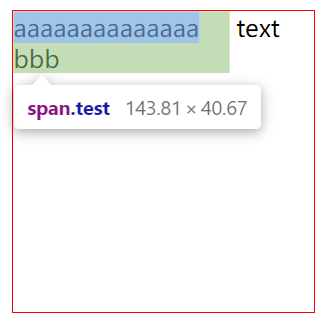

# Box Types

## Block

- The box will break onto a new line.
- The `width` and `height` properties are respected.
- `padding`, `margin` and `border` will cause other elements to be pushed away from the box.
- The box will extend in the inline direction to fill the space available in its container.

## Inline

- The box will not break onto a new line.
- The `width` and `height` properties will not apply.
- Vertical padding, margins, and borders will apply but will not cause other inline boxes to move away from the box.
- Horizontal padding, margins, and borders will apply and will cause other inline boxes to move away from the box.

```html
<div class="container">
  <span class="test">aaaaaaaaaaaaaa</span>
  <span>text</span>
  <span>bbb</span>
</div>
```

```css
.container {
	width: 200px;
	height: 200px;
	border: 1px solid red;
}

.test {
	padding-right: 20px;
	padding-bottom: 20px;
}
```



## Block-inline

- The box will not break onto a new line.
- The `width` and `height` properties are respected.
- `padding`, `margin`, and `border` will cause other elements to be pushed away from the box.

## Refs

- [display : block](https://developer.mozilla.org/en-US/docs/Learn/CSS/Building_blocks/The_box_model#outer_display_type)
- [display : inline](https://developer.mozilla.org/en-US/docs/Learn/CSS/Building_blocks/The_box_model#inner_display_type)
- [display : inline-block](https://developer.mozilla.org/en-US/docs/Learn/CSS/Building_blocks/The_box_model#using_display_inline-block)
