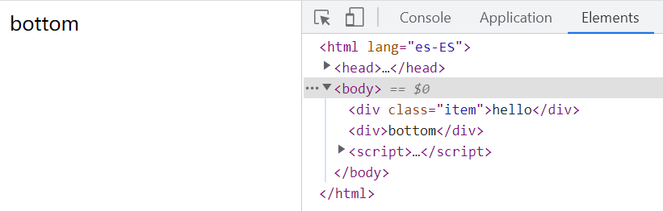
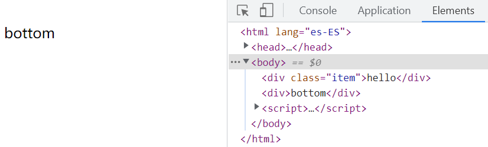
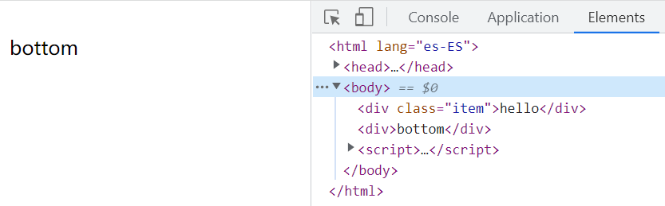
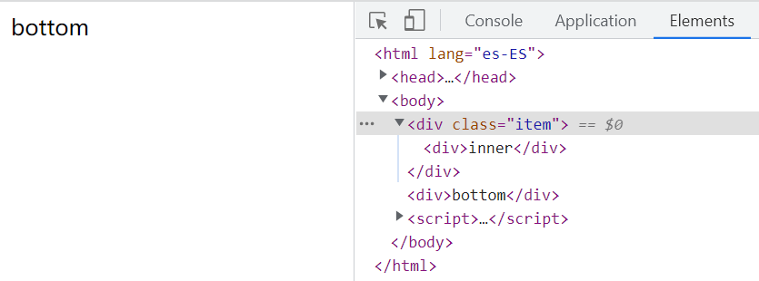

# Hide Element

## `display: none`

- Hidden elements do not take up space
- Elements are deleted from accessibility tree

```html
<div class="item">hello</div>
<div>bottom</div>
```

```css
.item {
	display: none;
}
```



## `visibility: hidden`

- Hidden elements take up space
- Elements are not deleted from accessibility tree
- Events can not trigger event handler

```html
<div class="item">hello</div>
<div>bottom</div>
```

```css
.item {
	visibility: hidden;
}
```



## `opacity: 0`

- Hidden elements take up space
- Elements are not deleted from accessibility tree
- Events can trigger event handler

```html
<div class="item">hello</div>
<div>bottom</div>
```

```css
.item {
	opacity: 0;
}
```

```js
const item = document.querySelector('.item')
item.addEventListener('click', () => {
  console.log('run...')
})
```



## width + height + overflow

- Hidden elements do not take up space
- Elements are not deleted from accessibility tree
- Events can not trigger event handler

```html
<div class="item">
  <div>inner</div>
</div>
<div>bottom</div>
```

```css
.item {
	width: 0;
	height: 0;
	overflow: hidden;
}
```


