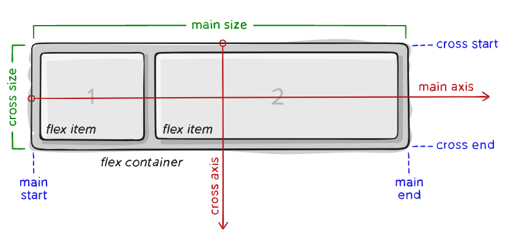
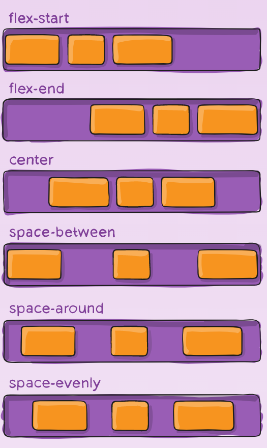
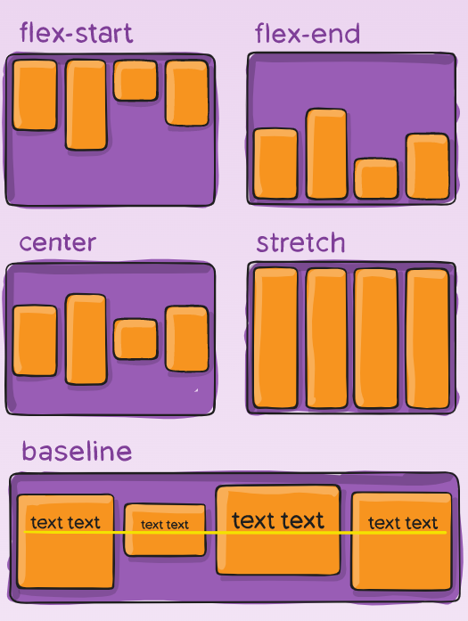
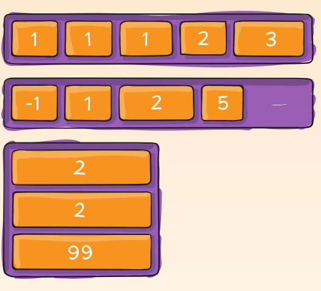
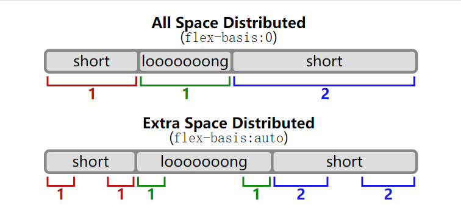

# Layout: Flexbox

## Reason

The Flexbox Layout module aims at providing a more efficient way to lay out, align and distribute space among items in a container, even when their size is unknown and/or dynamic (thus the word “flex”).

## Terminology

- main axis
- main start
- main end
- main size
- cross axis
- cross start
- cross end
- cross size

## Flex Container

### display

The `display: flex` property defines a flex container.

### flex-direction

The `flex-direction` establishes the main-axis.
- `row` (default): left to right
- `row-reverse`: right to left
- `column`: top to bottom
- `column-reverse`: bottom to top

### flex-wrap

- `nowrap` (default): all flex items will be on one line
- `wrap`: flex items will wrap onto multiple lines, from top to bottom
- `wrap-reverse`: flex items will wrap onto multiple lines from bottom to top

### flex-flow

A shorthand for the `flex-direction` and `flex-flow`

### justify-content

The `justify-content` defines the alignment along the main axis. It helps distribute extra free space leftover.
- `flex-start` (default): items are packed toward the start of the flex-direction.
- `flex-end`: items are packed toward the end of the flex-direction.
- `center`: items are centered along the line
- `space-between`: items are evenly distributed in the line; first item is on the start line, last item on the end line
- `space-around`
- `space-evenly`: items are distributed so that the spacing between any two items (and the space to the edges) is equal.

### align-items

The `align-items` defines the default behavior for how flex items are laid out along the cross axis on the current line. Think of it as the `justify-content` version for the cross-axis.

- `stretch` (default): stretch to fill the container (still respect min-width/max-width)
- `flex-start`: items are placed at the start of the cross axis.
- `flex-end`: items are placed at the end of the cross axis.
- `center`: items are centered in the cross-axis.
- `baseline`: items are aligned such as their baselines align.

- `align-items: stretch` and `align-content: stretch` do not work when specify `height` to flex items.

### align-content

The `align-content` property aligns a flex container’s lines within when there is extra space in the cross-axis, similar to how `justify-content` aligns individual items within the main-axis.

- `flex-start` (default): items packed to the start of the container.
- `flex-end`: items packed to the end of the container.
- `center`: items centered in the container.
- `space-between`: items evenly distributed; the first line is at the start of the container while the last one is at the end.
- `space-around`: items evenly distributed with equal space around each line.
- `space-evently`: items are evenly distributed with equal space around them.
- `stretch`: lines stretch to take up the remaining space.

#### Attentions

- This property only takes effect on multi-line flexible containers.
- `align-content` determines the spacing between lines. `align-items` determines how the items as a whole are aligned within the container.

### gap, row-gap, column-gap

- `gap`: `row-gap` `column-gap`

## Flex Item

### order

- the `order` property controls the order in which they appear in the flex container.

- Items with the same order revert to source order.

### flex-grow

- It dictates what amount of the available space inside the flex container the item should take up.
- the default value of `flex-grow` is 0.

### flex-shrink

- This defines the ability for a flex item to shrink if necessary.
- the default value of `flex-shrink` is 1.

### flex-basis

- This defines the default size of an element before the remaining space is distributed.
- The `auto` keyword means “look at my width or height property”
- the default value of `flex-basis` is `auto`.
- If set to 0, the extra space around content isn’t factored in. If set to auto, the extra space is distributed based on its flex-grow value.

### flex

- This is the shorthand for `flex-grow`, `flex-shrink` and `flex-basis` combined.
- `flex: <number>` is equal to `flex: <number> 1 0`
- `flex: <width>` is equal to `flex: 1 1 <width>`

### align-self

This allows the default alignment (or the one specified by align-items) to be overridden for individual flex items.

## Refs

- [A Complete Guide to Flexbox](https://css-tricks.com/snippets/css/a-guide-to-flexbox/)
- [Flex Items cannot Stretch](https://stackoverflow.com/a/34365843/9863318)
- [align-items vs align-content](https://stackoverflow.com/a/45713137/9863318)
- [flex: \<number\> vs flex: \<width\>](https://developer.mozilla.org/en-US/docs/Web/CSS/flex)
