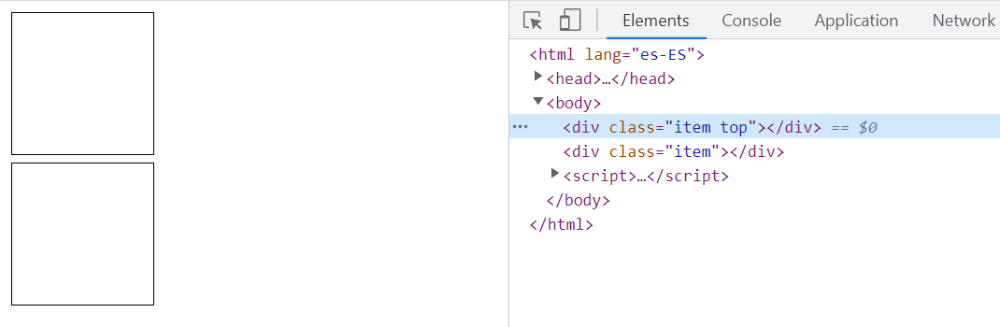
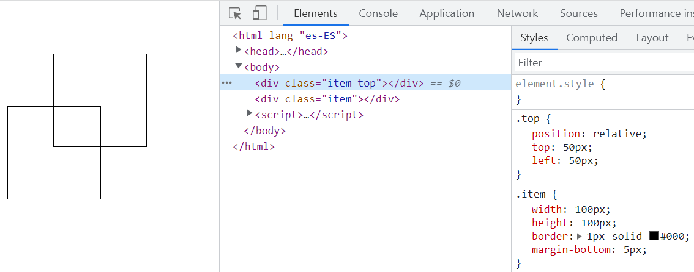
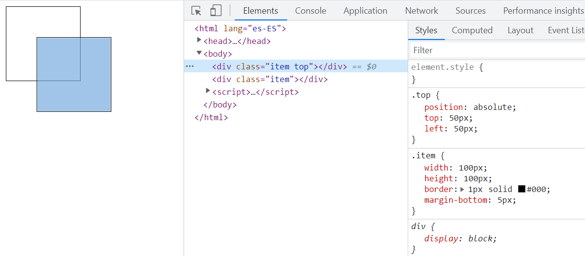
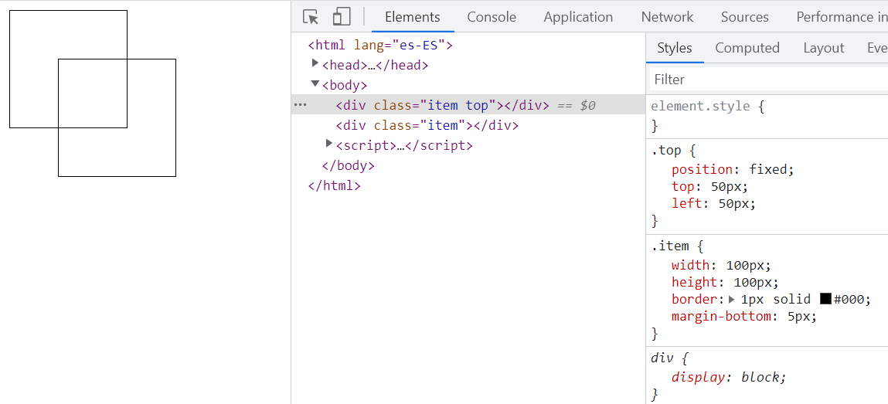
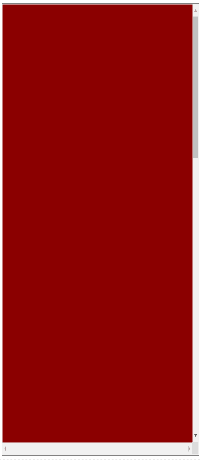

# Layout: Positioning

## static

- The element is positioned according to the normal flow of the document.
- The `top`, `right`, `bottom`, `left` and `z-index` properties have no effect.
- This is the default value.

```css
.item {
	width: 100px;
	height: 100px;
	border: 1px solid #000;
	margin-bottom: 5px;
}

.top {
	position: static;
	top: 50px; /* not working */
}
```



## relative

- The element is positioned according to the normal flow of the document.
- The element is offset relative to itself on the values of `top`, `right`, `bottom` and `left`.
- The offset does not affect the position of other elements.
- The element space still be occupied.
- [Skip](https://developer.mozilla.org/en-US/docs/Web/CSS/position#values) : This value creates a new stacking context when the value of z-index is not `auto`.

```css
.item {
	width: 100px;
	height: 100px;
	border: 1px solid #000;
	margin-bottom: 5px;
}

.top {
	position: relative;
	top: 50px;
	left: 50px;
}
```



## absolute

- The element is removed from the normal document flow.
- The element's original space is removed.
- The element is positioned to its closest positioned ancestor, if any; otherwise, it is placed relative to the initial containing block (**tips**: the initial containing block is the `html` element).
- [Skip](https://developer.mozilla.org/en-US/docs/Web/CSS/Containing_block): Containing Block.

```css
.item {
	width: 100px;
	height: 100px;
	border: 1px solid #000;
	margin-bottom: 5px;
}

.top {
	position: absolute;
	top: 50px;
	left: 50px;
}
```



## fixed

- The element is removed from the normal document flow.
- The element's original space is removed.
- The element is positioned relative to the initial containing block established by the viewport. [Skip](https://developer.mozilla.org/en-US/docs/Web/CSS/position#values): except when one of its ancestors has a transform, perspective, or filter property set to something other than none (see the CSS Transforms Spec), or the will-change property is set to transform, in which case that ancestor behaves as the containing block.

```css
.item {
	width: 100px;
	height: 100px;
	border: 1px solid #000;
	margin-bottom: 5px;
}

.top {
	position: fixed;
	top: 50px;
	left: 50px;
}
```



## sticky

- The element is acting like static element before reaching the position.
- The element is acting like fixed element after reaching the position.
- Commonly using this feature to stick navigation bar.

:::: code-group

::: code-group-item index.html
```html
<div class="container">
  <div class="top"></div>
  <div class="item"></div>
  <div class="bottom"></div>
</div>
```
:::

::: code-group-item index.css
```css
.container {
	height: 600px;
	border: 1px solid #000;
	overflow: scroll;
}

.top {
	height: 800px;
	background-color: darkred;
}

.bottom {
	height: 800px;
	background-color: royalblue;
}

.item {
	height: 100px;
	background-color: lightpink;
	position: sticky;
	top: 50px;
}
```
:::

::::



## Refs

- [MDN Positioning](https://developer.mozilla.org/en-US/docs/Web/CSS/position)
