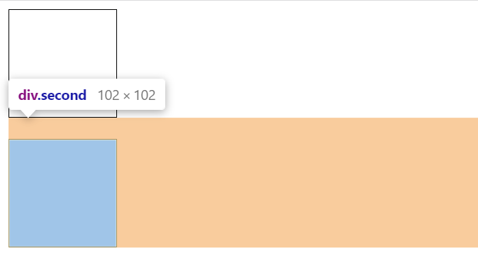
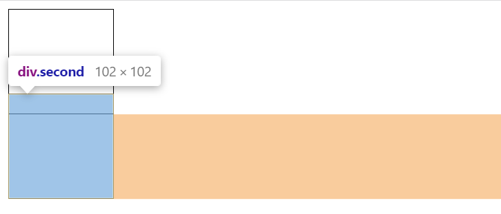
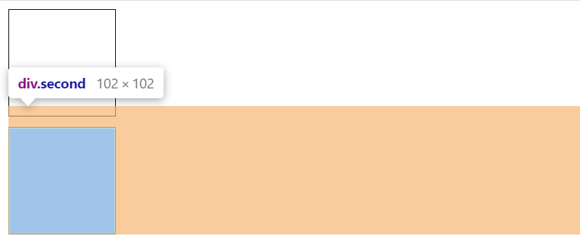
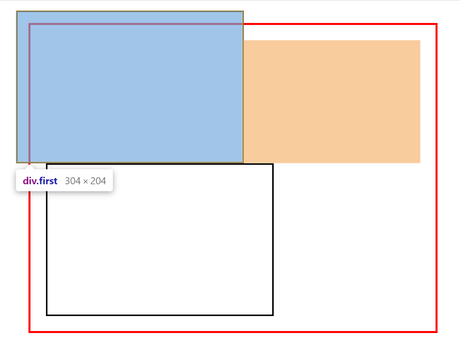
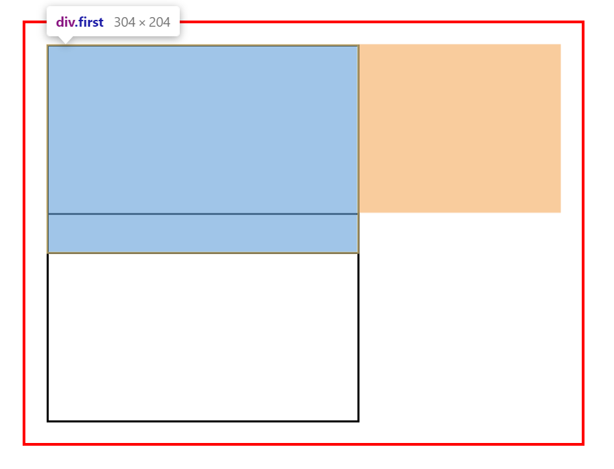

# Margin

## Margin Collapsing

- Two positive margins will combine to become one margin. Its size will be equal to the largest individual margin.

```html
<div class="first"></div>
<div class="second"></div>
```

```css
.first, .second {
	width: 100px;
	height: 100px;
	border: 1px solid #000;
}

.first {
	margin-bottom: 10px;
}

.second {
	margin-top: 20px; /* largest one wins */
}
```



- Two negative margins will collapse and the smallest (furthest from zero) value will be used.

```html
<div class="first"></div>
<div class="second"></div>
```

```css
.first, .second {
	width: 100px;
	height: 100px;
	border: 1px solid #000;
}

.first {
	margin-bottom: -10px;
}

.second {
	margin-top: -20px; /* smallest one wins */
}
```



- If one margin is negative, its value will be subtracted from the total.

```html
<div class="first"></div>
<div class="second"></div>
```

```css
.first, .second {
	width: 100px;
	height: 100px;
	border: 1px solid #000;
}

.first {
	margin-bottom: -10px; /* subtracted from the total */
}

.second {
	margin-top: 20px;
}
```



## Negative Margin

- an element with negative `margin-left` / `margin-top` will move to the left / top.

```html
<div class="container">
  <div class="first"></div>
  <div class="second"></div>
</div>
```

```css
.container {
	width: 500px;
	padding: 20px;
	border: 3px solid red;
	margin: 30px;
}

.first, .second {
	width: 300px;
	height: 200px;
	border: 2px solid #000;
}

.first {
	margin-top: -40px;
	margin-left: -40px;
}
```



- An element with negative `margin-right` / `margin-bottom` will cause elements on the right / bottom of that move left / up.

```html
<div class="container">
  <div class="first"></div>
  <div class="second"></div>
</div>
```

```css
.container {
	width: 500px;
	padding: 20px;
	border: 3px solid red;
	margin: 30px;
}

.first, .second {
	width: 300px;
	height: 200px;
	border: 2px solid #000;
}

.first {
	margin-bottom: -40px;
}
```



## Refs

- [Margin Collapsing](https://developer.mozilla.org/en-US/docs/Learn/CSS/Building_blocks/The_box_model#margin)
