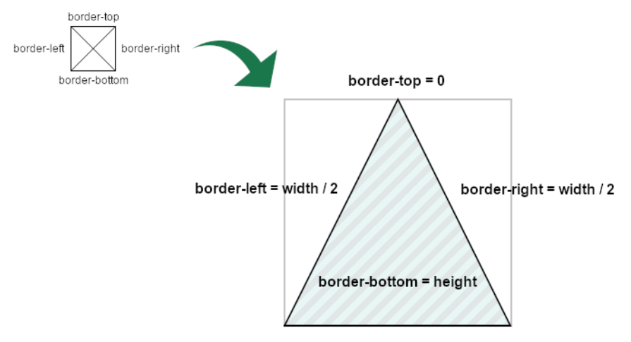

# Shapes

## Triangle

```html
<div class="container">
  <div class="top"></div>
  <div class="bottom"></div>
  <div class="left"></div>
  <div class="right"></div>
</div>
```

```css
.container {
	display: flex;
	justify-content: space-around;
	align-items: center;
}

.top {
	width: 0;
	height: 0;
	border-bottom: 50px solid #000;
	border-right: 50px solid transparent;
	border-left: 50px solid transparent;
}

.bottom {
	width: 0;
	height: 0;
	border-top: 50px solid #000;
	border-left: 50px solid transparent;
	border-right: 50px solid transparent;
}

.left {
	width: 0;
	height: 0;
	border-right: 50px solid #000;
	border-top: 50px solid transparent;
	border-bottom: 50px solid transparent;
}

.right {
	width: 0;
	height: 0;
	border-left: 50px solid #000;
	border-top: 50px solid transparent;
	border-bottom: 50px solid transparent;
}
```

## Equilateral Triangle



```html
<div class="container">
  <div class="top"></div>
  <div class="bottom"></div>
  <div class="left"></div>
  <div class="right"></div>
</div>
```

```css
:root {
	--border-width: 100px;
}

.container {
	display: flex;
	justify-content: space-around;
	align-items: center;
}

.top {
	width: 0;
	height: 0;
	border-bottom: var(--border-width) solid #000;
	border-right: calc(var(--border-width) / 2) solid transparent;
	border-left: calc(var(--border-width) / 2) solid transparent;
}

.bottom {
	width: 0;
	height: 0;
	border-top: var(--border-width) solid #000;
	border-left: calc(var(--border-width) / 2) solid transparent;
	border-right: calc(var(--border-width) / 2) solid transparent;
}

.left {
	width: 0;
	height: 0;
	border-right: var(--border-width) solid #000;
	border-top: calc(var(--border-width) / 2) solid transparent;
	border-bottom: calc(var(--border-width) / 2) solid transparent;
}

.right {
	width: 0;
	height: 0;
	border-left: var(--border-width) solid #000;
	border-top: calc(var(--border-width) / 2) solid transparent;
	border-bottom: calc(var(--border-width) / 2) solid transparent;
}
```
