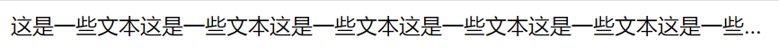

# Text Overflow

## Single Row

- `overflow: hidden`: 隐藏移除的文本
- `text-overflow: ellipsis`: 用省略号表示溢出的文本
- `white-space: nowrap`: 文本不换行

```html
<div class="item">这是一些文本这是一些文本这是一些文本这是一些文本这是一些文本这是一些文本这是一些文本这是一些文本这是一些文本这是一些文本</div>
```

```css
.item {
	overflow: hidden;
	text-overflow: ellipsis;
	white-space: nowrap;
}
```



## Multiple Row

- `overflow: hidden` : 隐藏移除的文本
- `text-overflow: ellipsis` : 用省略号表示溢出的文本
- `display: -webkit-box` : 将对象作为弹性伸缩盒子模型显示
- `-webkit-line-clamp: <number>` : 文本行数
- `-webkit-box-orient` : 设置或检索伸缩盒对象的子元素的排列方式

```html
<div class="item">这是一些文本这是一些文本这是一些文本这是一些文本这是一些文本这是一些文本这是一些文本这是一些文本这是一些文本这是一些文本</div>
```

```css
.item {
	overflow: hidden;
	text-overflow: ellipsis;
	display: -webkit-box;
	-webkit-line-clamp: 2;
	-webkit-box-orient: vertical;
}
```


## Refs

- [Text Overflow](https://vue3js.cn/interview/css/single_multi_line.html)
