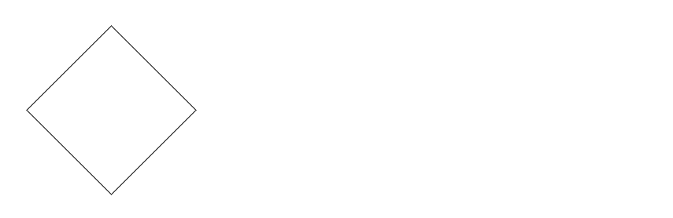
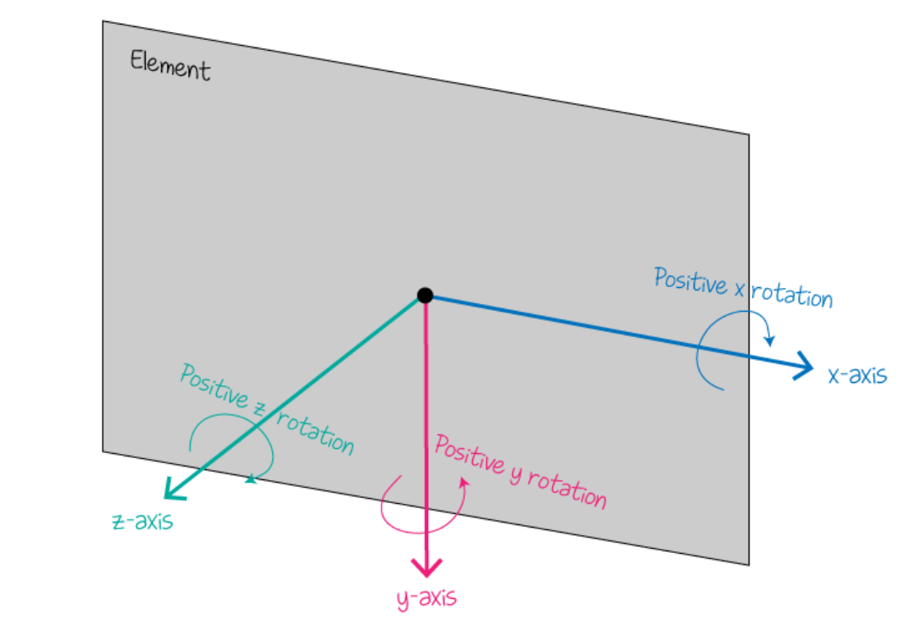
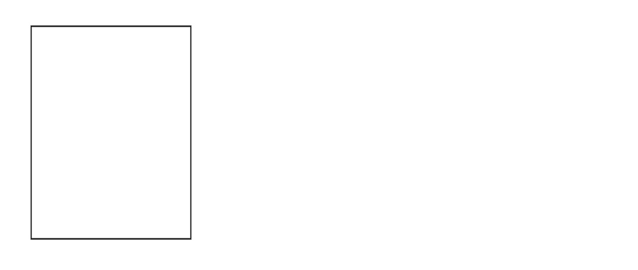

# Transform

## Reason

The transform CSS property lets you rotate, scale, skew, or translate an element.

## Rotate

### rotate (angle)

- If the angle is positive, the movement will be clockwise; if that is negative, it will be counter-clockwise.

```html
<div class="item"></div>
```

```css
.item {
	width: 100px;
	height: 100px;
	border: 1px solid #000;
	margin: 50px;
	transform: rotate(45deg);
}
```



### rotate3d (x, y, z, angle)

- x, y, z: a number describing the x-, y-, z-coordinate of the vector denoting the axis of rotation which could be between 0 and 1.
- If the angle is positive, the movement will be clockwise; if that is negative, it will be counter-clockwise.
- The following image shows the positive clockwise direction of rotation along the three axes.


- [Example 1](https://developer.mozilla.org/en-US/docs/Web/CSS/transform-function/rotate3d)
- [Example 2](https://css-transform.moro.es/)

### rotateX(angle), rotateY(angle), rotateX(angle)

- rotateX(angle) is equivalent to rotate3d(1, 0, 0, angle)
- rotateY(angle) is equivalent to rotate3d(0, 1, 0, angle)
- rotateX(angle) is equivalent to rotate3d(0, 0, 1, angle)

## Scale

### scale

- scale(x and y)
- scale(x, y)
- When a coordinate value is outside the `[-1, 1]` range, the element grows along that dimension; when inside, it shrinks.

```html
<div class="item"></div>
```

```css
.item {
	width: 100px;
	height: 100px;
	border: 1px solid #000;
	margin: 100px;
	transform: scale(1.5, 2);
}
```



### scale3d(x, y, z)

[Example](https://developer.mozilla.org/en-US/docs/Web/CSS/transform-function/scale3d)

### scaleX(x), scaleY(y),  scaleZ(z)

- scaleX(sx) is equivalent to scale(sx, 1) or scale3d(sx, 1, 1)
- scaleY(sy) is equivalent to scale(1, sy) or scale3d(1, sy, 1)
- scaleZ(sz) is equivalent to scale3d(1, 1, sz)

## Skew

The effect is as if you grabbed each corner of the element and pulled them along a certain angle.

### skew

### skewX

### skewY

## Translate

This transformation is characterized by a two-dimensional vector. Its coordinates define how much the element moves in each direction.

### translate

translate(x, y)

```html
<div class="item first"></div>
<div class="item second"></div>
```

```css
.item {
	width: 100px;
	height: 100px;
	border: 1px solid #000;
	margin-bottom: 10px;
}

.first {
	background-color: darkred;
	transform: translate(20px, 20px);
}

.second {
	background-color: royalblue;
}
```

### translate3d

translate3d(x, y, z)

### translateX, translateY, translateZ

- translateX(x): translate(x, 0) or translate3d(x, 0, 0)
- translateY(y): translate(y, 0) or translate3d(0, y, 0)
- translateZ(z): translate3d(0, 0, z)

## Refs

- [Rotate](https://developer.mozilla.org/en-US/docs/Web/CSS/transform-function/rotate)
- [Rotate3d](https://developer.mozilla.org/en-US/docs/Web/CSS/transform-function/rotate3d)
- [Rotate3d Visualizer](https://css-transform.moro.es/)
