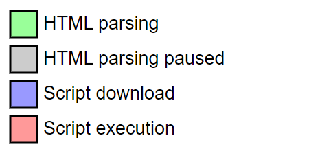

# `defer` vs `async`

## Non-attribute

### 过程

1. 解析 HTML
2. (如果遇到 JS) 下载 JS
3. 执行 JS
4. 继续解析 HTML




### 问题

- JS 文件无法访问未解析的元素
- 如果加载 JS 文件过大，用户可能需要等待很长时间才能看到页面的全部内容

### 代码

```html
<p>...content before script...</p>
<script src="https://javascript.info/article/script-async-defer/long.js?speed=1"></script>
<!-- 脚本下载并执行后再继续解析 -->
<p>...content after script...</p>
```

## Defer

### 过程

1. 解析 HTML，并行下载 JS
2. HTML 解析完成后执行 JS


### 代码

```html
<p>...content before script...</p>
<script defer src="https://javascript.info/article/script-async-defer/long.js?speed=1"></script>
<!-- 不会被 JS 阻塞 -->
<p>...content after script...</p>
```

### 注意

- `DOMContentLoaded` 事件在 defer 脚本执行完成之后执行

```html
<script>
  document.addEventListener('DOMContentLoaded', () => alert("DOM ready after defer!"));
</script>
<script defer src="https://javascript.info/article/script-async-defer/long.js?speed=1"></script>
```

- defer 脚本的执行顺序为在 HTML 中的顺序

```html
<!-- 
  small.js 虽然比 long.js 先完成下载，
  但是 small.js 在 long.js 后面引入，
  所以 small.js 比 long.js 晚执行。
-->
<script defer src="https://javascript.info/article/script-async-defer/long.js"></script>
<script defer src="https://javascript.info/article/script-async-defer/small.js"></script>
```

- The `defer` attribute is only for external scripts and the `defer` attribute is ignored if the `script` element doesn't have a `src` attribute.

```html
<!-- 'defer' is not working -->
<script defer>
// ...  
</script>
```

## Async

### 过程

1. 解析 HTML，并行下载 JS
2. （如果 JS 已经完成下载，而 HTML 未完成解析）中断 HTML 解析，执行 JS
3. JS 执行完成，继续解析 HTML


### 注意

- `DOMContentLoaded` 和 `async` 脚本不会互相等待
- `async` 脚本和其他 `async` 脚本不会互相等待
- The `async` attribute is only for external scripts and the `async` attribute is ignored if the `script` element doesn't have a `src` attribute.

```html
<!-- 'async' is not working -->
<script async>
// ...  
</script>
```

```html
<p>...content before scripts...</p>

<!--
  HTML 完成解析后就执行 DOMContentLoaded 的事件回调，
  不会等待 async 脚本
-->
<script>
  document.addEventListener('DOMContentLoaded', () => alert("DOM ready!"));
</script>

<!-- small.js 比 long.js 先下载完，所以先执行 -->
<script async src="https://javascript.info/article/script-async-defer/long.js"></script>
<script async src="https://javascript.info/article/script-async-defer/small.js"></script>

<p>...content after scripts...</p>
```

## Refs

- [Basic](https://javascript.info/script-async-defer)
- [Pictures](https://www.growingwiththeweb.com/2014/02/async-vs-defer-attributes.html)
- [MDN](https://developer.mozilla.org/en-US/docs/Web/HTML/Element/script)
