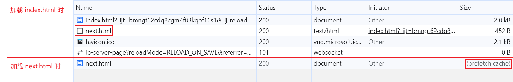

# Pre Operation

## PreFetch

> Reference
> - [MDN: PreFetch](https://developer.mozilla.org/en-US/docs/Web/HTML/Attributes/rel/prefetch)
> - [resource hints performance optimization](https://nitropack.io/blog/post/resource-hints-performance-optimization)

- PreFetch：提前获取后续可能需要的资源，并存储在磁盘中。需要此资源时，该资源以缓存的形式加载。

::: code-tabs
@tab index.html
```html {2,5}
<head>
  <link rel="prefetch" href="next.html"/>
</head>
<body>
  <a href="./next.html">nav to next</a>
</body>
```

@tab next.html
```html
<body>
  <div>next</div>
</body>
```
:::

- 因为配置了 PreFetch，所以浏览器下载 `index.html` 之后会自动下载 `next.html` 并存储在磁盘中。需要用到 `next.html` 资源时从磁盘中访问。



- PreFetch 可以在用户鉴权期间使用，提前获取首页资源。

- 一些 `Cache-Control` （例如：no-cache, no-store）会阻止 PreFetch。

- PreFetch 相当于携带 `priority: false` 的 fetch。

## DNS PreFetch

> Reference
> - [MDN: DNS PreFetch](https://developer.mozilla.org/en-US/docs/Web/Performance/dns-prefetch)

- DNS PreFetch: 在获取资源之前执行域名（domain name）解析。

```html
<link rel="dns-prefetch" href="https://fonts.googleapis.com/" />
```

- 不要用 DNS PreFetch 获取本域的 IP 地址。

## PreConnect

> Reference
> - [MDN: PreConnect](https://developer.mozilla.org/en-US/docs/Web/HTML/Attributes/rel/preconnect)
> - [MDN: PreConnect best practices](https://developer.mozilla.org/en-US/docs/Web/Performance/dns-prefetch#best_practices)
> - [Blog: PreConnect](https://nitropack.io/blog/post/resource-hints-performance-optimization)

- PreConnect: 在获取资源之前与服务器建立连接，包括 DNS 查找、TLS 协商（negotiation）、TCP 握手（handshake）。

```html
<link rel="preconnect" href="https://fonts.googleapis.com/" crossorigin />
```

- PreConnect 适合提前获取**少数关键的**资源，如果网站需要与很多第三方域建立连接，那么使用 PreConnect 会起到反作用，这种情况 DNS PreFetch 更合适。

## PreLoad

> Reference
> - [blog: preload](https://nitropack.io/blog/post/link-rel-preload-explained)
> - [MDN: preload](https://developer.mozilla.org/en-US/docs/Web/HTML/Attributes/rel/preload)

- PreLoad: 提前获取在页面渲染过程中才能发现的关键资源。

```html
<link rel="preload" as="image" href="banner.jpg">
```

- `as` 用于指定资源的类型，有很多[选项](https://developer.mozilla.org/en-US/docs/Web/HTML/Attributes/rel/preload#what_types_of_content_can_be_preloaded)

- 跨域 PreLoad 需要使用 `crossorigin` 属性。

```html
<link rel="preload" as="image" href="banner.jpg" crossorigin>
```
