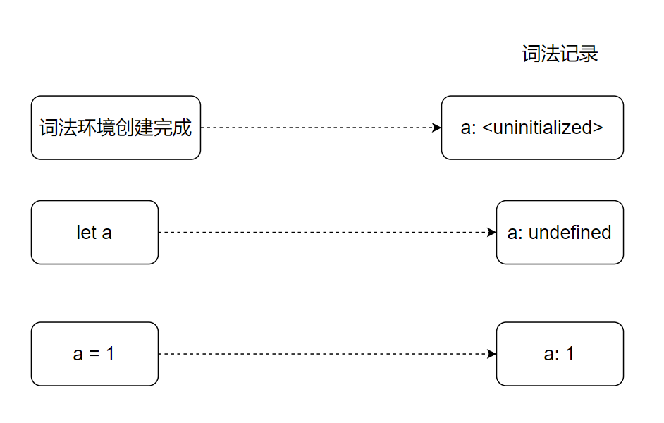

# Lexical Environment

## 基本概念

- 块级作用域、作用域和全局作用域都有一个叫做词法环境 (lexical environment) 的隐藏对象
- 词法环境由环境记录 (environment record) 和指向外部词法环境的引用组成
- 作用域中的本地变量 (local variables) 和 `this` 都是环境记录的属性


- 词法环境只存在于规范中，引入这个概念是为了描述作用域是如何工作的

## 访问外部词法环境的变量

- 函数 `say` 产生了一个词法环境，最外层的脚本也产生了一个全局词法环境
- 例子：`say` 在执行时可以在它的词法环境中获取 `name`，但无法获取 `phrase`。因此通过指向外部词法环境的引用寻找 `phrase`，最终在全局词法环境中找到


## 函数声明 vs 变量声明

- 当词法环境创建后，通过函数声明的函数立刻出现在环境记录中，因此函数调用可以出现在函数的声明之前


- 当词法环境创建后，变量的状态为 `uninitialized`，此时访问该变量会报错。当使用 `let` 或 `const` 声明变量后，变量的初始值变为 `undefined`



## 嵌套函数

- 当函数被调用时会产生一个新的词法环境，每个词法环境包含的本地变量是独立的，不会相互影响。

```js
function makeCounter() {
  let count = 0

  return function() {
    count++
    console.log(count)
  }
}

const counter1 = makeCounter() // 产生词法环境-a
const counter2 = makeCounter() // 产生词法环境-b

counter1() // 1
counter1() // 2

counter2() // 1
```

- 函数调用时会通过 `[[Environment]]` 属性定位到定义该函数的词法环境
- 例子：当 `counter` 被调用时，会通过 `[[Environment]]` 属性定位到它的词法环境，然后执行里面的代码


## 闭包

- 定义：函数 + 该函数外层的词法环境
- 作用：封装变量，不对外暴露
- 例子：`inner` 可以访问 `outer` 的 `a` 变量

```javascript
function outer() {
  const a = 1

  return function inner() {
    console.log(a)
  }
}

const innerFn = outer()
innerFn()
```

- 在 JavaScript 中，所有函数都是闭包。

## 垃圾回收

### 闭包阻止垃圾回收

- 由于 `inner` 指向外部词法环境的引用是 `outer` 函数词法环境，`outer` 的变量可能会被 `inner` 使用到，所以不会被垃圾回收。这样容易造成内存泄露
- 当设置 `inner = null` 时， `inner` 和 `outer` 都会被清理

```js
function outer() {
  const a = 1

  return function inner() {
    console.log(a)
  }
}

const innerFn = outer()
innerFn()

innerFn = null
```

### 浏览器优化闭包阻止垃圾回收

- 针对上述闭包导致内存泄露的问题，浏览器进行了优化，让所有词法环境占用的内存尽可能缩小。具体操作是如果外部词法环境的变量会被内部的词法环境所使用，那么该变量不会被垃圾回收；反之则会被垃圾回收
- 例子 : `inner` 只需要使用到 `outer` 的变量 `a`，因此变量 `a` 不会被垃圾回收，变量 `b` 会被垃圾回收。可以通过 debugger 验证

```js
function outer() {
  const a = 1
  const b = 2

  return function inner() {
    console.log(a)
    debugger
  }
}

const innerFn = outer()
innerFn()
```


## Refs

- [Variable Scope and Closure](https://javascript.info/closure)
